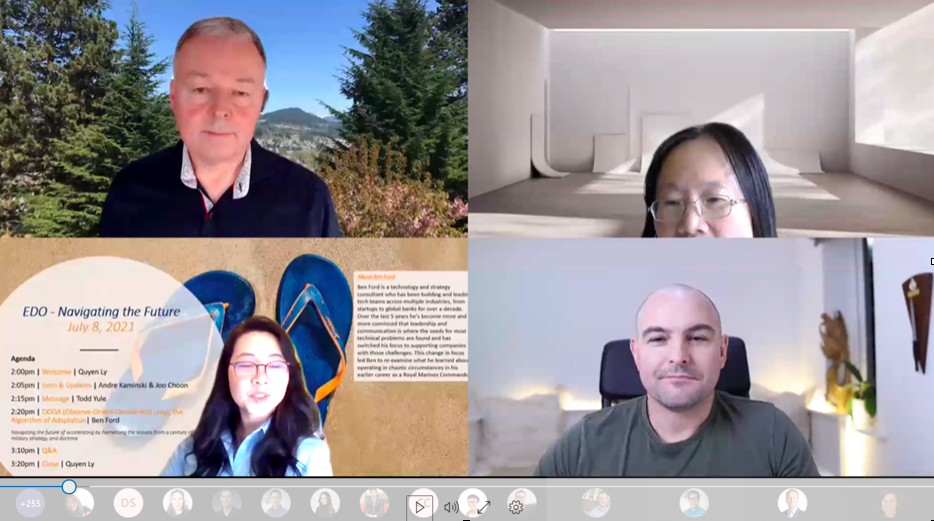

Title: OODA Loop and DevOps
Date: 2021-07-13
Category: Posts 
Tags: learning
Slug: ooda-loop-and-devops
Author: Alex Bunardzic
Summary: What is the relationship between Observe-Orient-Decide-Act Loop and DevOps.

Our July 8, 2021 Navigating the Future ceremony was focused on learning, with **Andre Kaminski**, **Joo Choon** and **Todd Yule** opening talks emphasizing the vital importance of keeping up with the accelerating changes in the world.

We were fortunate to be able to invite a featured guest speaker, **Ben Ford**, who specializes in applying strategic and tactical thinking for the purpose of increasing our learning potential. Ben’s amazing talk was sponsored and endorsed by the executive leadership, which is another strong message that fortifies the importance of _continuous learning_.

 

The title of Ben’s talk was **“OODA (Observe-Orient-Act-Decide) Loop, the Algorithm of Adaptation”**. 
Ben's talk gave us a lot of food for thought and here I’d like to riff off some of Ben’s observations to elucidate how those may apply to our current problem at hand.

## DevOps is not about the solution

Before DevOps entered the mainstream practice, all software delivery teams have already been delivering solutions. DevOps wouldn’t be as successful as it is today if it was yet another “me too” solution provider.

DevOps is a revolutionary improvement because it is all about _changing the solution_. No solution, regardless of how brilliant it may be, stays valid for very long. Change is inevitable, and what used to fit the bill perfectly just a few months ago, suddenly turns from being an asset to being a liability.

Many organizations find themselves stuck in that land of obsolescence, where the solutions they’ve settled on a few years back have now turned into a straitjacket that is severely limiting their mobility. The solution suddenly turns into a new problem.

DevOps shines in such situations. Because DevOps embraces change at the very outset by aggressively shifting left, the inevitable onslaught of changes transforms from being a stress-inducing obstacle to becoming an anti-fragile advantage. Accepting the change gladly and rolling with the punches, DevOps enables business and organizations to grow ever stronger with each potentially traumatic change.

## DevOps embraces the OODA Loop

DevOps is based on Lean and on Extreme Programming (XP). Both Lean and XP are strictly empirical disciplines that eschew any Big Plan Upfront and instead focus on working in extremely small batches. DevOps is, in essence, based on rapid iterating.

And so is OODA Loop. The goal of OODA/DevOps is to increase frequency of feedback. Any time we react to the circumstances and then must wait until we receive feedback, we are working in complete darkness. DevOps is an attempt to remove that scary working in darkness situation by shining the light of feedback as soon as possible. Hence the jist of the practice – shift left. Shifting left means we receive feedback the moment we make any change. We don’t wait until the change we made propagates throughout various layers of organization until we eventually get the feedback. Did the change work? Did it not work? Learning the outcome of the change late in the game is stressful, traumatic, demoralizing, sometimes even debilitating.

Being empirical, DevOps insists on continuous and careful observation (the first O in the OODA Loop). Don’t assume anything, rather observe the situation as it unfolds. Once we notice something of significance, don’t act on it in a knee jerk fashion. Instead, consciously move into the orientation phase (the second O in the OODA LOOP). Orientation is the most critical phase in the OODA Loop. Again, abandon preconceived notions and assumptions. This is the phase where prior experience quickly turns from being an asset to becoming a liability. Instead of grabbing the first familiar ‘solution’ that pops to mind, we should keep our minds open. Seek fresh perspective. Cultivate the Beginner’s Mind because that’s where the highest quality solution may emerge from.

A slight pause associated with the Orient phase may seem counterproductive, but it’s worth slowing down at that point because we increase our chances of finding a better solution.

Once a better solution emerges, decide to do it, then act on it, and commit to our actions.

Our actions create a stir and that stir is now observable, which takes us back to the beginning of the cycle – Observe. The cycle thus repeats continuously, giving the DevOps practice a long, sustainable presence.