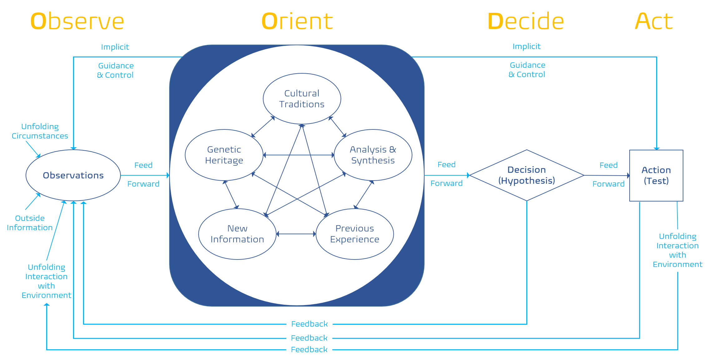
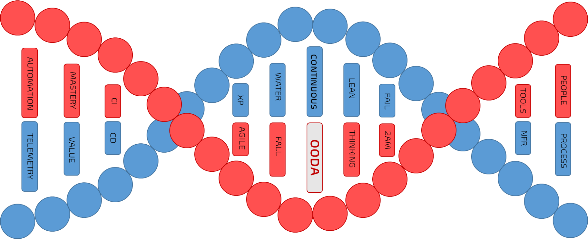

Title: Why OODA is one of the DevOps genomes
Date: 2021-09-01
Category: Posts 
Tags: devops
Slug: ooda-one-of-the-devops-genomes
Author: Willy-Peter Schaub
Summary: TBD

In the [analyzing the DNA of DevOps](https://opensource.com/article/18/11/analyzing-devops) article I argued that waterfall, agile, and other development frameworks have not only shaped the evolution of DevOps, but that they are part of the DevOps DNA. Recent explorations of DevOps, as it evolves and matures, revealed an exciting hypothesis that OODA is another one of its numerous genomes. 

# DevOps is a mindset

 “DevOps is the union of people, process, and products to enable continuous delivery of value to our end users.” - (Donovan Brown, 2015). It is based on [5 essential values for the DevOps mindset](https://opensource.com/article/19/5/values-devops-mindset), creating a foundation for **continuous** measure, feedback, collaboration, learning, adoption, and most importantly, delivery of value to delighted users.

# Observe-Orient-Decide-Act (OODA) 

During my explorations of what drives the “continuous” narrative, I remembered the exciting OODA loop, by John Boyd, a fighter pilot, strategist, and an inspiration for change. The book BOYD (Coram, 2002) covers both his extraordinary life story, as well as the history behind the infamous OODA-loop.

Boyd argued that the key to victory is the ability to create situations in which one can make appropriate decisions more quickly than one's opponent. **O**bserve the environment, **O**rient to be in a good position, **D**ecide what to do next, and **A**ct accordingly. While it conceptually sounds like a loop, the following reproduced illustration from Boyd’s “an essay on winning and losing” suggests that the OODA loop is more of a continuous state machine, than a loop. Note that I am intentionally referring to states, not stages, to avoid any misguided mapping of the four stages to a linear or circular (loop) process.
 

> Figure 1 - The modified OODA-Loop, reproduced from Boyd’s “An essay on winning and losing.”

 

So, why am I talking about a strategy, that has its roots in the military and applies to aviation combat?

# OODA Genome?

It is useful to remember where the OODA originated from and that its original intent was razor focused on analyzing, understanding, and improving fighter combat. However, I argue that OODA can be applied to any context outside aviation as an invaluable model in pursuit of everything **continuous**, such as innovation, improvement, and learning.

Here is my hypothesis:

> - I believe that **OODA**, for **agents of change**, will enable **continuous** innovation, improvement, and learning.
>
> - I will know this to be true when other engineers embrace **OODA** in the context of **DevOps**.

I would go one step further and argue that if we unpack the DevOps DNA we will not only find traces of waterfall, lean thinking, agile, scrum, Kanban, and other genetic material, but also a prominent genome labeled OODA.
 

> Figure 2 – Slither of a DevOps DNA strand

 

There is widespread reproach of OODA, claiming it to be out of date, military focused, and “despite its popularity, however, the OODA Loop is flawed as a model of human decision making.” (David J. Bryant) In my humble opinion, erroneous criticism predominantly from the military sector. In fact, OODA does apply outside the aviation context and it is a natural fit for the DevOps mindset to **continuously** innovate and deliver **value**.

Boyd’s enhanced OODA model of “winning or losing” can be interpreted as “pass (value) or fail (fast).” We are striving to incrementally build solutions, while learning, reducing delivery lifecycles, and continuously delivering value to our delighted end-users. We are plagued by an inherent fear of failure, which can destroy a healthy DevOps mindset like cancer, as discussed in [why fear of failure is a silent DevOps virus](https://opensource.com/article/19/8/why-fear-failure-silent-devops-virus).

By embracing failure, through experimentation and learning, we can “pass value” or “fail fast” while continuously reiterating through shortening delivery cycles. As shown in the illustration below, both delivering **value** and **learning** through **failure** are positive and invaluable outcomes.

> Figure 3 – Hypothesis-driven development (HDD)

 

A major notion of DevOps is to continuously process feedback (observe), correcting and innovating (orient), experimenting and pivoting (decide), and delivering value (act). It is hard not to “observe” the synergy between OODA and a healthy DevOps mindset, which I refer to as the OODA genome of DevOps. If only Boyd had known how his OODA model would evolve and influence minds and concepts outside his original context of the fighter pilot; let alone inspire software and value stream engineers decades later.

I particularly like the culture, genetic, and experience factors that Boyd introduced in the **Orient** state as they are in harmony with “creating a healthy DevOps mindset requires 80% focus on people, 15% process, and 5% products.” – (Agent 13, 2020). It is about the people and the organization’s unique culture! Culture, genetics, bias, and experience plays a big role in how observations influence the orientation state, and how decisions are made, based on the analysis of all known information. 

Remember, DevOps is not a silver bullet or a remedy to cure all ailments and solve all problems. It is an evolving **mindset** within a unique context, that enables us to continuously innovate, learn, and most importantly, deliver value to delighted users.

Thoughts?

---

References

- Agent 13. (2020). Navigating DevOps through Waterfalls. TacTec. Retrieved from https://www.tactec.ca/ndtw-resources
- Coram, R. (2002). Boyd: The Fighter Pilot Who Changed the Art of. Library of Congress Cataloging-in-Publication Data.
- David J. Bryant. (n.d.). David J. Bryant. Toronto: Defence Research Development Canada.
- Donovan Brown. (2015, September 1). What is DevOps? Retrieved from Donovan Brown Technology Blog: https://www.donovanbrown.com/post/what-is-devops

