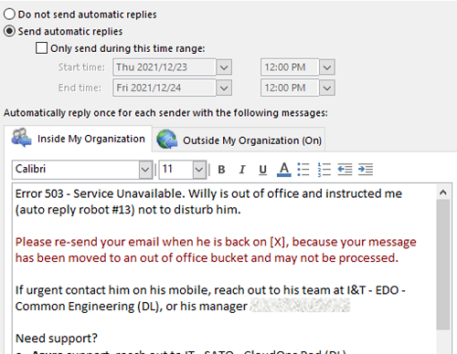

Title: How to tame your vacation email traffic
Date: 2021-12-24
Category: Posts 
Tags: tips
Slug: optimize-and-avoid-emails.md
Author: Willy-Peter Schaub
Summary: How to ensure you are not confronted by hundreds of emails when you are back-to-work.

We pick up from the [How to track (and optimize) your email traffic](/optimize-and-track-emails.html) post, where we have discussed the tsunami wave of emails we receive and process every day. I would like to focus on avoiding the **WASTE**ful first day back at work, when we spend hours processing hundreds of emails we received while we were away on a well-deserved vacation.

---

# Why should we avoid the return-to-work flood of emails?

We have all had the terrifying welcome back to work experience, when we opened our favourite email client and stared at hundreds of emails seeking our attention. After hours of reading dated and often redundant emails, we have a brief sense of achievement when the inbox is finally empty - similar to sorting bottle tops into respective colours.

> 

Unfortunately, we just wasted hours of previous time we could have used for more productive work and often find ourselves behind schedule and stressed out after the first day of work. What is important to realize is the following:

- Email that has been sitting in your inbox for days or weeks is most likely **outdated** by the time you read it.
- Many emails are fire-and-forget type communication and will be **rotting** by the time you read them.
- Users will automatically loop other users into their email thread if they realise you are out of office or touch base with you again when you return.

>
> Every second you spend on outdated email is **WASTE**!
>

---

# Create a vacation rule

I recommend you create a vacation rule which automatically moves all inbound email to a bucket you can reference, not process, in future.

> 

This ensures that you can hit the ground running when you return to work, rather than sorting through a pile of junk for hours first.

More importantly, it discourages you from "quickly" checking your email during precious family time in order to avoid the inbox from hell. To achieve a **work-life balance** you must **STOP** mixing the two!

---

# Set the expectations in your out of office message

> 

When I go away for a longer period, I enable both the **Archive OOO** email rule and create an out of office message. You will notice in the red text, that I set a clear expectation with senders that I will **not** process their email.

---

# Last, but not least, your phone is a phone!

Oh, how I hate my mobile device at times. It started as a handy text + phone device with a short-lived and huge battery in the 90's but evolved into an ever-lasting digital device that follows you to the end of the world, interrupts your precious family time, and encourages you to keep track of email.

Please note that I have uninstalled business email, business collaboration, and social channels such as Facebook from my mobile "phone".

Worst case you can drag your business phone and laptop with you on vacation, but intentionally leave your chargers at home. That gives you a few hours of distraction at worst.

---

With that, I wish everyone a safe, warm, and festive holiday season, as well as a jump into a successful new year!

C (see) U (you) in 2022!

