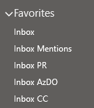
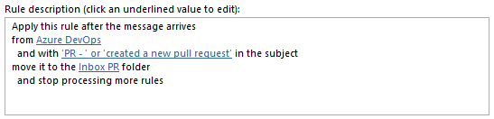
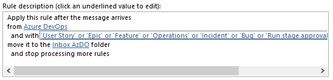
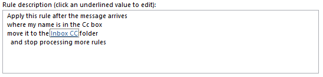
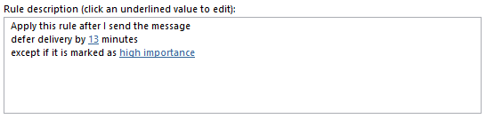
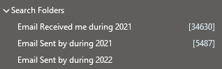
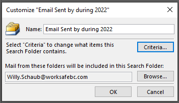
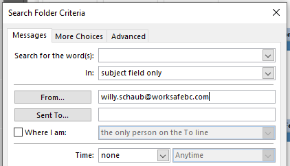
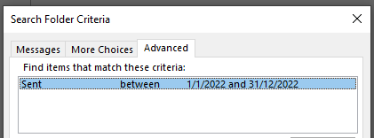
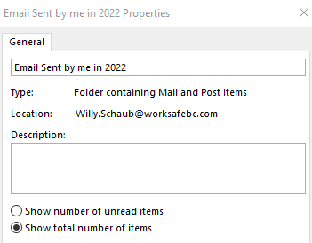

Title: How to track (and optimize) your email traffic
Date: 2021-12-13
Category: Posts 
Tags: tips
Slug: optimize-and-track-emails.md
Author: Willy-Peter Schaub
Summary: How to stop the insane volume of emails and WASTE!

As mentioned in [What is origin of our common engineering team](/common-engineering-journal-1.html) we have declared war on *WASTE* and are fighting that battle on multiple fronts. On the meeting frontline we are reducing the number of meetings, dropping off meetings when our presence adds no value or we add no value to the meeting, avoiding repetitive meetings, and enjoying a meeting free Friday. I recommend you try to optimize your meetings - it is extremely liberating q;-) 

But, I am drifting, because in this email I want to focus on the tsunami wave of emails we receive and process every day. 

- In my case I receive an average of **149 emails per day** - too much to process to remain productive! 
- In response I send an average of **21 emails per day** - time I could invest more productively!

So, what are we doing to combat the email **WASTE**?

---

# Prioritize (and ignore) incoming emails

I am using Outlook rules to separate and prioritize incoming email.

> 

I process emails from most important to least important, as follows:

- **Inbox** contains email sent directly to me (I am on the **To** list).
- **Inbox Mentions** contains email notifications generated by Azure DevOps where I am @mentioned.

> 

- **Inbox PR** contains incoming email notifications generated by Azure DevOps where I need to review a Pull Request (PR).

> 

- **Inbox AzDO** contains all the other email notifications generated by Azure DevOps services.

> 

- **Inbox CC** contains email sent to me indirectly (I am on the **Cc** list).

> 

I focus on the first three when I have time to check my emails. The **Inbox CC** seldom makes it onto my radar as I "assume" CC == FYI only.

> 

> 
> **Emails I regards as noise:**
> - Any email is sent to me as a **Cc** - I assume it is for my information only.
> - Any Azure DevOps work item notification where I am not explicitly @ mentioned - I assume it is for my information only.
> 

---

# Defer outgoing email

Ever sent an email and regretted it 10 seconds later? Well, I defer all emails I send that are not priority for 13 minutes. It give me time to tweak the content and reconsider sending it in the first place.

> 

---

# Qualifiers

Something we used in the ALM/DevOps Ranger era and which I have noticed making a comeback in our group the use of qualifiers in the email subject.

For example:

- [INFO] This is an information-only email sample email subject
- [NOTIFICATION] This is an important notification email sample email subject
- [ALERT] Someone's hair is on fire sample email subject

If you have a **consistent** list of qualifiers, users can create email rules and take action on emails, based on their qualifier tag.

---

# Use more productive collaboration channels

Instead of email, consider using Microsoft Teams, Slack, or some other collaboration service that allows you to collaborate with your peers and stakeholders far more effectively. It avoids the misunderstandings and the frustrating and often time consuming conversations that split and drift from the conversation topic.

---

# 25% email reduction challenge

I just challenged my team to reduce the email we send as individuals and as a team by 25% in 2022. We will track the challenge using a Search Folders.

> 

- **Email Sent by me in 2021 shows the total number of emails** I sent in 2021.
- **Email Send by me in 2022 tracks the number of emails** I sent in 2022.

Let us walk through the process of creating one of these search folders.

- Right click on **Search Folders**, scroll to bottom of list, and a choose **Create a new search folder**.

> 

- Click **Criteria** and set **Sent To** to your email address.

> 

- Click **Advanced** tab and add two **Sent** date filters to limit search folder to 2002.

> 

- Click OK a few times to save all the changes you have made to the search folder.
- Right Click on the search folder, select **Properties**, and change view to **Show total number of items.**

> 

Simple! Now you can track the emails sent in 2021 and 2022.

My hypothesis for the challenge is: "_I believe that by sending 25% less email the EDO Ce team will achieve a drastic reduction in incoming email and associated WASTE created as a bi-product of replies and split email conversations._" 

> 

C U in 2023 to disprove or prove my hypothesis q;-)

---

Anything else that helps you to manage your emails?

