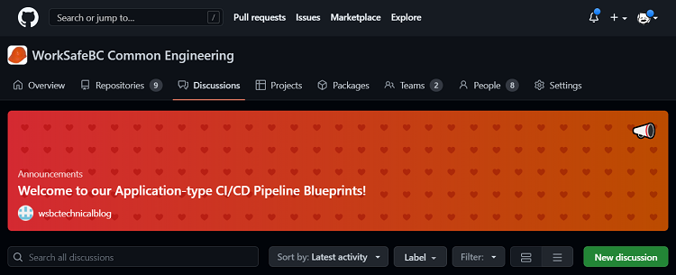
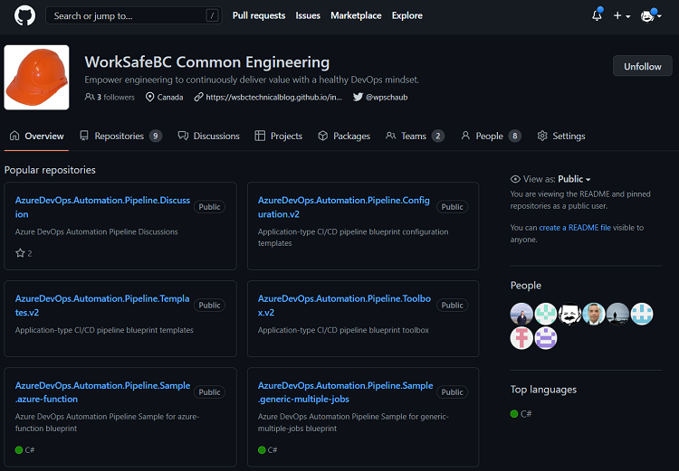

Title: Our open-source pipeline blueprints have landed!
Date: 2022-11-08
Category: Posts
Tags: azure-devops, pipelines, automation
Slug: our-open-source-pipeline-blueprints-have-landed
Author: Willy-Peter Schaub
Summary: Lifting the hood of our consistent, standardized, and self-service based Azure Pipelines. 

Our group took huge step when we convinced our leadership to empower us to create this technical blog and share our technology journeys, learnings, and innovation with the community back in September 2020. Two years later, we finally managed to dot the ```i's``` and cross the ```t's``` and publish our [second-generation application-type blueprints](https://wsbctechnicalblog.github.io/yaml-pipelines-part10.html). 

It is hopefully the splash down of a long and innovative collaboration to improve our (community) use of [Azure Pipelines](https://azure.microsoft.com/en-ca/products/devops/pipelines).


Peruse our [why bother and what are our nightmares and options?](https://wsbctechnicalblog.github.io/why-pipelines-part1.html) pipeline series for the complete story.

“_Constantly think about how you could be doing things better._” - Elon Musk

---

# Discussions



You can use the [Discussions](https://github.com/orgs/WorkSafeBC-Common-Engineering/discussions) feature to collaborate with our team and/or the rest of the community. Please keep discussions focused on the application-type blueprints, communicate clearly, be open-minded, respectful, and empathetic. 

> **NOTE** - All discussions and comments are moderated. Users who do not adhere to the [GitHub Acceptable Use Policies](https://docs.github.com/en/site-policy/acceptable-use-policies/github-acceptable-use-policies) will be blocked from our organization.

- Vibrant collaboration (over black holes and silos)
- Consistent, standardized, and secure continuous integration (CI) and delivery (CD) pipelines
- Empower software engineers with self-service automation
- Take advantage of every ounce of YAML [Azure Pipelines](https://azure.microsoft.com/en-ca/products/devops/pipelines) features

---

# Repositories



We have published a total of eight (8) repositories, consisting of five (5) sample repositories and three (3) application-type blueprint core repositories.

### Samples

The five (5) sample repositories are used by our self-service automation to extract an application-type sample and inject it into the users repository. We reduced the [self-service cycle-time](https://youtu.be/DWuDqCM1t6A) to less than 15 seconds ... a success story that we will cover in an upcoming self-service automation post. 

- AzureDevOps.Automation.Pipeline.Sample.azure-function
- AzureDevOps.Automation.Pipeline.Sample.generic-multiple-jobs
- AzureDevOps.Automation.Pipeline.Sample.generic-single-job** 
- AzureDevOps.Automation.Pipeline.Sample.nuget-package
- AzureDevOps.Automation.Pipeline.Sample.universal-artifact

### Core

The three (3) core repositories represent the heart of our blueprint-based [Azure Pipelines](https://azure.microsoft.com/en-ca/products/devops/pipelines).

- **AzureDevOps.Automation.Pipeline.Configuration.v2** - Contains a configuration file for each solution using our blueprints, organized in a flat ```deploy/<portfolio>/<product>-config.yml``` hierarchy. The configuration files are loaded and injected when the pipelines are queued.
- **AzureDevOps.Automation.Pipeline.Templates.v2** - Application-type blueprint and other templates. See [meet our second-generation app-type blueprints](https://wsbctechnicalblog.github.io/yaml-pipelines-part10.html) for details. 
- **AzureDevOps.Automation.Pipeline.Toolbox.v2** - Scripts and config files that are loaded by the ```boot-strap.yml``` template, using the ```checkout:``` feature. See [two ways to share your toolbox with your pipelines](https://wsbctechnicalblog.github.io/share-your-toolbox-with-pipelines.html) for details.

For more information on the history and a peek under the hood of the blueprints, please peruse our technical blog [pipelines series](https://wsbctechnicalblog.github.io/why-pipelines-part1.html) and anything that is tagged with [pipelines](https://wsbctechnicalblog.github.io/tag/pipelines.html).

Some of the templates contain a ```__TODO_<ACTION>_``` placeholders to hide our internal implementation but maintain the blueprint template dependencies and integrity. You will need to search for ```__TODO_``` and implement these ```STUBBED``` templates yourself. Contact our team using the [Discussions](https://github.com/orgs/WorkSafeBC-Common-Engineering/discussions) if you have any questions.

### Getting Started

1. Fork the repositories if you intend to make changes.
2. Create or use a common engineering Azure DevOps project.
2. Clone the repositories to your Azure DevOps project.
3. Search for ```__TODO_``` placeholders in all repositories and adjust to match your Azure DevOps Project(s) and services.
4. Remember to contribute your changes back using a pull request.

---

# How to contribute

As mentioned, collaborate with us using the **Discussions** feature and submit your blueprints changes through **pull requests** which will be considered, reviewed, integrated, and synchronized by our common engineering open source team of passionate engineers.

May the **collaboration**, have **fun**, and **innovation** begin!

