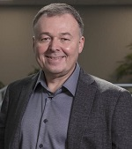
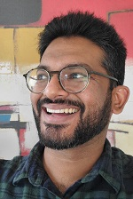

Title: Authors
Date: 2020-10-20 09:37
Category: Links
Slug: authors
Author: WorkSafeBC
Summary: WorkSafeBC Contributors

## Aditya Chourasiyac

Aditya is a hard working, proactive, go-getter. He excels in overseeing the quality assurance, monitoring and people development in a fast-paced DevOps environment. He considers information technology an important means to fulfill to customer needs and transform it to customer delight.

If you would like to discuss or share feedback on his posts, please ping him on [LinkedIn](https://www.linkedin.com/in/adichourasiya/).

Read Aditya's posts [here](/author/aditya-chourasiya.html)

---

## Andre Kaminski

Andre Kaminski is a technology leader with a passion for creating high performing teams for rapid delivery of business solutions. Currently, as Director at WorkSafeBC (WSBC), Andre is responsible for setting up and leading Agile DevOps functional teams to deliver business value. An entrepreneur with proven track record of successful software projects and products, Andre has worked in engineering, product development, project and program management and held consulting advisory roles across industries in both public and private sectors over a 30-year career. While he’s no stranger to working hands-on directly with his teams “in the trenches”, Andre has held several executive-level positions at global companies, including VP of Product Development, Director of Product Development and Services Director. Andre is a passionate advocate for Agile and DevOps. His solid Agile DevOps experience is supported by a foundation of extensive study and certifications. He has over 25 years of experience in information technology and holds several certifications, including PMP, CSPO, CSM, SAFe Advanced Scrum Master and SAFe Program Consultant.

Read Andre's posts [here](/author/andre-kaminski.html)

---

## Alex Bunardzic

Alex has been doing software development since 1990. His professional passion is bringing _soft_ into software. Which means software must be soft, maleable, pliable. That quality enables the flexibility of the business operations.

In order to make sure that software we are building is flexible, we must evolve it one step at a time. Each step (and the smaller that step is, the better) must get verified by automated testing. Early failures are welcome, because they are small and they force us to fix them right away. In the software engineering discipline, giant steps are foolish steps. It is more prudent to stay with small steps (many, many small steps) on our journey to deliver value to customer satisfaction.

> _Move fast to delight customers!_

Read Alex's posts [here](/author/alex-bunardzic.html)

---

## Daniel Broderick

Daniel began his IT career in Sydney Australia before moving to Canada. 

Daniel has worked on numerous projects for large North American companies migrating infrastructure, automating everything and anything possible and now cloud migration and devops. 

When not working in IT Daniel enjoy getting out and about, skiing hiking, mountain bike riding and generally exploring new places, looking for that next adventure. 

Read Daniel's posts [here](/author/daniel-broderick.html)

---

## Kevin Schwantje

Kevin has been working in cybersecurity for the past nine years, attacking and defending everything from networks to virtual machines. In his current iteration, he’s a DevSecOps security engineer safeguarding web apps from today’s scary modern threat landscape. At WorkSafeBC, Kevin has found a passion for integrating security practices into every level of software development practices, from Agile principles all the way to Azure DevOps and CI/CD pipelines and processes. He believes in pushing left, purple teaming, favouring a human approach over spreadsheets and always saying “no”.

> _“The purpose and intent of DevSecOps, is to build on the mindset that ‘everyone is responsible for security’ with the goal of safely distributing security decisions at speed and scale to those who hold the highest level of context without sacrificing the safety required.” - Shannon Lietz_

Read Kevin's posts [here](/author/kevin-schwantje.html)

---

## Laurent Blain

Laurent joined WorkSafeBC in 2011 as the Manager of Enterprise Application Architecture and has since played a role in the evolution of the architecture function across a variety of assignments, most notably Cloud Architecture in the early days of Cloud DevOps (CDO). Laurent now manages the Enterprise Architecture function under Business Engagement Services, which is tasked with the elaboration and evergreening of portfolio roadmaps. 

Read Laurent's posts [here](../author/laurent-blain.html)

---

## Martin M. Lacey

Innovative, solutions-driven Software Specialist with over 40 years leading and contributing to the planning, architecture, and development of n-tiered object-oriented software and mission-critical business and engineering applications in a wide range of industries. Involved in research, planning, design architecture, and development of n-tiered mission-critical business and engineering applications, using Waterfall and Agile methods with the latest technologies and best practices.

Read Martin's posts [here](../author/martin-m-lacey.html)

---

## Said Akram

Said has been working as a full-stack software engineer since the early 2000s. He worked for small and large organizations on a variety of projects. His focus has always been on delivering clean code. He is constantly learning and sharing how to do things in new ways.

At WorkSafeBC, Said works on legacy systems maintenance, cloud migration, cloud and mobile apps, and DevOps practices.

> _“Truth can only be found in one place: the code.” - Robert C. Martin_

Read Said's posts [here](../author/said-akram.html)

---

## Shay Vannery

Helps organizations streamline their software delivery. Talk to him about Site Reliability, DevOps, Agile-at-scale and Cooking.

Read Shay's posts [here](../author/shay-vannery.html)

---

## Willy-Peter Schaub

Willy-Peter began his IT career in the early 1980s, during his electrical engineering studies, focusing on the BTOS/CTOS operating systems until he moved over to Microsoft technologies in the early ‘90s. Since then, his passion has been to investigate, research, and evangelize technology and best practises, striving for _simplicity_ and _maintainability_ in software engineering. Apart from sharing technology and transformation learnings in [tweets](https://www.twitter.com/wpschaub), blogs, [articles](https://www.opensource.com/user_articles/180826), and books such as [.NET Enterprise Solutions - Best Practises](https://1drv.ms/b/s!AoTKFn7kQntwmahQJlHkxzgjlzQv4w), [.NET Enterprise Solutions - Interoperability for the Connoisseur](https://1drv.ms/b/s!AoTKFn7kQntwmahS9OnZ20IB2aecYg), [Software Engineers on their way to Pluto](https://1drv.ms/b/s!AoTKFn7kQntwmahRBJUVSZWpWXnDAg), and [Navigating DevOps Through Waterfalls](https://www.amazon.ca/Navigating-DevOps-Through-Waterfalls-Brent/dp/1999529103), his varied and extreme interests include scuba diving, cycling, science fiction, astronomy, and, most importantly, his family. 

If you would like to discuss or share feedback on his posts, please ping him on [Twitter](https://twitter.com/wpschaub) or [LinkedIn](https://www.linkedin.com/in/wpschaub/).

> _Encourage everyone's creativity, passion, purpose, and strengths!_

Read Willy's posts [here](/author/willy-peter-schaub.html)

