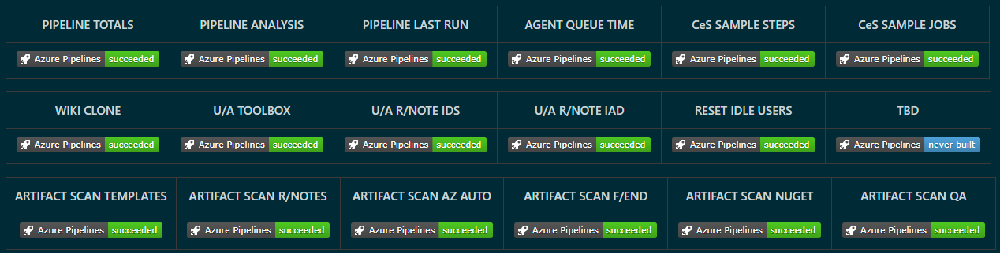
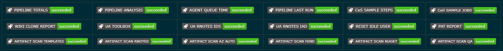

Title: Make your pipeline badges more compact and meaningful
Date: 2022-01-17
Category: Posts
Tags: azure-devops, eliminate-waste, pipelines, tips
Slug: pipelines-streamlined-approvals
Author: Willy-Peter Schaub
Summary: Tired of cluttering your dashboards with duplicated waste?

We have dashboards with multiple pipeline badges to keep an eye on our Azure DevOps pipelines. I often wondered why we cannot change the "Azure Pipelines" label to reduce the duplication (WASTE) and make our dashboards more compact.



Well, if you change ...

```
[](https://dev.azure.com/demo-org/demo-proj/_build/latest?definitionId=1818)
```

... to ...

```
[](https://dev.azure.com/demo-org/demo-proj/_build/latest?definitionId=1818)
```

... by adding by adding ```&label=<TEXT>```, you can enjoy a more compact version of your dashboard.



I stumbled over this tweak in a recent Azure DevOps community chat and realized that I must read the Azure DevOps REST API documentation a bit more carefully. See **URI Parameters** in [Status Get](https://docs.microsoft.com/en-us/rest/api/azure/devops/build/status/get?view=azure-devops-rest-6.0) and notice "_Replaces the default text on the left side of the badge._"

