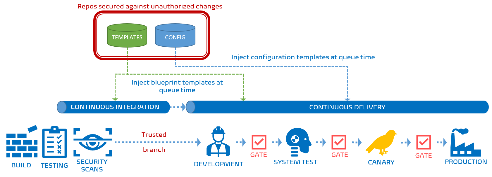
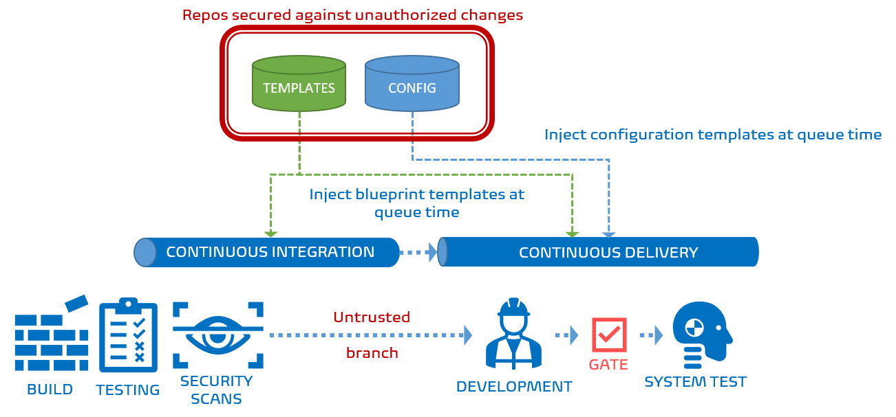
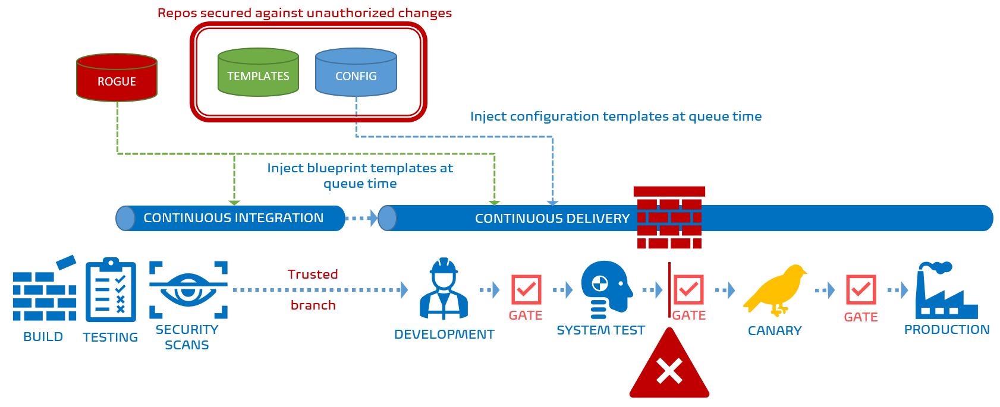
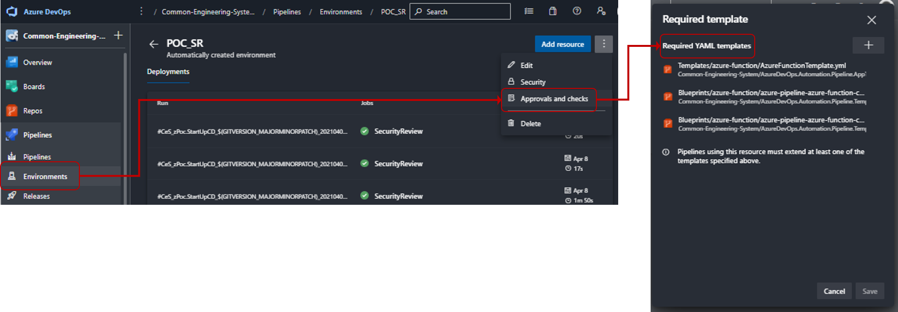

Title: Streamlining your pipeline using the magic of YAML-base Azure Pipelines
Date: 2021-11-09 13:13
Category: Posts
Tags: azure-devops, eliminate-waste, pipelines, tips
Slug: pipelines-streamlined-approvals-new-world
Author: Willy-Peter Schaub
Summary: Teleport to the future, to optimize the YAML-based Azure Pipeline approvals.

In the previous [Streamlining your pipeline approvals, without flooding DevSecOps with noise](/pipelines-streamlined-approvals.html) post we covered streamlined approvals and the magic and challenges of artifact filters. In essence, we discussed the Jurassic era of classic Azure Pipelines.


 In this post we will switch gears and compare it to the era of state-of-the-art YAML-based Azure Pipelines. 
 

 
 Most of the engineers I recently discussed this magic with, looked at me with the _"what are you talking about?!?"_ glazed look. 
 

 
 A really worrying trend, because the Microsoft [documentation](https://aka.ms/yaml) is comprehensive and the associated features amazing - hence this post.


# Goodbye Artifact Filter Issues

Using the YAML-based Azure Pipelines we implemented the same streamlined approvals as we discussed in [Streamlining your pipeline approvals, without flooding DevSecOps with noise](/pipelines-streamlined-approvals.html).



As shown above, the pipeline looks the same as the classic pipeline when the release artifact is created using one of the repository branches that are trusted for the Canary and Production environments.

If the source branch is untrusted, the pipeline looks different - in fact, everything after the system test environment is missing. 



```yml
# ------------------------------------------------------------------------------------------
# SECURITY REVIEW STAGE
# ------------------------------------------------------------------------------------------
- ${{ if or(eq(variables['Build.SourceBranch'], 'refs/heads/release'), startsWith(variables['Build.SourceBranch'], 'refs/heads/release/')) }}:
  - template: /Templates/DevSecOps/azure-pipeline-security-review.yml
```

The code extract reveals the simple trick. If the source originates from the **release** branch, we inject the Security review, Canary, and Production stages. If not, Azure DevOps ignores them while assembling the run-time pipeline. If they are missing, they cannot be overridden as is the case with artifact filters, even if you are an Azure DevOps god. Simple!

---

# Blocking untrusted templates

If you are working with Azure Pipelines I urge you to read [Create and target an environment](https://docs.microsoft.com/en-us/azure/devops/pipelines/process/environments?view=azure-devops) and [Define approvals and checks](https://docs.microsoft.com/en-us/azure/devops/pipelines/process/environments?view=azure-devops). It is standard reading material for our engineers.



As shown above, if one of more of the templates used by Azure DevOps when assembling the run-time pipeline, the environment check blocks the pipeline from trundling down the deployment chain. In this case you cannot override the template check. "You shall not pass" if you are using untrusted pipelines.

The magic in this case is the **extends** feature, as used in the following code extract:

```yml
extends:
  template: /Blueprints/azure-function/azure-pipeline-azure-function-control.yml@CeSTemplates
```

You configure the required templates in your **Environments**, under **Approvals and Checks**.



Read [josh-ops'](https://twitter.com/jjjettrain) blog post [Azure DevOps: Extends Template with Build and Deployment Templates](https://josh-ops.com/posts/extends-template/) for a great overview and example of using **extends**.

Right, if you are excited and interested in these YAML-based pipeline features, I recommend that you review our [Pipeline Series](/why-pipelines-part1.html) which delves deeper into the classic and new pipelines. If not, you are likely in the wrong movie.

