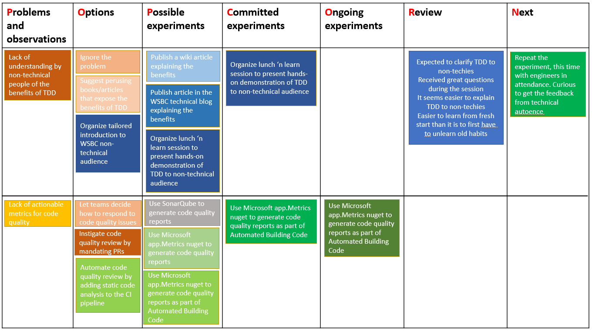

Title: Track work with POPCORN Flow
Date: 2021-09-16
Category: Posts
Tags: agile, quality, lean, engineering, innovation, learning
Slug: popcorn-flow
Author: Alex Bunardzic
Summary: Work challenges are opportunities to explore, experiment, and track the feedback gathered from the innovation

I love to visualize the work. It’s easy to do – all I need is a low tech/low rent board and some yellow sticky notes. Or, a simple, inexpensive whiteboard with erasable markers. Easy to acquire, easy to set up.

Yes, but what to put on the board? Ah, that’s where the real trick lies. Knowing what information to put on the board is oftentimes half the battle.

Different teams adopt different prescriptions on how to track the work using a board. Whatever the prescription, it always boils down to something simple – track the progress of work in time by starting from the left-hand side of the board until you reach the right-hand side of the board. Leftmost side implies nascent work; rightmost side implies completed work.

That’s easy, but what goes in the middle? That’s where various prescriptions propose various types of tracking. It is difficult to argue that one type of tracking is necessarily better than other types of tracking. At the end of the day, it mostly boils down to personal preferences.

## My preferred mode of tracking

I can only talk about my personal preferences, but I’m sure others will find something similar in the way they prefer to track the progress of work. To begin, I tend to perceive work as a response to challenges. Things change, and with the change we experience challenges. Taking those challenges on is a special skill because we don’t want to be caught in the situation where we are faced with chronic challenges. To avoid that trap, we must make the work that matters more visible. Still, without challenges we wouldn’t have anything to work on.

I like to start by adding a column to the board where I place problems and observations that come along the way. Once I pick the problem I plan to focus on, I move it to the next column to the right of the “Problems” column. I label that column “Options”. The problem that made its way into the Options column should be split into several possible options. It is unlikely that a problem is so simple that there is only one option available to solve it. Having options at our disposal is always a desirable thing.

We then choose one option that seems to promise the best outcome. We then move that option to the next column to the right; we label that column “Possible experiments”. Each experiment could be defined with three attributes:

1. Action: which action is the experiment proposing?
2. Duration: how long is the experiment expected to run?
3. Expectation: What is the expected desired outcome of the experiment?

From that position the work continues by picking one of the possible experiments and moving it to the next column to the right – “Committed experiments”.

Once the experiment gets committed, we move it to the next column to the right – “Ongoing experiments”.

The experiments selected to be worked on (i.e., the ongoing experiments), must obey the constraints of the Work in Progress (WiP) buffer. Small batches are de rigeur here. It’s best if at any point in time no more than a couple of experiments are being worked on. Because we strive to keep the WiP buffer as small as possible, there could be a number of committed experiments waiting for their turn in the "Committed experiments" column.

When the experiment is finished, it moves to the column to the right – “Review”. During the review, we ask some of the questions, such as:

- What did we expect to happen (i.e., the hypothesis)?
- What had actually happened?
- What did we learn?
- What opportunity do we perceive?

Based on the answers to the above questions, we now move to the next column to the right – “Next”. In this column, we try to answer the question:

- Based on what we learned, what do we need to learn next?

Which leads us back to the leftmost column – “Problems”. The work thus progresses smoothly from left to right.

## POPCORN Flow

The columns on our board, from left to right, are:

**P**roblems and observations

**O**ptions

**P**ossible experiments

**C**ommitted experiments

**O**ngoing experiments

**R**eview

**N**ext

Reading the capitalized letters, it spells **POPCORN**. So, we can call it the Popcorn Flow (a handy mnemonic to help us recall the correct order of the workflow; originally proposed by _Claudio Perrone_, a.k.a. _Agile Sensei_).

Why is this workflow useful? It comes from the recognition that the best way to respond to challenges is to collect feedback. Rather than formulating the solution to the challenges by working in isolation, it is better to face the challenges head-on and start getting feedback by experimenting.​​​​​​​
 
## An example

I will use my own example to illustrate the Popcorn Flow in the workflow board. For brevity, I will present only two problems (and in here I won’t include the experiment details):

1. Lack of understanding by non-technical people of the benefits of TDD
2. Lack of actionable metrics for code quality

 
The first problem was solved by entertaining three options:

1. Ignore the problem
2. Suggest some reading material
3. Organize a tailored presentation for the staff

After some deliberation with the team, option 3 was picked to be worked on, and it generated three possible experiments:

1. Publish a wiki article explaining the benefits
2. Publish article in the WSBC technical blog explaining the benefits
3. Organize lunch ‘n learn session to present hands-on demonstration of TDD to non-technical audience

Out of 3 proposed experiments, experiment #3 was picked and committed to work. Once the experiment was completed (i.e., the hands-on demo session was delivered), we performed the review (i.e., a retro, or Inspect and Adapt). From the review we examined the possibility of having the next learning opportunity.

The second problem was pulled in with #3 possible options:

1. Let teams decide how to respond to code quality issues
2. Instigate code quality review by mandating PRs
3. Automate code quality review by adding static code analysis to the CI pipeline

Option #3 was then pulled into the next column, where it generated 3 possible experiments:

1. Use SonarQube to generate code quality reports
2. Use Microsoft app.Metrics nuget to generate code quality reports
3. Use Microsoft app.Metrics nuget to generate code quality reports as part of Automated Building Code
​​​​​​​
Experiment #3 was then picked as committed work item, and it is ongoing at the time of writing this episode.

## Conclusion

Change comes with challenges. Those challenges present us with the opportunity to work. We practice picking our battles wisely and knowing when to cut our losses.

Visualizing the workflow is a helpful heuristic. There are many ways to visualize the progress of the work, but such visualization cannot help solving the problem. The problem can only be solved by experimenting and gathering feedback. After accomplishing that, we apply validated learning and obtain insights into what should be done next.