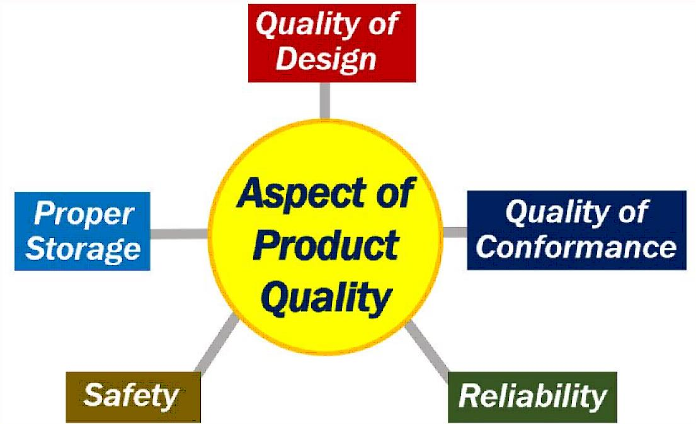

Title: Quality of Design 
Date: 2021-10-27
Category: Posts
Tags: design, code-quality, learning
Slug: quality-of-design
Author: Alex Bunardzic
Summary: Adopt design principles to ensure highest quality of the code design
  

Quality of design in software engineering is focused on the code structure. There are many ways to implement the desired behaviour of a software product. Careless implementation of desired behaviour delivers poor quality of design. Consequently, the quality of the delivery gets compromised.

It is therefore paramount to invest time and effort to ensure that quality of the designed code structure is optimal. There are two branches of industry standards that serve as guidelines when it comes to producing optimal quality of the designed code structure:

1. Design principles
1. Design patterns

Design patterns have been introduced more than 25 years ago ([Design Patterns: Elements of Reusable Object-Oriented Software](https://www.amazon.ca/Design-Patterns-Elements-Reusable-Object-Oriented/dp/0201633612/ref=sr_1_1?dchild=1&gclid=Cj0KCQjw8eOLBhC1ARIsAOzx5cH-0nZehpHbrYfJBmdgtJ5AAfU0wYOyyHk4LrPvKjNjmsHAy31fcO8aAlsVEALw_wcB&hvadid=353255290729&hvdev=c&hvlocphy=9001545&hvnetw=g&hvqmt=e&hvrand=362995041334244275&hvtargid=kwd-301036555631&hydadcr=26084_9772498&keywords=design+patterns+gang+of+four&qid=1635370689&sr=8-1), published in 1994). Most software engineers are by now familiar with many design patterns, which is a great improvement compared to earlier days of software engineering practices.

Design principles, on the other hand, are still not as widely accepted as design patterns are. Now may be a good time to pay a bit closer attention to what design principles mean and how to adopt them in our daily practice.

## What are design principles?

Organizing structural components of a software system should be following accepted industry standards. These standards comprise the body of design principles.

The standardized body of design principles has two levels of abstraction:

1. Coarse-grained design principles
1. Fine-grained design principles

Coarse-grained design principles are difficult to apply in daily practice because they are quite abstract. There are four coarse-grained design principles:

1. Low coupling
1. High cohesion
1. Low complexity
1. Proper encapsulation

Fine-grained design principles are less abstract and therefore easier to apply in daily practice. Adhering to fine-grained design principles ensures adherence to more abstract, coarse-grained design principles.

## What are the benefits of design principles?

Design principles are helpful in building common basis of architectural knowledge. By following guidelines on how to implement fine-grained design principles, software engineers get enabled to build, understand, and maintain high-quality software systems. Systems built following design principles can successfully grow into large scale systems. Following those principles is also helpful in preventing us from unforeseen pitfalls.

## An example of fine-grained design principle

An example of a fine-grained design principle may help understand the benefit of mastering those principles. For this exercise let’s have a quick look at **Option Operand Principle (OOP)**:

Every routine, method, or function operates on certain values. Those values are referred to as _operands_. Typically, operands make their way into the body of a routine, method, or function by being passed in as an argument, or a parameter. The OOP principle states:

> The argument of a routine should only include operands (no options).

What is meant by ‘option’ in the above principle? We can view option in two ways:

1. Option that the client calling the routine does not provide a value for the argument
1. Option that is passed in as an argument but is not treated as an argument

In the first case, the onus is on the creator of the routine to provide a default value that will kick in in case the client chooses not to provide the value (i.e., in case the argument contains NULL value).

In the second case, a value passed in as an argument is not being operated on by the routine. If the routine does not operate on a value passed in, that value is viewed as an option, not as an operand.

Both cases of violating the OOP principle are considered bad code smell, with the first case being viewed as a mild code smell while the second case a more serious case of bad code smell.

Providing default value for cases when the client chooses not to provide the value for an argument is a code smell because it places the onus on the routine to implement reasonable escape hatch (which may not always be easily achievable), while it may give the client code a false understanding of what to expect when calling the routine.

Providing an option when calling a routine places onus on the called routine to handle the decision logic. That responsibility is better left to the calling client; they need some processing done; they should possess sufficient understanding which routine to call.

## Detecting violations of the OOP principle

While it is very desirable to be able to automatically detect violations of this principle, in practice it is proving to be a tough challenge. Static code analyzers cannot easily distinguish between operands and options. The only time when it is possible to detect violations of this principle automatically and unambiguously is if the option type is Boolean. In such case it is obvious that Boolean argument serves to split the code into two paths and decide the mode of operation.

##Conclusion​​​​​​​

There are numerous design principles that guide us in producing high quality structure of a software product. Adhering to those principles protects us from various pitfalls and improves the overall quality and maintainability of our system. In this episode I’ve reviewed only one design principle, to provide a simple example and a foretaste of how those principles may apply in our daily practice.