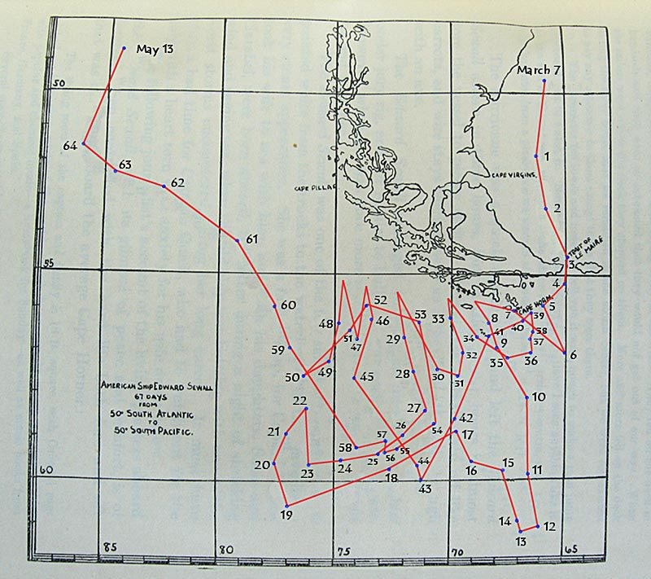

Title: Replace road maps with sea charts
Date: 2021-12-10
Category: Posts
Tags: strategy, planning
Slug: replace-roadmaps-with-seacharts
Author: Alex Bunardzic
Summary: Adopt more modest planning strategy by treating the journey as if sailing trecherous waters

Roadmaps are a familiar way to represent a strategic vision. We start from our current position, we then pinpoint our strategic goal/destination, and then map our projected journey by placing strategic milestones to be hit along the way.

Roadmaps are very useful in situations that are predictable and free of hazards. However, we live in the world that is not so predictable. The challenges are manifold, including global challenges such as the unpredictable pandemics, climate changes, economic turmoil, and so on. As our world is becoming more global and the blast radius of various changes keeps attaining ever wider reach, we are starting to recognize and acknowledge that we live in the so-called **VUCA** world.

## What is **VUCA**?
 
[**VUCA**](https://en.wikipedia.org/wiki/Volatility%2c_uncertainty%2c_complexity_and_ambiguity) is an acronym first used in 1987; it stands for:

1. **V**olatility
1. **U**ncertainty
1. **C**omplexity
1. **A**mbiguity

If we recognize and acknowledge that we operate inside such environment, we begin to realize that roadmaps are not that useful. For example, two years ago we may have mapped an ambitious roadmap which then got completely invalidated when the pandemic hit in March 2020. Less than a year ago we may have projected another roadmap that got perturbed by the unexpected regulation to provide paid sick leave for employees affected by COVID-19. And so on; examples of volatility and uncertainty abound.

## Why do roadmaps tend to be imprecise?
 
Roadmaps assume that all factors affecting the desired outcome are understood and managed. If we chart the direction, from our current position, to the desired destination, we feel we can draw a road leading from here to there. We also feel that the road is well paved, smooth, with clearly mapped pit stops, landmarks, and milestones.

In reality (as we’ve seen), **VUCA** interferes without asking for our opinion or for our permission. It doesn’t even give us the slightest hint of warning. Volatility seems to appear randomly, creating uncertainty, complexity, and ambiguity.

And because we’ve invested a lot of energy into producing the roadmap, the temptation to stick to it persists. We’d often rather ignore the warning signals around us than agree to cut our losses and ditch the precious roadmap.

That bias leads to imprecision. By continuing on the now invalidated roadmap, we run the risk of not hitting our desired destination, and instead finding ourselves in an unfamiliar territory.

When that happens, we need to act carefully. Here is an analogy: if we buy a car and sit down and drive around, after a while we may park somewhere, get out, and look around. If, at that point, we realize that we do not like the place where we’ve arrived, we should not invest in buying a new car. Instead, we should invest in making better plans that get us to the desired destination.
 
## Why are sea charts more realistic?
 
When sailing a boat across the sea, we are not restricted by the rails or by the paved roads. We are not even restricted by the dirt roads. The sea is wide open for exploring.

But the flexibility comes at a cost. Our sailing will be smooth if we catch the tail wind. But if we are counting and betting on the continuous presence of the tail wind, we’d be in for an unpleasant surprise. Because the weather conditions are volatile and unpredictable, we may experience head winds. Those types of winds are highly undesirable because they impede our progress by slowing us down and even pushing us off the planned course.

Knowing that, we are better equipped to deal with the **VUCA** situation. Yes, by agreeing to avoid charging ahead in the straight line we may appear to be losing track of our goals, but in reality we are rolling with the punches and making sure we persist in our efforts to reach our destination. That way, we never sacrifice the precision of our plans.