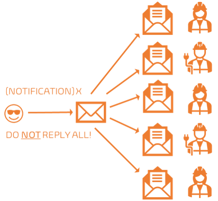

Title: Stop the email overload!
Date: 2022-05-27
Category: Posts
Tags: eliminate-waste
Slug: stop-the-email-hell
Author: Willy-Peter Schaub
Summary: Our quest to optimize email and associated WASTE

Email was born around 1978 and has been the backbone of communication ever since. Unfortunately, when you start to [track](/optimize-and-track-emails.html) your actual email volume or consider options to [optimize](/optimize-and-avoid-emails.html) after a well deserved vacation, you realize that enough is enough. Similar to [stop the meeting overload](/stop-the-meeting-hell.html) we will discuss strategies to optimize your use of email and reduce the amount of email and **WASTE** thereof.

**WHY**? Well, I receive an average of 154 emails per working day. I have time to read about 20%, skimming the rest as I context switch between meetings, work, and breaks. **NOT** efficient!

---

# A few email anti-patterns to avoid at all costs!

As discussed in [Navigating DevOps through Waterfalls](TBD), act 4 STORM - Building a better Boat, communication complexity becomes unproductive and **WASTE**ful as the number of members in the collaboration thread increases. Looking at the simple illustration above, it is evident that five or more members introduces duplication, split (separate) discussions, inherent quality issues, a flood of emails that impedes our productivity.

Let us look at some email practices you should avoid to drastically reduce the amount of collaboration **noise** for your colleagues.

## The duplicate and split email

When you send an email to a shared mailbox, as shown above, you may inadvertently send an email to Willy in his private mailbox and an email through the shared mailbox. 

A minor annoyance, but also an unfortunate opportunity to create a split in collaboration, or worse duplication of effort if the team reacts to the message in the shared mailbox and Willy to the message in his mailbox.

> **ASK #1** - **When addressing an email to a shared mailbox, do not add individual users of the same team!

## The planetary email

Avoid sending an email to hundreds of users using broad distribution lists without discouraging reply-all.

If only a fraction of recipients "reply all" you inadvertently create a brushfire of split collaboration threads and an inbox from hell for everyone. 

> **ASK #2** - Think twice before "replying all" to an email with one or more distribution lists.

## The meta morphed email

Recognize this type of email response? "_Thank you for your help. I have another question ..._" - completely unrelated to the email subject. 

Not only is this confusing but creates a major headache when searching for an email with the solution to the subsequent discussions months later. 

> **ASK #3** - Stick to the subject! 

## The empty subject email

It happens to all of us, but please try not to send an email with no subject.

Not only is it bad email etiquette, but it breaks email rules and workflow automation, forcing the recipient to read the email to get an idea of context and priority.

> **ASK #4** - Use meaningful and actionable email subjects.

## The fire and forget email

The last example is one that I have started to intentionally deprioritize, and I urge everyone to do the same. User encounters an issue, for example, user is unable to deploy latest release, and decides to send us an email to ask for help. For good measure user also loops in management, after which user disappears (coffee break, lunch, or end-of-day).

The result is a firestorm with everyone wanting to understand the issue, resolution, and status. Instead of focus on finding the root cause and a speedy remediation, we are shrouded by stress, context switching, duplication of effort, and a work:life imbalance that will taint any future vibrant collaboration.

---

# A few collaboration strategies that work for us

As a team, we looked at three options. (1) No more email, (2) less email, and (3) using different collaboration channels. We opted for a hybrid option, generating less email, and switching to Microsoft Teams for all our team internal and immediate stakeholder collaboration.

> **NOTE** - Some users love, some hate email. Some users love, some hate Teams. It is a personal preference - find the sweat spot for your **team**!

Here are three of our core collaboration guardrails.

## Use email for broad one-way notifications

Use email for broad notifications, clearly stipulating that recipient(s) should **not** reply-all.  

## Use email where process dictates

Use email where an existing process dictates the use of email or is optimized for the use of emails.

## Use teams collaboration for everything else

For everything else, use another collaboration channel, such as Microsoft Teams. 

Email promotes costly context switches. Send email, wait for response, switch context, focus on something else, response email notification, and another context switch is triggered. Interruptive, costly, and stressful!

In comparison Microsoft Teams gives use a cue if you are available, busy, or out of the office. Gone are the guessing days and impatiently waiting for a reply. Instead, we can ...

- Have a chat to exchange ideas, share video to add virtual (v) face to vFace social cues, and share our desktops or a virtual whiteboard to inject visual feedback.

> **TIP** - Use named Team Chats and Teams Channels to focus collaboration on a specific context and improve discoverability of shared content.

- Easily share files, data, and knowledge, stored on SharePoint.

> **TIP** - Share files by reference, not a copy thereof. This allows everyone part of the collaboration to revise and observe the content real-time.

- Search for discussions and content in one place. Gone are the days of brittle and time-consuming Outlook searches.

- Integrate Microsoft Teams with Microsoft PowerApps, Azure DevOps, and other 3rd party products, to create an efficient collaboration ecosystem that empower us to move forward **together**. 

Hope you enjoyed this quick chat. Good luck optimizing your [meetings](/stop-the-meeting-hell.html) and **collaboration** - focus on what is important!