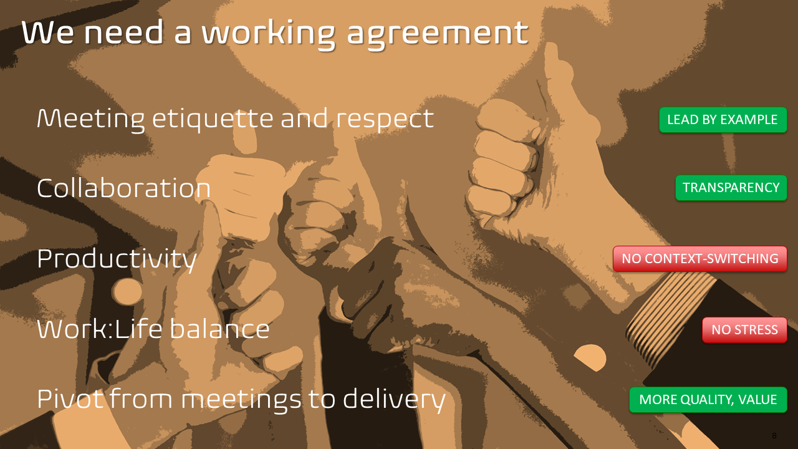

Title: Stop the meeting overload!
Date: 20212-03-09
Category: Posts
Tags: eliminate-waste
Slug: stop-the-meeting-hell
Author: Willy-Peter Schaub
Summary: My personal crusade to optimize meetings and associated WASTE

Thank you for the opportunity to collaborate on a very important topic, that will help us raise productivity and lower stress … as well as errors caused by excessive context switching.

To start, I would like to get rid of my pet peeve of our new remote and video conferencing era. No-one with a healthy meeting etiquette would barge into the following meeting environment to ask you to join another meeting. 

Correct?

Then why are we using the worst Microsoft Teams feature to call a colleague who is busy in another scheduled event to join your meeting?

This context switching and causes interruptions for all … be right back … Willy what do you think … Willy? … back … What did I miss? These interruptions drive me insane. 

For the person being teleported out of the meeting it means a context switch … and I, for example, start making mistakes and forgetting things when I battered by context switching.

Back to the actual topic … can we stop the meeting madness? So, what is the actual problem?

We must choose whether we want to improve productivity and balance work:life, or continue the multi-tasking, context-switching overload. 

The choice is yours … my team and I are taking the right turn!

Here are a few examples of OUR calendars … on a good day. 

Let us look at one and spot the challenges.

Looking at this example we will notice a few things.

1. We have back-to-back meetings. Context-switching hell, with few opportunities to take a break.
2. Double and triple booked meetings … how many clones of me are you expecting to join your meetings?
3. Meetings booked after working hours ... unthought of in the days of people walking out of the office to catch their last bus.
4. Everyone is working extra hours to try to catch-up with their commitments.

This person spend most of the day going from meeting to meeting without a break. That is not healthy and NOT sustainable. 

In our regular stress-o-meter polls the feedback clearly points to one worrying outcome of this madness, namely “STRESS”.

However, the eye of the storm is not just the number of meetings, but the quality of our meetings.

As per our team working agreement, we are trying hard to …

- Finish meetings 5-minutes early, instead of bleeding into other meetings.
- Have a meeting free Friday, by blocking our Friday and, by not scheduling meetings on a Friday.
- If there is no agenda, purpose, or we add or receive no value, we eject ourselves from the meeting.
- We expand all three lettered acronyms when speaking to ensure we create no time wasting confusion.
- Conclude every meeting with actionable notes.

In addition, I have asked my team to block out their lunch hours and decline double bookings to reduce the context switching and associated stress. In terms of double bookings, I am not referring to meetings we have not committed to, but keep in our calendars for reference, but instead to an ask or expectation to commit to be in two calls at the same time.

In my humble opinion, we need an organizational working agreement, which:

- Encourages a respectful meeting etiquette that raises the quality and reduces the number of meetings
- Fosters collaboration
- Focuses on productivity
- Enables a healthy work:life balance
- Pivots our culture from ”just another meeting” to collaboration, leadership, and delivery

Thank you for listening. Thoughts? Questions?

