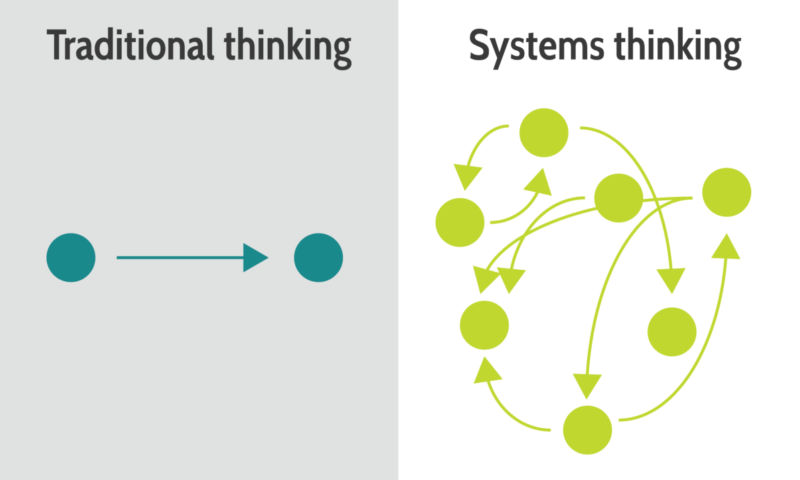

Title: Systems thinking
Date: 2021-08-25
Category: Posts
Tags: automation, eliminate-waste, agile, learning, quality, engineering, learning, architecture
Slug: systems-thinking
Author: Alex Bunardzic
Summary: Switch focus from monitoring and measuring activities and outputs to measuring outcomes

As software creation profession keeps maturing, our focus seems to be shifting toward systems thinking. For the better part of my career, I was working in environments where the main focus was on measuring _activities_ and _outputs_. I was always expected to take orders and then provide estimates in terms of how much activity is needed to fulfill given order.

Then, once the estimates got firmed up, I’d engage in software creation activities which were tracked using task tracking tools (the most ubiquitous being Atlassian Jira). The measure of success was not only in meeting those estimated and projected deadlines, but also in producing visible and measurable outputs.

With continuous maturing of our profession, we’ve witnessed the shift in the focus regarding which outputs get measured. In the early, low maturity days, our productivity used to be measured by the lines of code written in a unit of time (per day, or per week, or per month). Then we started noticing that while functionality is an asset, code isn’t an asset. More likely, code is a liability. Understanding that fact, we stopped measuring number of lines of code written in a unit of time (and in some organization we switched from saying ‘number of lines of code written’ to saying ‘number of lines of code wasted’). Code is a liability because it needs to be tested (waste), it needs to be maintained (waste), it needs to eventually be decommissioned (waste).

Once we abandoned measuring the outputs by counting the lines of code wasted, we switched our focus to other easily measurable outputs. Things like number of commits per unit of time, number of Pull Requests per unit of time, number of user stories delivered per unit of time, number of bugs fixed per unit of time, and so on.

## Activities and outputs are not telling us much

The shift in the mindset started occurring when teams began to realize that measuring the activities and outputs isn’t really telling us anything about the health of the business, other than that the staff is keeping busy. We need another set of metrics to help us gauge the level of success of our business operations.

While it is very easy to monitor and measure above-described activities and then summarize them in a neatly presented set of outputs, we cannot use those quantifiable metrics and view them as a measure of quality. We could say that the team had delivered 25% more story points this iteration compared to the previous iteration, for example, but that fact alone isn’t telling us much about the story points delivery contribution to the success of our business operations. We could use the process of monitoring team activities and measuring team outputs to estimate team velocity, for example, but that velocity has little or no correlation to how viable overall operation of the business is. Yes, maybe we’re noticing that the team is picking up the velocity, but the question is: velocity of what? Maybe the team is increasing the velocity in producing bugs and defects (which is never desirable).

## Switching from ‘how?’ and ‘what?’ to ‘why?’

Processes of monitoring team activities and measuring team outputs are closely related to questions such as “how are we to create something?” and “what do we need to create?” But a much more important question is “why are we spending time creating something?”

Any activity on the job must be justified by having a clear answer to the question “why are we doing this?” There must be a clear business case that sponsors any activity that spends company’s time, resources, good will, etc. How do we go about formulating that sponsorship?

A useful vehicle seems to be the concept of a user story. A succinct three-liner, each user story begins with a role (first line) that desires some functionality (second line), and then justifies that desire (third line).

Third line in a user story is the most important line. It presents the business case. If the third line is not clear and convincing, we have no valid reason to pursue the opportunity to implement the proposed user story.

Third line in a user story helps us make a switch from thinking about activities and outputs to thinking about outcomes. Outcomes talk about the benefits of introducing the change into our operations. If there are no measurable benefits of the proposed change, it really makes no sense to waste time, effort, money, and other resources.

## Systems thinking is based on outcomes

As any chain is as strong as is its weakest link and as any organization is as fast as its slowest department, in a similar vein our system is as powerful as are the outcomes of its operations.

We may disregard the ‘big picture’ systems thinking in the pursuit of a more efficient optimization of some process that feeds the business operation. But such optimization will be wasteful. It’s of little (actually, it’s of no use) to optimize the performance of one process in the organization if some other process remains a bottleneck. Creating proverbial log jams is a surefire way to harm the business operations.

It is therefore necessary to think in terms of outcomes. If, for example, the outcome of the situation where an injured worker’s claim got approved is to release the financial compensation, it’s of little use if the claims approval process is seamless unless the financial transaction also happens seamlessly.

For such outcome to happen, we must pay attention to the entire system, end-to-end. We should pay special attention to identifying bottlenecks that are slowing us down, or sometimes even bringing everything to a grinding halt. Our customers only experience the outcomes of our complex business operations, and it’s no use apologizing to the frustrated customers by explaining to them how most parts of our system work flawlessly, only a few glitchy ones are making things difficult. Customers don’t care, and they shouldn’t care.

## How to ensure desired outcomes

It’s easy to switch from monitoring and measuring activities and outputs and to pay full attention to outcomes: switch the focus from measuring individual productivity to measuring team productivity. None of the outcomes could ever be accomplished by a single individual. It is teamwork, and teamwork alone that delivers desired outcomes. Self-organizing teams are necessary for ensuring continuous delivery of desired outcomes. And for that to happen, it is necessary to adopt systems thinking.