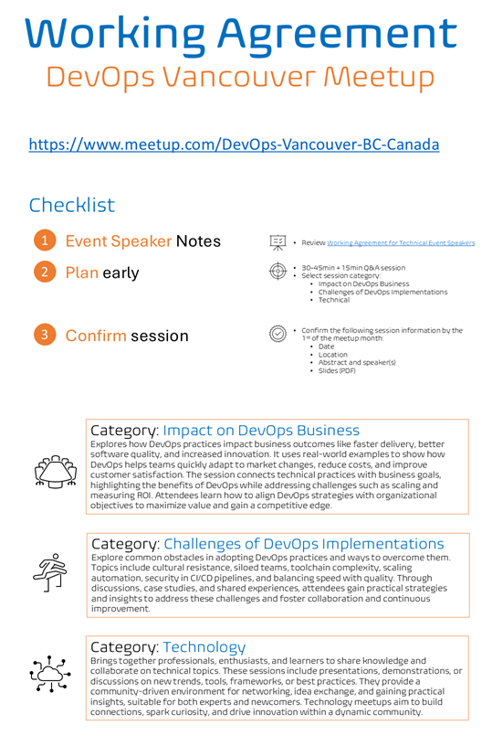
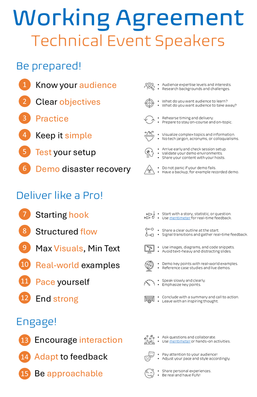
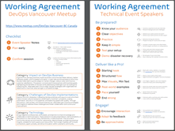

Title: Working Agreement for Technical Event Speakers
Date: 2024-11-27
Category: Posts 
Tags: event, learning, posters
Slug: technical-event-speakers
Author: Willy-Peter Schaub
Summary: Tips and tricks for preparing as a technical event speaker, from preparing your message to engaging your audience effectively.

Preparing for a technical community event, such as the [DevOps Vancouver meetup](https://www.meetup.com/DevOps-Vancouver-BC-Canada), is essential to deliver an impactful message. A well-prepared speaker builds credibility and trust, ensuring the presentation is relevant and engaging. This preparation boosts confidence, allows for smoother delivery, and respects the audience's time.

>  

Engaging your audience with relatable examples, storytelling, or questions encourages learning and idea exchange. An engaged audience internalizes your message and provides valuable feedback. Whether you're sharing DevOps practices, lessons, or innovations, preparation makes your session memorable and beneficial for all.

---

# Tips for DevOps Vancouver Meetup

For the DevOps Meetup Vancouver, prepare a 30–45-minute presentation followed by a 15-minute Q&A to share insights and engage with the audience. For a technical session, select one of our three session categories:

- **Impact on DevOps Business** - Explores how DevOps practices impact business outcomes like faster delivery, better software quality, and increased innovation. It uses real-world examples to show how DevOps helps teams quickly adapt to market changes, reduce costs, and improve customer satisfaction. The session connects technical practices with business goals, highlighting the benefits of DevOps while addressing challenges such as scaling and measuring ROI. Attendees learn how to align DevOps strategies with organizational objectives to maximize value and gain a competitive edge.
- **Challenges of DevOps Implementations** - Explore common obstacles in adopting DevOps practices and ways to overcome them. Topics include cultural resistance, siloed teams, toolchain complexity, scaling automation, security in CI/CD pipelines, and balancing speed with quality. Through discussions, case studies, and shared experiences, attendees gain practical strategies and insights to address these challenges and foster collaboration and continuous improvement.
- **Technical Insights** - Brings together professionals, enthusiasts, and learners to share knowledge and collaborate on technical topics. These sessions include presentations, demonstrations, or discussions on new trends, tools, frameworks, or best practices. They provide a community-driven environment for networking, idea exchange, and gaining practical insights, suitable for both experts and newcomers. Technology meetups aim to build connections, spark curiosity, and drive innovation within a dynamic community.

> DevOps Vancouver Meetup
>
>  

To ensure a seamless event, confirm all session details by the first of the meetup month. This includes providing the date, location, session abstract, speaker details, and finalized slides in PDF format. Adhering to these guidelines ensures well-prepared sessions that deliver value to both attendees and organizers.

---

# Tips and Tricks for Technical Event Speakers

Preparation, content delivery, and audience engagement are key to a successful technical presentation. Tailor your content to your audience’s expertise and set clear objectives for a focused message. Practice and use visuals and storytelling to simplify complex topics. Test equipment and have backups for demos. Start with a hook, use real-world examples, and keep a clear structure. Engage your audience, adapt to feedback, and be authentic to create a memorable experience. This approach enhances learning and builds your credibility and confidence.

> Technical Speaker Tips
>
>  

As summarised on the working agreement cheat sheet, we recommend that you:

## Preparation

- **Know your audience** - Tailor content to their expertise. Research backgrounds if possible.
- **Clear objectives** - Clarify what you want them to learn or take away.
- **Practice** - Rehearse timing and delivery, but adapt based on audience feedback and reactions.
- **Keep it simple** - Use analogies, visuals, and storytelling for technical concepts.
- **Test your setup** - Check projector, microphone, and demo environments early.
- **Demo disaster recovery** - Have a backup plan like pre-recorded videos or screenshots.

---

## Content Delivery

- **Starting hook** - Use an intriguing story, statistic, or question.
- **Structured flow** - Follow a clear outline and use transitions.
- **Max visuals, min text** - Prefer visuals, diagrams, and code snippets for clarity.
- **Real-worlds examples** - Use real-world applications, live demos, or case studies.
- **Pace yourself** - Speak slowly, clearly, and avoid jargon unless explained.
- **End strong** - Conclude with a call to action, summary, or inspiring thought.

---

## Engagement

- **Encourage interaction** - Engage the audience with questions, polls, or activities. Using an interactive [mentimeter](https://www.mentimeter.com) poll, sharing its link on your slides, and using it to review audience feedback or vote on the next topic can effectively engage the audience.
- **Adapt to feedback** - Adjust your delivery based on audience feedback.
- **Be approachable** - Be genuine and relatable; use humor when appropriate.

---

Finally, stay open to questions and feedback, both during and after your talk. A technical meetup is as much about knowledge sharing as it is about building connections.

Have fun!

---

> Quick reference Working Agreements 
>
>  
>
> DOWNLOAD >> [PDF](/documents/technical-event-speakers.pdf)

---

