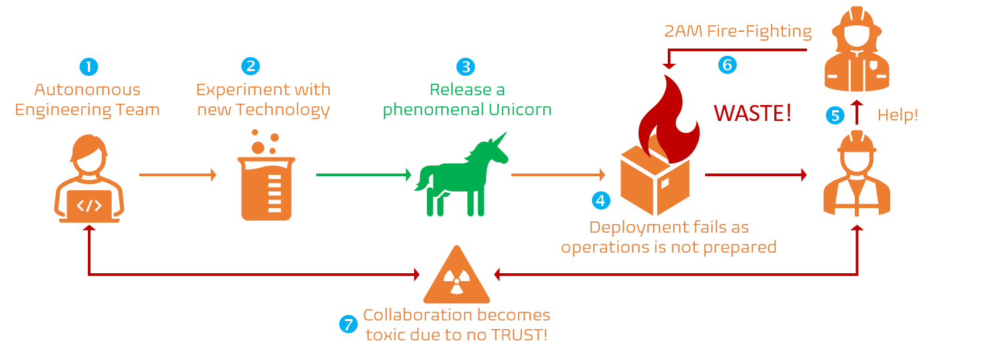

Title: Having a sound Technology Adoption Process is pivotal to innovation
Date: 20212-MM-DD 13:13
Category: Posts
Tags: architecture, devops, technical-excellence
Slug: technology-adoption-program
Author: Laurent Blain
Summary: Selecting a new process or product without surprising or blindsiding anyone.

> Co-author: [Willy Schaub](https://wsbctechnicalblog.github.io/author/willy-peter-schaub.html), from Common Engineering.

**Autonomous** teams have organizational latitude to establish their own internal goals and work practices. Combined with **Master** and **Purpose** these teams can be very effective, as outlined by Daniel Pink in [What Motivates Us](https://www.bing.com/videos/search?q=Drive%3a+The+Surprising+Truth+About+What+Motivates+Us).

> Figure 1 - The wrong way!
> 

Typical, but not recommended way for an autonomous team to acquire new processes and products:

1. Assume the right of self-organization and self-management.
2. Acquire processes or products in isolation.
3. Release the solution, using products unknown to the rest of the organization - a Unicorn.
4. The solution fails during deployment, or worse in production impacting end-users.
5. Operations are alerted, but ill-equipped to assist, as they are caught completely off-guard by the new technology used.
6. Infamous 2AM call is triggered, focused on determining and remediating the root cause, maintaining a customer-focus and value-first mindset.
7. Due to the isolated way the autonomous team operated, and the mystical Unicorn detected (too) late in the continuous delivery phase, the collaboration between development, operation, and other stakeholders becomes unproductive and toxic.

**Do you recognize this practice?** If yes, you are familiar with **WASTE**ful deployment delays, unexpected costs, and a frequent loss of **TRUST** between engineering teams.

---

# Why we need to do better!

To ensure that we can continuously deliver value to delighted end-users, we must find a better way.

> Figure 2 - The right way!
> 

1. Assume the right of self-organization and self-management but operate within organizational guardrails.
2. Acquire processes or products in collaboration with all stakeholders, such as architecture, operations, site reliability engineering, and [common engineering](https://wsbctechnicalblog.github.io/common-engineering-journal-2.html).
3. Release the solution, using known processes and products, operating within guardrails that ensure consistency, standardization, security, and simplicity.
4. Instead of dealing with 2AM calls, engineering can raise the awareness of the new processes and products, sharing the value with the rest of the organization through [dojos](https://wsbctechnicalblog.github.io/dojo-events.html) and [communities of practice](https://wsbctechnicalblog.github.io/ceremony-community-of-practice.html).
5. Likewise, [working groups](https://wsbctechnicalblog.github.io/ceremony-working-group.html) can be productive and preemptive, empowering engineering with re-usable blueprints to make the adoption of new processes and products simple.
6. Collaboration becomes vibrant, based on **TRUST**.

The core difference between the two ways of adopting new processes and products boils down to collaboration, trust, and guardrails that guide, not limit innovation.

---

# Technology Adoption Program (TAP) 

Enterprise Architecture introduced the Technology Adoption Program (TAP), as shown below, which guides us to adopt, asses, approve, and embrace new technology (processes and products). Instead of re-inventing the wheel, our Common Engineering Center of Enablement decided to base our process and product adoption program on the existing Technology Adoption Program (TAP) - **re-use**!

> Figure 3 - Technology Adoption Program (flow)
> 

The TAP lights up when combined with our common engineering ecosystem, in which the [centres of enablement](https://wsbctechnicalblog.github.io/ceremony-center-of-enablement.html) (CoE) provide thought leadership, vision, direction, guardrails, and sponsor vibrant and laser focused working groups to **ASSESS**, **TRIAL**, and **ADOPT** new technologies. Both the CoE and sponsored Working Groups are based on people from different disciplines, encouraging vibrant collaboration and awareness amongst all stakeholders.

> 
> **COLLABORATION FROM THE START** - we can ensure that new technology is supported by the innovation programs, such as pipeline blueprints and self-service, once organizational approval is received. This ensures that we can empower engineering to “hit the ground running” with new technologies.
>

By the time a process or product is approved, it is neither unknown, nor a mystical Unicorn. Instead, awareness and self-service automation programs are aware and supportive of the new technology, which not only enables and empowers engineering, but reduces **WASTE**.

---

How do you balance autonomy and standardization in your organization?

