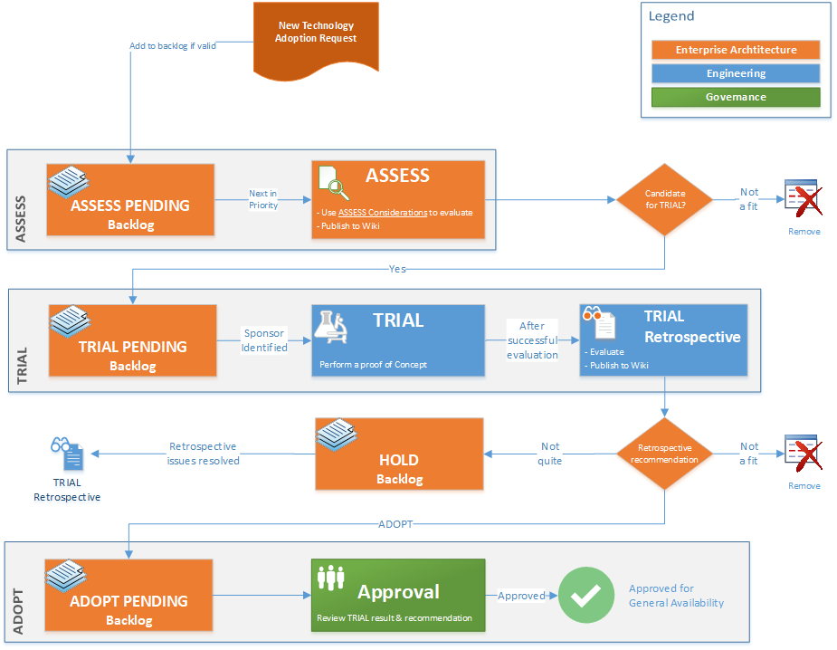

Title: Having a sound Technology Adoption Process is pivotal to innovation
Date: 20212-MM-DD 13:13
Category: Posts
Tags: architecture, devops, technical-excellence
Slug: technology-adoption-program
Author: Laurent Blain
Summary: Selecting a new process or product without surprising or blindsiding anyone.

> Co-author: [Willy Schaub](https://wsbctechnicalblog.github.io/author/willy-peter-schaub.html), from Common Engineering.

TBD @WRONG WAY EXAMPLE@

> Figure 1 - The wrong way!
> 

---

# Why we need to do better!

TBD

> Figure 2 - The right way!
> 

TBD

---

# Technology Adoption Program (TAP) 

TBD

> Figure 1 - Technology Adoption Program (flow)
> 

TBD

---

How do you balance autonomy and standardization in your organization?

