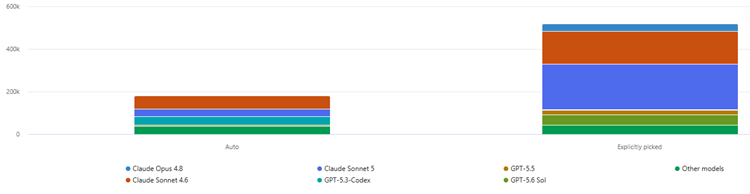

Title: Water Cooler Talk - GitHub Copilot Auto. Trust the Robot? Not So Fast.
Date: 2023-09-02
Category: Posts 
Tags: water-cooler
Slug: water-cooler-talk-github-copilot-auto-mode
Author: Willy-Peter Schaub
Summary: A recent watercooler conversation sparked a healthy debate around GitHub Copilot's Auto model selection capability.

> Reporting from our water cooler ...
>
>  

On paper, **Auto** sounds like the obvious choice. Let GitHub Copilot determine the best model for the task, optimise credit consumption, reduce unnecessary premium model usage, and remove one more decision from an engineer's day. GitHub positions Auto as an intelligent routing mechanism that balances task complexity, model capability, reliability, and efficiency.

>
> See [Supported AI models in GitHub Copilot](https://docs.github.com/en/copilot/reference/ai-models/supported-models) and [About Copilot auto model selection](https://docs.github.com/en/copilot/concepts/models/auto-model-selection) for more info.
>

Yet many engineers remain hesitant. The question is not whether Auto works. The question is whether we **trust** it enough to let go of the steering wheel.

# Why the Hesitation?

Engineers are problem-solvers.

We tune, optimise, configure, and continuously seek control over our environments. For many of us, manually selecting Claude, GPT, Gemini, or another model feels like making an informed engineering decision.

There is also history involved.

Most engineers have at least one story about a specific model delivering an exceptional outcome, helping solve a complex defect, generating a useful design, or identifying a solution nobody else considered. Those experiences create loyalty.

The result is predictable: "_I know Auto exists, but I would rather choose the model myself._"

That sentiment is both understandable and healthy. **Trust should be earned, not assumed.**

# What We Are Seeing

As AI credits become visible and accountable, model selection matters more than ever. Internal guidance has consistently highlighted model choice as one of the biggest drivers of GitHub Copilot consumption and recommends Auto as the default approach where appropriate.

The interesting observation is what our usage data appears to be telling us.

> While we have moved from **12%** to **18%** to **26.5%** for Auto share of credits over the past three months, we still have a way to go to reach the 80%+ Auto adoption that many of us expected. The data suggests that engineers are still not trusting Auto.
>
>  

But, what we are also seeing is that Auto is not simply selecting the cheapest available model.

When a task requires deeper reasoning, larger context windows, or more advanced analysis, Auto frequently selects the same families of premium models that many engineers would have chosen manually. When the task is relatively straightforward, it routes to more efficient models without requiring the engineer to make that decision themselves.

That is exactly what we should want. Use the right tool for the job. Not the most expensive tool for every job.

# The Real Opportunity

The bigger discussion is not about model selection. It is about stewardship.

Every organisation adopting Artificial Intelligence eventually reaches the same point. Initial excitement gives way to accountability. Usage grows. Costs become visible. Leadership starts asking questions.

The easy response is to focus on consumption. The better response is to focus on **value**.

The goal is not to minimise AI usage. The goal is to maximise **value** delivered for every AI credit consumed.

That means understanding when premium models genuinely create better outcomes and when they merely create larger invoices.

Are We Measuring the Wrong Things?

I increasingly worry that the industry is celebrating the wrong metrics.

In the past, we proudly reported:

- Lines of code generated
- Pull requests reviewed
- Prompts submitted
- Chats initiated

Those metrics are easy to collect. They are also largely meaningless. Nobody receives a promotion because an AI generated ten thousand lines of code. Nobody funds an initiative because an AI reviewed more pull requests. What matters is **value**.

Did Artificial Intelligence:

- Reduce delivery risk?
- Accelerate remediation of technology debt?
- Improve software quality?
- Shorten lead time?
- Reduce operational effort?
- Improve stakeholder experience?
- Avoid cost?
- Enable an engineer to solve a problem faster or better?

Those are the stories worth telling. Those are the outcomes leadership cares about. Those are the outcomes that justify continued investment.

# Share the Good, the Bad, and the Ugly

This is where we need **your help**. If you are using Auto model selection, share your experiences.

Add a comment to this post and tell us:

- Where Auto made the right decision.
- Where Auto surprised you.
- Where Auto saved credits without sacrificing quality.
- Where Auto selected a model you would never have chosen.
- Where Auto failed.
- Where manual model selection remains essential.

The intent is not to prove that Auto is perfect. The intent is to learn.

As engineers, we improve systems through evidence, feedback, experimentation, and transparency. The same applies to Artificial Intelligence.

If we want to get GitHub Copilot costs under control without reducing value, we need to understand what is actually working in the real world. Not the marketing slides or vendor promises.

Because the question we should be asking is not: "_How many lines of code did Artificial Intelligence write for us?_"

The question we should be asking is: "_Where did Artificial Intelligence help us deliver better outcomes?_"

That is the conversation worth having!

