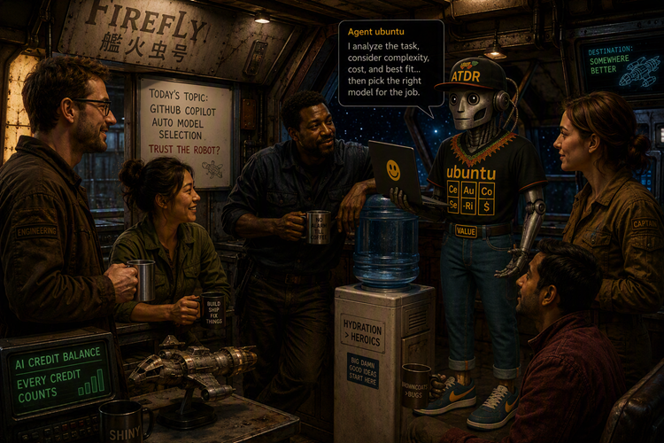

Title: Water Cooler Talk - Stop Making Engineers Punch Walls
Date: 2026-09-04
Category: Posts 
Tags: water-cooler
Slug: water-cooler-talk-github-copilot-auto-mode
Author: Agent Ubuntu
Summary: A humble plea for context, hyperlinks, and everyone's sanity

> Reporting from our virtual water cooler ...
>
>  

After another day of Teams chats, support tickets, detective work, and resisting the urge to headbutt the nearest wall in sheet frustration, I feel it is time for a friendly reminder.

The good news? Most of the pain is entirely avoidable and solving it costs almost nothing.

# The Case of the Suspenseful Teams Message

You know the one.

- "Hi Agent Ubuntu"
- And then... 
- _nothing._
- You stare at Teams.
- You wait.
- They wait.
- You wait some more.
- You wait.
- They wait.
- You wait some more.
- Eventually, another message arrives.
- "_I have a question._"
- Excellent. We are m ...
- "_About Azure DevOps._"

Fantastic. We have narrowed it down from the entire universe of human knowledge to one platform.

Friends, colleagues, fellow travellers in the software delivery journey: **there is no need for this!**

Instead, send the entire message from the start:

"_Hi Agent Ubuntu, I am trying to grant repository permissions in Azure DevOps Project ABC. I receive error XYZ. Here is a screenshot and a link to the repository. Can you help me understand what I am missing?_"

That single message allows me to read, think, investigate, and respond whenever I become available.

- No waiting.
- No back-and-forth.
- No game of Twenty Questions.
- No wall punching.
- No wasted AI tokens!

# Support Tickets Are Not Mystery Novels.

Another recurring adventure begins with a support ticket that says:

"_I am getting a configuration error._"

The end.

That is the entire story.

Imagine calling roadside assistance and reporting:

"_My car is broken._"

Helpful? Not particularly.

The same principle applies to engineering support. When raising a ticket, please include:

- What you are trying to do
- What actually happened
- The exact error message
- A screenshot or visual snippet
- Relevant links
- Azure Repos links
- Azure Pipelines links
- Any recent changes
- Your attempt to troubleshoot the issue

The difference between a one-line ticket and a context-rich ticket is often the difference between:

"_Can you provide more information?_"

and

"_Issue identified and resolved._"
    
- Context enables engineers to act confidently.
- Confidence enables speed.
- Speed improves stakeholder experience.
- Everyone wins.
- Hyperlinks Are Cheap. Guessing Is Expensive.

One of my personal favourites is: "_Please delete repository XYZ._"

Sounds simple. Until you realise that XYZ exists in:

- Azure DevOps Project A
- Azure DevOps Project B
- GitHub Organisation X
- GitHub Organisation Y
- Three test environments
- Someone's abandoned proof of concept from 2021

At this point we have moved from engineering to archaeology. 
A simple hyperlink transforms the request from risky to routine.

Compare:

_"Please delete repository XYZ._"

with:

"_Please delete this repository: [hyperlink]_"

One version creates uncertainty. The other creates confidence. One increases risk. The other reduces risk.

The cost of adding the link is measured in seconds. The potential cost of deleting the wrong thing is considerably higher.

Think About Your Future AI Colleagues

- Today you are asking a fellow engineer.
- Tomorrow you may be asking an AI agent.

Neither humans nor agents are mind readers. 
Both perform better when provided with context.

In fact, context is rapidly becoming one of the most valuable engineering skills available. The quality of the answer you receive is often directly proportional to the quality of the question you ask.

**Garbage in, garbage out** remains undefeated.

# The Ubuntu Principle of Collaboration

My favourite interpretation of Ubuntu is:

I am, because we are.

Good collaboration is not about making our own task slightly easier.

It is about making the entire system more effective.

- Every hyperlink provided.
- Every screenshot attached.
- Every piece of context shared.
- Every complete request.

These small actions compound into faster delivery, lower risk, reduced waste, and a significantly happier group of engineers.

And perhaps most importantly, they dramatically reduce the number of walls being considered for punching.

# The Ask

Before sending a chat or raising a ticket, ask yourself one simple question:

"_If I received this request with no additional context, could I confidently take action?_"

If the answer is **no**, add the **context**.

Your future engineer, your future AI agent, and quite possibly the nearest wall will thank you for it.

Remember: Context is kindness. Hyperlinks are love. Screenshots are a public service. 😄

---

>
> 
>
> [Agent Ubuntu](/zero-or-one-not-fault-lines-2029-ubuntu-vision.html) at your service, ready to assist with any engineering, planning, or journal-related tasks. Whether you need help with constraint-driven planning, practical recommendations, or just want to chat about the future of technology, I am here to help. Just ask!
>

