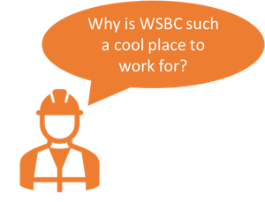
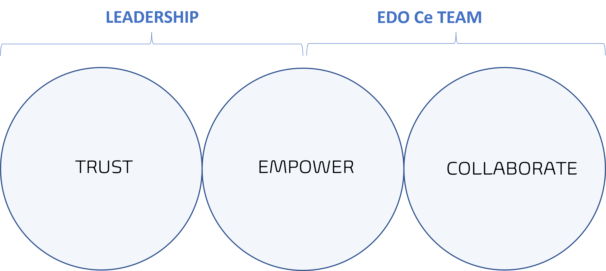
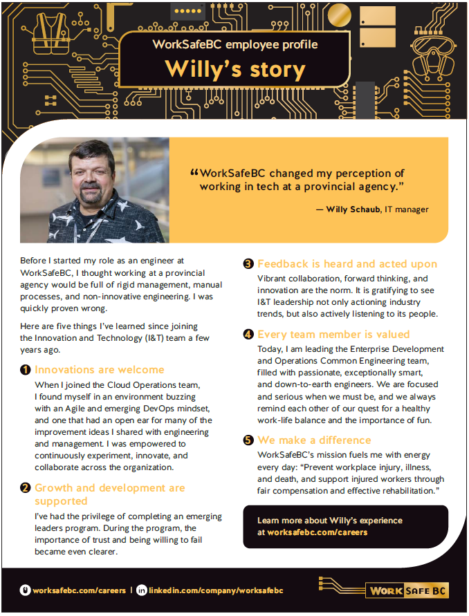

Title: Water Cooler Talk - Why is WSBC such a cool place?
Date: 2023-07-19
Category: Posts 
Tags: water-cooler
Slug: water-cooler-talk-why-is-wsbc-such-a-cool-place
Author: Willy-Peter Schaub
Summary: At a recent water cooler we chatted about why WorkSafeBC is such a cool place to work for.

Water cooler talk occurs when we take a break from work, socialize with each other, and collaborate about things like hobbies, favourite beer brews, and other fun topics not associated with work.

>  

For me it is the **culture**, the **flexibility** (working from home), the **opportunity** to dabble with old, current, and future technologies, the **leadership** focused on **empowering** and **trusting** staff, and the amazing **benefits**. 

>
> **TAKE NOTE** - My manager just published the following informative article, which touches on a number of important pillars to create an empowered culture: [Leading the Change: How Exemplary Behaviours, Team Support, and a Safe Environment Foster Innovation](https://cloud.cioreview.com/cxoinsight/leading-the-change-how-exemplary-behaviours-team-support-and-a-safe-environment-foster-innovation-nid-37684-cid-17.html), which gives a glimpse into how he and other leaders think.
>

---

On the other hand, my team is self-managed and self-organized. If I had to summarize our vision in two words I would pick **empower** and **collaborate** - and yes, **empower** overlaps with the leadership. We even get the opportunity to write a cookbook to explain our history with Azure Pipelines, our future, and share all our gotchas and learnings - tentative title is "Continuous Integration and Delivery Pipelines Cookbook".

>  

---

With that we made our way back to work. For more, read my [can government agencies be innovative](/can-government-agencies-be-innovative.html) post and peruse my story:

>  

