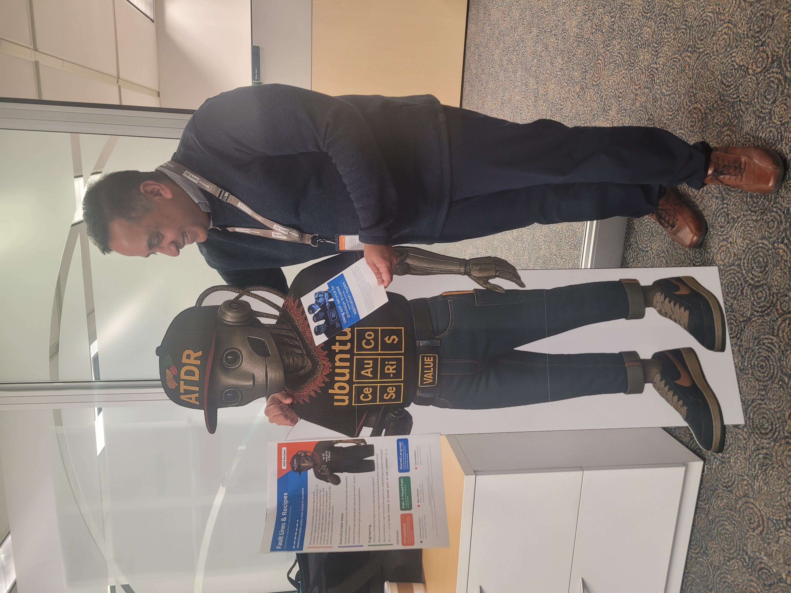

Title: Vis Joins the Paved Road
Date: 2026-04-17
Category: Posts 
Tags: automation, engineering
Slug: welcome-common-engineering-vis
Author: Vis Naidu
Summary: Starting a new journey with our engineering team and helping scale self‑service automation.

If you care about reducing delivery friction without sacrificing security or consistency, this post is for you: it follows Vis's first weeks in Common Engineering and uses that journey to unpack how our Self‑Service Automation (SSA) "bricks" accelerate teams on Azure DevOps today—plus what we are aiming for next with Self‑Service Kiosk v2 across ServiceNow, Terraform, and Ansible.

>  

# Interview and Selection

The Common Engineering team brings together experienced professionals across software development and operations. One of their flagship initiatives is a Self-Service Automation (SSA) solution that leverages *-as-code (eg. pipelines-as-code) patterns to rapidly provision standardized Azure DevOps repositories. These templates support common solution types such as .NET based Azure Functions and Web APIs and automatically scaffold build and release pipelines, enabling developers to move from idea to implementation in minutes rather than days.

I was fortunate to join this team following an engaging and collaborative interview process. As part of the interview, I was asked to design an SSA solution, walk through its architecture and flow, and discuss it interactively with the hiring manager, Willy, and team members Andreas and Derek. That experience made it clear this was not merely an "automation" role. Instead, the position offered opportunities to evolve an existing solution, contribute to the standardization of software delivery practices, and introduce thoughtful disruption where it could add value.

After being selected, I began my journey by deepening my understanding of *-as-code automation, supported by structured learning through Coursera. One course was instrumental: [Deployment and DevOps | Coursera](https://www.coursera.org/learn/deployment-and-devops?specialization=microsoft-back-end-developer). This course provided a comprehensive overview of DevOps principles and practices, with a particular focus on Microsoft technologies. It covered key topics such as continuous integration and continuous deployment (CI/CD), infrastructure-as-code, monitoring and logging, and the use of Microsoft Copilot to enhance development workflows. The practical exercises and real-world examples helped me quickly build relevant skills that I could apply in my new role.

This course is part of the eight course Microsoft Back End Developer Professional Certificate and covers system monitoring, continuous integration and deployment, debugging techniques, and practical use of Microsoft Copilot within the development workflow. I would recommend it to anyone looking to quickly build relevant DevOps expertise, whether at WorkSafeBC or elsewhere.

# Onboarding

The SSA solution did not emerge overnight. It is the result of years of research, experimentation, iteration, and feedback, vetted extensively with stakeholders across development, operations, and security. The outcome is a set of well defined blueprints ("bricks") associated with the various application types typically deployed within the organization.

To help me get up to speed during my first few weeks, Willy, who leads the Common Engineering (Ce) team, provided a thoughtful onboarding guide. By following this roadmap closely, I was able to meaningfully participate in technical discussions, attend cross team meetings, and quickly identify areas where I could start contributing.

A key part of the onboarding process involved completing a series of targeted training modules, known as "Dojos", modeled loosely on martial arts belt systems. For my role, earning the yellow and orange belts was sufficient to ensure that I could both walk the walk and talk the talk before engaging stakeholders on the next phase of the SSA solution.  This included recommended branch policies, naming guidelines to principles around SDLC, their Azure Pipeline Blueprints, and Ce team’s application of Paved Roads and Bricks within the SSA workflow.

In parallel, I had the opportunity to participate in an internal showcase highlighting the services and capabilities offered by teams across our department. Representing Common Engineering, we presented our focus areas and engaged with systems engineers, operations staff, and developers from multiple product teams.

These conversations revealed a recurring theme: "we don’t have time" or "the business isn't asking for this." While understandable, this mindset often undermines the long term value that solutions like SSA are designed to deliver. In practice, it can lead to higher defect rates, slower feature delivery, inconsistent architecture, support challenges, and mounting technical debt.

By contrast, the Common Engineering team embraces a continuous improvement mindset. Through standardized patterns, automation, and close collaboration with stakeholders, we reduce risk, improve developer and stakeholder experience, and significantly lower the total cost of ownership. This is the core value proposition of the team.

# Life Happens

Just as we were preparing to move into the next phase of the SSA initiative, I experienced a personal loss: my father passed away after a long struggle with his health. It required me to step away from work for a week at an especially inopportune time.  As my doctor often said, "Man makes plans, and God laughs."

# Self Service Kiosk v2

When I returned, still navigating the emotional weight of that loss, I was met with extraordinary support from my team. Beyond their professionalism, they demonstrated genuine empathy and humanity, helping me transition back into work at my own pace. I am deeply grateful for that support and feel incredibly fortunate to work in an environment where people are valued as individuals as whole, not just contributors.

Looking ahead, Willy and I are beginning stakeholder engagements to establish a shared "big picture" for the next evolution of the SSA platform, informally referred to as Self-Service Kiosk v2. This work will involve integrating multiple platforms and extending automation beyond Azure DevOps to include:

- Service management workflows through ServiceNow
- Infrastructure-as-code using Terraform
- Configuration management and orchestration with Ansible

The vision is to unify these capabilities into a cohesive, tightly integrated solution. While ambitious, the goal is achievable, and we are already seeing enthusiasm from partner teams eager to adopt similar patterns in their own domains—essentially taking a chapter from our engineering "cookbook" and adapting it to their needs.

More updates will follow as this project progresses. It promises to showcase how our team continues to operate at the leading edge of technology adoption within the public sector.

