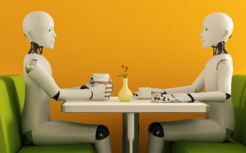

Title: What about ChatGPT?
Date: 2023.02.22
Category: Posts 
Tags: <COMMA SEPARATED LIST OF TAGS. See blog-post-101.md for allowed tags.>
Slug: what-about-chatgpt
Author: <Willy-Peter Schaub
Summary: A question that made me speechless at a recent Navigating the Future event.

A colleague asked a great question at a recent Navigating the Future event, which I answered with “I have no answer for you today.” To my defence, I was not feeling well at the time, had a cracking headache, and was therefore trying to hide in the audience. But … the reason I had no actionable answer was that I have been mulling over [ChatGPT]( https://openai.com/blog/chatgpt) and [OpenAI]( https://openai.com) for weeks, balancing a deep-rooted fear with respect for artificial intelligence. 

 
Fear as I am from the [HAL9000]( https://en.wikipedia.org/wiki/HAL_9000) and Terminator era where [SkyNet]( https://en.wikipedia.org/wiki/Skynet_(Terminator)) eventually took over control of our precious planet. The day machines develop self-awareness we are in serious trouble.

 
Respect as I programmed on the Intel 80186 processor, which had a 16-bit data width capable of addressing a phenomenal 65,536 bytes of memory. The magnitude of processing, memory space, and artificial intelligence we enjoy today makes engineers like a tad antiquated. 

 
> “I'm old but I'm not obsolete." Terminator, aka Arnold Schwarzenegger

---

# I loathe the dump chat bots

 
We have all experienced it. You spend hours reading static web pages from your favourite online marketplace, looking for ways to contact anyone to get help on a missing or damaged shipment. Eventually you are chatting to a machine that starts with the friendly “Hi, how can I help you?” After agonising and wasteful exchanges of information, the chat bot refers you back to the same pages you spend hours reading.

---

# Having a conversation with an intelligent bot sound appealing

 
What excites me about artificial intelligence is that we can turn the dialog with the machine into a meaningful conversation, making it possible for the machine to continuously learn, ask clarification questions, and investigate and formulate a detailed response in the background. Multi, continuous, repetitive, and context switching tasking is no problem for our binary companions.

I dream of a common engineering bot that can be the friendly onboarding buddy, an engineer’s patient wingman, and the first point contact for all technical and operational support. If anyone wants to raise this as an idea for the upcoming InnoFest / Hackathon, then you have both by vote and support! 

We will have an uphill battle to convince our legal, freedom of information and protection of privacy act, and especially our security team, but having a conversation with an intelligent bot makes it all worth it. 

---

# AI <> Humanoid

While many are scared that machines will take over our planet, we can rest assured that a machine will never be able to replace a human. Machines will never be able to demonstrate **empathy** or **passion**. 

---

I hope that artificial intelligence is based in Azimov’s Laws of robotics

1.	The robot shall not harm human or, by inaction allow a human to come to harm. 
2.	The robot shall obey any instructions given to it by humans. 
3.	The robot shall avoid actions or situations which could cause it to come to harm itself.

Let me ask my son, Thorsten who studied psychology, to review my post and share his thoughts on ChatGPT, OpenAI, and the rise of artificial intelligence. Handing the keyboard to T.

---

# Closing thoughts by [(T)horsten]( https://twitter.com/tschaub18)

TBD

