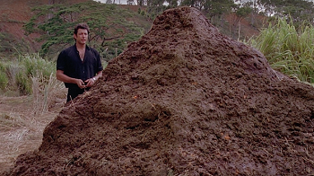
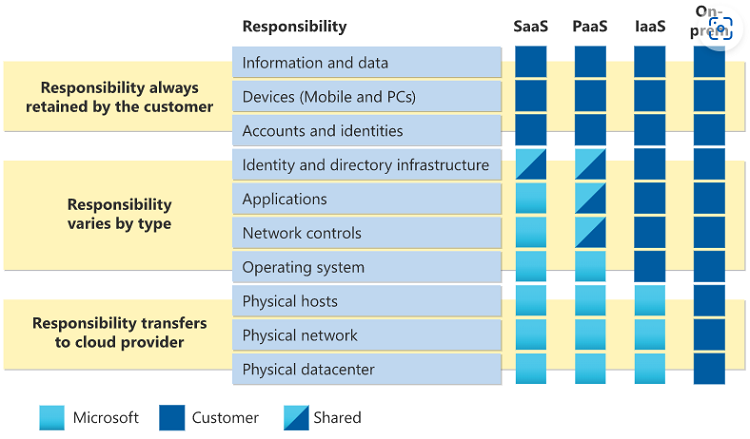
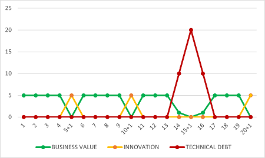
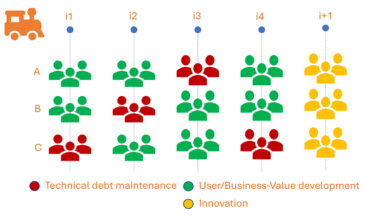
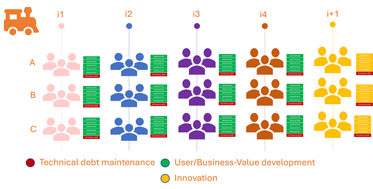
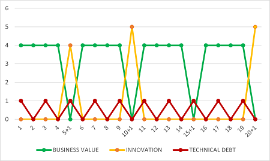

Title: What keeps us awake at night - Technical Debt
Date: 2023-04-12
Category: Posts 
Tags: azure, azure-devops, eliminate-waste
Slug: what-keeps-us-awake-at-night-patching
Author: Willy-Peter Schaub
Summary: Empower engineering without compromising security

The obvious question that comes mind is: "**What is technical debt?**" I asked [ChatGPT](https://chat.openai.com/chat) and got the following response: "_Technical debt is a term used in software development to describe the additional work required to maintain and update a codebase developed using suboptimal practices. It can occur due to factors such as tight deadlines or the use of quick-and-dirty coding practices that prioritize speed over code quality and maintainability. Technical debt can result in higher long-term costs and slower development, limiting the ability of the software to adapt to changing business needs. Therefore, it is important to manage and minimize technical debt to reduce risks and ensure the sustainability of software development projects._"

In a continued conversation another important nugget emerged from [ChatGPT](https://chat.openai.com/chat): "_Technical debt is typically considered to be self-imposed._"

Personally, I agree with all of the above, but have a very specific visual that pops up in my mind whenever I am part of a discussion where technical debt raises its ugly head:

> 
> Source [Jurassic Park](https://www.pastemagazine.com/movies/jurassic-park/the-12-best-quotes-from-jurassic-park)

I am currently having sleepless nights with technical debt in two areas.

---

# Toxic server debt

The first is the iron, the servers, that host the outcome of our software development. 

> 
> Image Source: [Shared responsibility in the cloud](https://learn.microsoft.com/en-us/azure/security/fundamentals/shared-responsibility) 

The image, I loaned from a Microsoft article, clearly shows that we are accountable for our servers and that we take responsibility to keep them up-to-date and secure. As we move to platform-as-a-service (PaaS) or software-as-a-service (SaaS) we delegate the accountability to the hosting vendor.

This area will be covered in a future post by one of our operations-focused engineers, but it is worth mentioning my personal checklist:

- Use **SaaS** where you can. Someone else is accountable for solution and hosting infrastructure.
- Use **PaaS** for custom built solutions. Someone else is accountable for hosting infrastructure.
- Perform continuous patching and upgrading of frameworks in **IaaS** and **on-prem**. You are responsible!

Now for the second area.

---

# Turbulent application WASTE

We intentionally and unintentionally gather WASTE, vulnerabilities, and technical debt in with our software development solutions when using 3rd-party frameworks, extensions, or services. We have to adapt to a dynamic and continuously evolving world. 

For example, when using the .NET framework, we need a strategy to understand which versions are supported, which versions we recommend as an organization, and how we upgrade hundred to thousands of solutions.

The strategy could guide us as follows:

- Support latest and latest - 1 versions of .NET.
- Upgrade the hosting servers you own, accordingly.
- Upgrade the solutions you own, accordingly.
- Do it as soon as possible. If you make a conscious decision to defer the upgrade, you have just made your pile of technical debt grow.

> **FOCUS ON TECHNICAL DEBT**
>
> - Too **much** - unable to deliver continuous new value to your customers.
> - Too **little** - unable to deliver new value to your customers when your solutions drown in WASTE. In addition, you will create STRESS and eventually BURNOUT your engineers during ad-hoc remediation spikes.

## Option 1 - Reactive housekeeping

I do not support the reactive **spikes** of remediating vulnerabilities and reducing technical debt remediation. It makes no sense!

> 

Note that the deliver of value is drastically reduced over three iterations. NOT a customer friendly experience!

## Option 2 - Rotate housekeeping accountability

If you have Agile Teams within an ART Flow, you could rotate the housekeeping baton and associated accountability between the teams. 

> 

As shown, each team in the Agile Flow will focus on housekeeping for an iteration, followed by one or more iterations of delivering business features and value. During an innovation and planning iteration, also known as a +1, all teams would park new features and housekeeping, and focus on innovation.

> **IMPORTANT**
> Sustainment, maintenance, and housekeeping is something that should be part of every engineer's responsibility, similar to built-in quality. Avoid creating sustainment-only teams - most engineers will otherwise avoid it like the plague.
>  

**PROS**

- Accountability and responsibility of housekeeping is **shared**.
- Overall, the ART Flow delivers a **continuous flow** of business and innovation value.

**CONS**

- Focus of housekeeping in an iteration is focused only on the Agile team's technical debt.
- Other teams may skip housekeeping for 2 or more consecutive iterations.

## Option 3 - Continuous housekeeping (my personal recommendation)

Alternatively, every Agile team in every Agile Flow can commit to one, two, or more items from their technical debt backlog, or commit to a predefined percentage of capacity dedicated to housekeeping activities, in parallel to delivering new features and value.

> 

As shown above, the **tax** on each team is minimal and there are no costly and disruptive remediation spikes. As shown below there is a continuous flow of innovation and business value - Agile Team and customer FRIENDLY experience!

> 

**PROS**

- Continuous flow of value.
- Continuous reduction of WASTE.
- Ability to plan and budget for the housekeeping.
- Cannot think of a CON q;-)

---

## Continuous vacuum cleaning!

I compare the continuous housekeeping to vacuuming our float home. If everyone in my family owns a chore and I do vacuuming on a regular weekly cadence, I typically spend 45-60 minutes collecting dust. If I ignore my responsibilities, I have to spend hours cleaning, often at the most inopportune time.

I favour the former, because I can plan it and it only briefly distracts me from more interesting tasks, such as watching the Formula One grand-prix, or writing these posts.

How are you dealing with technical debt? What are your learnings? Your pain points?

