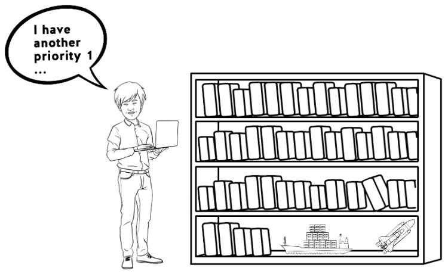
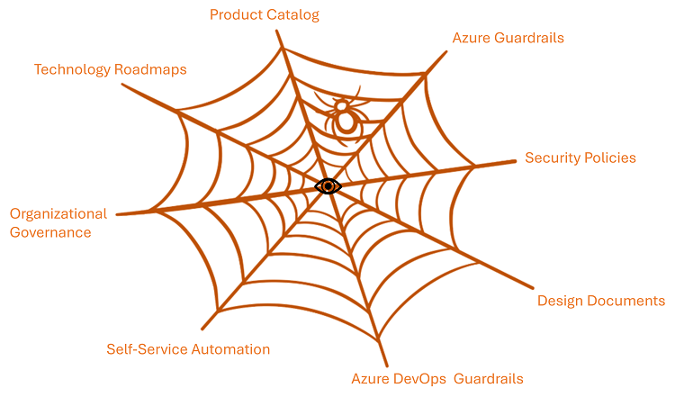

Title: Why bother with governance?
Date: 2023-04-28
Category: Posts 
Tags: engineering, quality, learning
Slug: why-bother-with-governance
Author: Willy-Peter Schaub
Summary: Why bother with governance when no-one can find it?

I will not waste your time with the **why** and **what** of governance, guardrails, policies, and standards have been covered in [Servant stewardship of guardrails](/servant-stewardship-of-guardrails.html) and [Can we enact governance through engineering-friendly manifestos and guardrails](/governance-manifestos-guardrails.html). Instead, I want us to have a discussion as to why it is so difficult to encourage engineering to remain within guardrails, to collaborate to make improvements, and to steward the guardrails that intend to keep us all from danger.  

---

## Why care about something I cannot find

Picture the typical software engineering team at their planning event. A quick visit by the business owner to describe the current state and vision. Product management presents needed features to deliver value and delight the end-users. Last, but not least, the schedule and priorities.

>  

After the buzz and dust settles, the software engineering team is left with what they perceive as another priority #1 and the sinking-feeling of more late nights and troubleshooting weekends.

At the water cooler the team chatter starts.

- _What is the recommended architecture for this solution?_
- _Should we use .NET 6 or 8?_ 
- _Go with Angular or Blazer?_
- _Can we use self-service automation to get us started quicker within the guardrails?_ 
- _Are there re-usable packages or bricks we can/must use?_ 
- _..._

If the typical engineer cannot get these and other questions answered within minutes, they will proceed with what and how they know best ... which may not be aligned with your drive for consistency and standardization, guardrails, and organizational governance.

>
> **TIP** - Whether you have some, lots, or too much automation, guidance, and governance is not the question. **Awareness** and **Discoverability** thereof is the key!
>

---

## Step 1 - Create a one-stop-shop, the eye of the spiderweb

>  

### Create one-stop-shop

The first step is to use products you have to create a one-stop-shop, where you can find pointers to all the information needed by a predefined persona. In our case we used SharePoint 365 (product) to create a one-stop portal that serves our software development engineers (persona).

>  

It serves as an index to content related to collaboration centers, contacts, decisions, guardrails, presentations, processes, product catalog, reports, technology road maps, and tons of other materials, in a platter of formats.

>  

### Raise awareness and gather candid feedback

Next challenge is to ensure everyone either tattoos the one-stop-shop URL on their forearm or remember it whenever they are looking for information. Something we are trying to achieve by continuously mentioning the site and the need for candid feedback - we can only continuously improve the one-stop-shop site if everyone tells us what is lacking and ideas how to improve the site.

### Conversational discovery

Here is a snippet of our one-stop shop so far:

>  

But, even the best one-stop-shop is not a user-friendly or productive solution. What is missing is the opportunity to have a discussion with a person or a conversation with an intelligent bot to discover relevant information for the task or problem at hand, without having to spend hours looking for the right information.

---

## Step 2 - next time

>  

In the next post we will chat about Step 2, evaluating Open AI technology at the InnoFest to supplement the one-stop-shop to improve awareness and discoverability through conversation.

