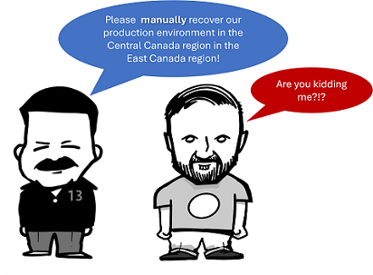
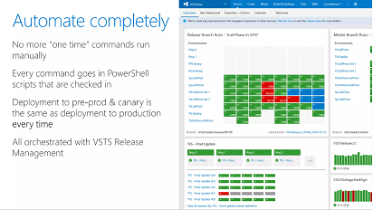

Title: Why do we care about infrastrucure-as-code (IaC)?
Date: 2024-08-02
Category: Posts 
Tags: azure, azure-devops, pipelines
Slug: why-we-care-about-iac
Author: Willy-Peter Schaub
Summary: Our vision is *aC, but to avoid boiling the ocean, we will focus on an overview on IaC today.

Microsoft Azure has a great definition of [infrastructure as code (IaC)](https://learn.microsoft.com/en-us/devops/deliver/what-is-infrastructure-as-code) - "_Infrastructure as code (IaC) uses DevOps methodology and versioning with a descriptive model to define and deploy infrastructure, such as networks, virtual machines, load balancers, and connection topologies. Just as the same source code always generates the same binary, an IaC model generates the same environment every time it deploys._"

As highlighted in the above definition, one of the main goals of IaC is to bring the benefits of software development practices, such as version control, code reuse, and automation, to the infrastructure provisioning and management process. It makes it **easier** to maintain, collaborate, and **scale** infrastructure resources **efficiently** and **consistently**.

Have you ever found yourself in a situation where you needed to manually provision infrastructure identical to what was set up 6 months ago by an engineer? Perhaps, in an emergency scenario like disaster recovery? 

>  

If you have, then you are likely familiar with the frustrating experience of encountering **inconsistent** results and the significant **time wasted** on searching for documentation, consulting subject matter experts, and tediously executing repetitive tasks. 

To streamline the process and avoid such challenges, embracing IaC can be a game-changer. Our digital friends can swiftly recreate infrastructure consistently, quickly, and repetitvely, especially during critical situations like disaster recovery or disruptive context switching.

As I look back, I fondly remember hosting a presentation at the [devconf](https:/www.devconf.co.za) conference in South Africa back in 2018. The topic of the talk was [Moving 75,000 Microsofties to DevOps with Visual Studio Team Services](https://www.slideshare.net/VSTSCommunityMicroso/moving-75000-microsofties-to-devops-with-visual-studio-team-services), and it was an incredible opportunity to share the valuable insights and lessons we had learned.

During the presentation, there was one particular slide that stood out, capturing the essence of IaC.

>  

Fast forwarding to 2023, it becomes evident that Infrastructure as Code (IaC) is far from a novel concept!

---

# Why is IaC important to us?

Why is our Enterprise DevOps (EDO) group exploring Infrastructure as Code (IaC)? The answer is clear - we aim to streamline the provisioning and maintenance of our infrastructure, enhancing factors like consistency, standardization, maintainability, and security. By embracing IaC, we seek to make these processes significantly easier and more efficient for our team.

> **My personal vision**: "_Streamline our software development lifecycle and make it so simple for engineers to start a new project the right way, that they no longer worry about reinventing the hammer._"

---

# How are we planning to integrate IaC into our Pipeline-as-code (PaC)?

We are on a journey to innovate our [Pipeline Journey](/yaml-pipelines-part1.html) by actively exploring fresh ideas. Our primary focus is to consistently enhance our continuous integration (CI) and continuous delivery (CD) pipelines, integrating Infrastructure as Code (IaC) into the CD pipeline, as illustrated below. 

>  

This strategic move is set to bring greater efficiency and effectiveness to our processes, ultimately advancing our development and delivery capabilities.

Watch this space for updates.

---

Thoughts and feedback from your IaC experience?

