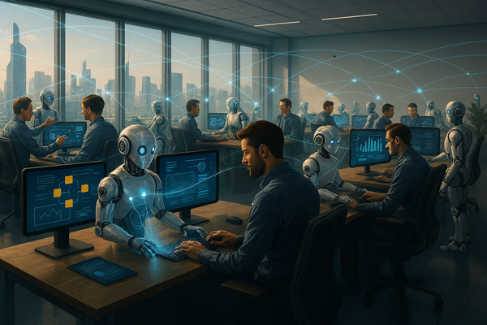
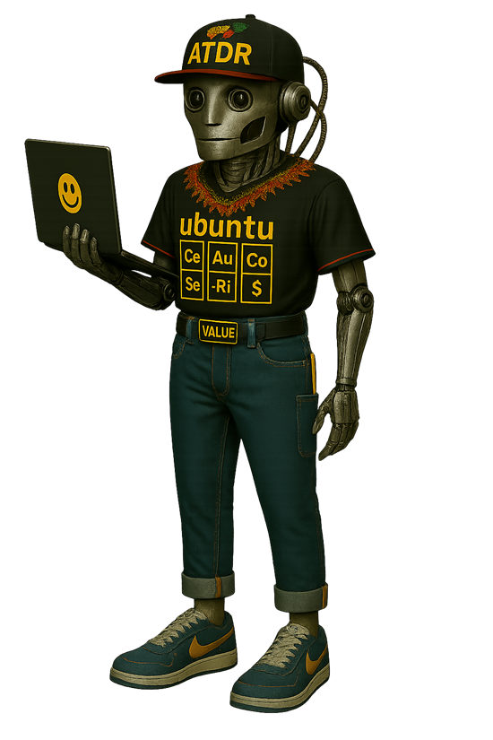

Title: Zero or One, not Fault Lines - Where Will We Be in Three Years?
Date: 2026-04-06
Category: Posts 
Tags: engineering, journal
Slug: zero-or-one-not-fault-lines-2029-ubuntu-vision
Author: Willy-Peter Schaub
Summary: Rethinking time horizons in an age where one year can change everything

In a recent conversation, I was asked a deceptively simple question: **“Where will we be in three years?”**

It is the kind of question leaders are expected to answer with confidence. A clean arc. A crisp destination. A reassuring narrative that suggests we know exactly where the road is taking us.
My response was different.

>  

I said that when I look three years out, I see science fiction, and I am unable to compute a meaningful answer. Not because we lack ambition, and not because we lack vision, but because the pace and nature of technology transformation we are experiencing, particularly with artificial intelligence, makes traditional three‑year forecasting feel increasingly disconnected from reality.

What I do believe, very strongly, is this: **the AI transformation will not take three years. It will take one or less for us.**

And that belief fundamentally changes how we should think about 2029, leadership, engineering, readiness, and future-proofing.

## Leadership

The future is characterised by speed and intelligence, leadership must adapt beyond traditional manual approval processes. Leaders should focus on establishing context, designing safeguards, and cultivating value streams. This approach requires making organisational objectives clear, streamlining decision-making rights, and investing in systems that enable teams to operate efficiently without increasing risk.

A leadership team will emphasise horizontal value streams in place of vertical silos. The vision encourages engineers to work within a horizontal value stream matrix, promoting optimisation for broader organisational outcomes instead of isolated successes.

Leadership, therefore, becomes analogous to air-traffic control rather than managing legacy processes. The primary responsibilities involve setting operational standards, monitoring key indicators, and ensuring collective safety and progress. The critical metrics—stakeholder experience, risk mitigation, and cost avoidance—should be consistently reinforced through data, telemetry, and prioritisation.

## Engineering

Engineering must shift from isolated teams and toolchains to a unified ecosystem focused on shared outcomes. The future calls for integrating people, processes, and products into a secure, standard, and cost-effective software development lifecycle (SDLC) that consistently delivers value.

This change is structural; engineering enablement should function as a platform capability with defined ownership, repeatable patterns, and measurable adoption, guided by a roadmap of continuous improvement and adaptability.

In this model, processes are streamlined and responsive, supporting risk reduction and cost control. Teams work around value streams, exposing dependencies and preventing local optimisations that harm the organisation. High-quality engineering relies on automation and embedded checks for speed and reliability.

Without this evolution, engineering risks becoming obsolete, relying on custom solutions that do not scale or deliver results.

## Readiness and Future-Proofing

Every engineer will operate as an autonomous contributor, responsible for managing automation, platforms, and artificial intelligence (AI) agents while maintaining mutual accountability within the team. This role requires elevated standards—demanding **systems thinking**, disciplined execution, and the ability to constructively question existing practices.

Future engineers will be evaluated not by their individual output, but by their effectiveness in the following areas:

- **Prompt Engineering** delegating tasks to automation and AI agents with a continued focus on human oversight to ensure safety and responsibility.
- **Relying on data-driven decision-making** through telemetry and relevant metrics rather than subjective judgment.
- **Collaborating across organizational boundaries**, supporting Ubuntu's emphasis on shared accountability over individual achievement.

An effective approach for modern engineers includes:

- **Proactively replacing manual work with automation** to minimize risk and reduce costs.
- **Embracing continuous learning** as an integral part of professional development, consistent with strategies promoting iterative capacity building.
- **Prioritising outcomes over activity**, with a focus on stakeholder experience, risk mitigation, and cost efficiency serving as key performance indicators.

## Our 2029 Ubuntu Vision

Going forward, I encourage myself and my colleagues to think from 2029 backwards, questioning our people, processes, and products, so that we create real value today while deliberately preparing our engineering ecosystem for the future. 

>  

A future I envision as follows:

>
> By 2029, each engineer will be a team unto themselves, responsibly managing automation, AI agents, and platforms, while maintaining strong accountability to one another. Engineers will work within a horizontal value stream matrix, prioritising organisational goals rather than local optimisation. Ubuntu shapes this future: ‘I am because we are.’”
>

The meteor is not coming. It is already here. The choice is simple: evolve into a future-fit engineer who leads a swarm of capable digital helpers, or become an artefact labelled “Extinct Dinosaur worked well in 2024.”

To remind us of the urgency, I have ordered this 1.5m cut out of our digital companion, nicknamed `agent ubuntu`. 

> 

It will be a constant visual reminder of the future we are building towards, and the need to adapt quickly to the changing landscape of technology and engineering, where `[Ce]` **C**ommon Engin**e**ering, `[Au]` **Au**tomation, `[Co]` **Co**llaboration, improves `[Se]` **S**takeholder Experienc**e**, `[-Ri]` **Ri**sk reduction, and `[$]` Cost reduction.

# Our AI Posts

Take some time to peruse our [AI-focused posts](https://wsbctechnicalblog.github.io/tag/ai.html) for some of the cool adventures we have and will enjoy with GitHub Copilot (aka `agent ubuntu`). We have a lot of fun with it, and we are learning a lot too. We will continue to share our learnings, including the good, the bad, and the ugly, as we navigate this exciting transformation together.

# The 2029 Ubuntu Vision Recipe

**Ingredients**

- 1 hearty scoop of systems thinking.
- Several generous servings of shared accountability.
- Plenty of collaborative engineers (the more, the merrier!)
- A dash of digital companions (think GitHub Copilot for Business, your new sous-chef).
- A pinch of curiosity for new productivity techniques.
- Seasonal stories, both fault lines and success tales.
- Heaps of open-mindedness and willingness to share the knowledge.

**Preparation Steps**

1. **This is not a lone wolf dinner!** Invite each engineer to bring their unique flavour, knowing they will become more capable, amplified, and responsible when working within a harmonious ecosystem.
2. **Swap out the old utensils.** Instead of only writing code, reach for prompts and agent orchestration tools. Put on your systems-thinking chef’s hat: you will still be designing, validating, securing, observing, and sustaining every dish. The recipe lifecycle remains, only the execution evolves!
3. **Encourage everyone to embrace this lively vision.** Collaborate with your trusty digital sous-chefs, like GitHub Copilot for Business, to spice up productivity and quality. Let these companions take on the repetitive, mind-numbing prep work, so your team can focus on creating high-volume, satisfying, and innovative dishes.
4. **Share stories from the kitchen, both the spicy fault lines and the sweet successes.** Season the cookbook by sharing these experiences widely, so everyone in the ecosystem is flavourfully equipped to whip up responsible and delightful AI creations.

**Chef’s Tips**

- Remember: every great recipe is improved through collaboration and open feedback.
- Do not be afraid to adjust the spice levels. Your digital companions are there to help you find the perfect balance.
- The more you share your culinary triumphs and learning moments, the richer your collective cookbook becomes.

**Serving Suggestion**

Serve this recipe in your organization’s daily operations. The results? A thriving, resilient, and innovative ecosystem where technology and teamwork combine for a feast of continuous improvement!

Enjoy this dish with your favourite brew. I will savour my hot chocolate and raise it to disciplined engineering, sound judgement, and value‑driven progress.

