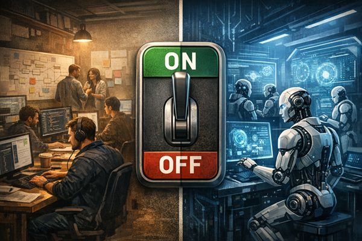
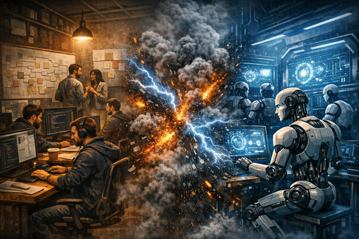
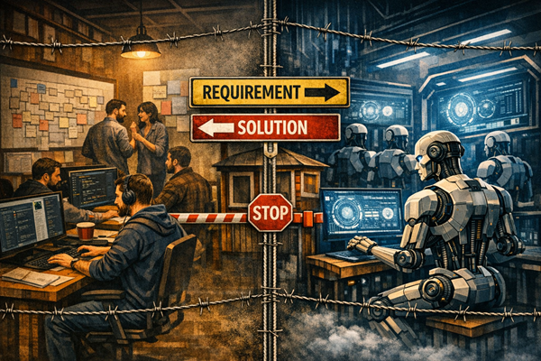

Title: Zero or One, not Fault Lines - Traditional Delivery Meets Agentic AI
Date: 2026-04-20
Category: Posts 
Tags: ai, engineering, journal
Slug: zero-or-one-not-fault-lines-crossroads
Author: Willy-Peter Schaub
Summary: A pragmatic operating model for legacy ecosystems and AI-native ambition

The AI Train Has Left the Station and the Platform Still Matters - I am mulling over a dilemma at the traditional software development and Artificial Intelligence crossroads, creating friction instead of excitement and empowerment.

>  

**Let me take a few steps back.**

Two years ago, we enabled GitHub Copilot in our engineering ecosystem and engineers adopted it in a platter of variations. Some ignored it (at their own future-proofing peril). Some embraced it as their new search-and-answer companion. Some delegated coding, quality assurance, and other engineering tasks to their digital companion. Others ventured into vibe coding and agentic Artificial Intelligence.

To keep things simple, I bucket these approaches as:

- **AI Lipstick** (help me write and search faster)
- **AI** [**Agent Ubuntu**`](/zero-or-one-not-fault-lines-2029-ubuntu-vision.html) (delegate - help me do the tedious work)
- **AI First** (rethink the Software Development Lifecycle from the ground up)

I will skip the first approach, because “AI Lipstick” will become as normal as searching the web became normal. Useful, ubiquitous, and not particularly controversial.

The real story is the tension between AI Agent Ubuntu and AI First.

>
> **PS:** I now share the same topics and questions with my AI copilot as I do with colleagues. Getting AI's perspective is important, and some highlights are in this blog post.
>

# AI Agent Ubuntu: Delegation Without Denial

> 
> 
>

I introduced our Agent Ubuntu vision previously in the [zero-or-one-not-fault-lines-2029-ubuntu-vision](/zero-or-one-not-fault-lines-2029-ubuntu-vision.html) narrative, and expected it to materialise in “six-plus months”. Here is the surprise: we are already bleeding into this world.

If you like analogies (and I do), the train is speeding out of the station. Most engineers have jumped aboard. A few sceptical stragglers are quickly running out of platform and wagons. 

[TBD: STATION IMAGE]

We have started delegating the tedious tasks:

- analysing a code base
- identifying vulnerabilities and code smells
- automating mind-numbing manual tasks
- scaffolding code and rapidly prototyping ideas

And the side effects are real:

- We generate **more code**, which increases the review and verification load.
- We debate **trust**: can we trust Artificial Intelligence as much as we trust human-crafted artefacts?
- We unlock dramatic cycle-time improvements when the code base is well maintained.

In practice, this is not theoretical. We have seen concrete acceleration in day-to-day engineering work when using **GitHub Copilot** in real engineering contexts, including code generation and test generation, with strong emphasis on prompt specificity and human validation. Code analysis now takes minutes or hours instead of weeks or months. For well-maintained code bases, .NET upgrades have sped up from days or weeks to just hours.

> 
> 
>
> **Thoughts from the AI Copilot (friction you can predict):**
>
> _The moment you delegate more work to an agent, your bottleneck moves. It moves from “writing code” to “verifying outcomes”. If verification does not scale, velocity becomes turbulence, not value._
>

Before we hop to **AI First**, I want to emphasise something: we may have boarded the train, but the train is not yet running at full speed. There is so much more we can do, and so much more we must do.

As we delegate the coding effort to agents, the centre of gravity shifts:

- Prompt quality matters, because **Garbage In, Garbage Out** applies here too.
- Governance and guardrails must be consumable by both humans and agents.
- Security oversight and verification become the differentiators.
- Mindset and process modernisation become the make-or-break factors.

I still argue that, as with DevOps, success is mostly people (80%) and mindset, then process (15%), then products (5% tools).

# AI First: Reinvention Without a Safety Net

In an AI-first world, or “AI-native Software Development Lifecycle” by Andre Kaminsk, we pivot to Artificial Intelligence without bolting it onto existing processes. We embrace agentic Artificial Intelligence to collaborate with people across development, quality assurance, deployment, and observation. 

This is where the conversation gets spicy.

If we have solid governance, principles, and verification in place, we can delegate the **HOW** to Artificial Intelligence and focus people on the **WHY** and **WHAT**. That is the promise.

It is also the point where I see the most friction and the least realised gain, especially inside mature ecosystems that have spent decades optimising for security, quality, consistency, and predictability.

AI First is not only a tooling change. It is an operating model change.

> 
> 

> **Thoughts from the AI Copilot (the executive translation):**
>
> _AI First is not “developers type faster”. AI First is “the organisation makes decisions faster, with less risk, and with more predictable cost”. If those three outcomes do not improve, the organisation will (correctly) call it hype._
>
> _Externally, the “AI-native Software Development Lifecycle” framing is increasingly described as a blueprint for rebuilding delivery around prompts, orchestration, and continuous evolution._
>
> _Internally, we also see AI-native delivery models being articulated as consistent tooling, orchestration, and standard methodology, even counting agents as “team members”._
>

# The Dilemma: Three Options, None of Them Clean

So, how do we introduce Artificial Intelligence into our engineering ecosystem effectively?

Spoiler alert: **I do not have the “42 answer”.** I have three options, and none of them is a clean win.

### Option 1: Bolt AI onto traditional delivery (Agent Ubuntu path)

This works. It reduces risk, reduces development cost, and delivers meaningful improvements across disciplines.

>  
 
But as we overlap into vibe coding and agentic behaviour, friction shows up fast: people friction, process friction, governance friction. The more we delegate to agents, the more we need to verify, and the more we need to modernise our processes and mindset.

If we do not modernise, we risk creating a “Frankenstein” delivery model that is neither traditional nor AI-native, and delivers neither predictability nor reinvention.

### Option 2: Flip the switch (decommission traditional SDLC and reboot)

This is where reality punches back.
 
>  

Many organisations cannot flip a binary switch without putting business solutions and stakeholder outcomes at serious risk, especially where legacy solutions have been built and maintained over decades.

That is why I am not fully sold on the “traditional software development just died” framing in Andre’s book. The ambition may be correct, but the operational path is rarely safe. 

### Option 3: Create dedicated AI-First teams

This sounds attractive: isolate the new mindset and let it run.

>  

But sooner rather than later, these teams collide with traditional governance, architecture constraints, release processes, security controls, and funding models that were designed for predictability, not reinvention.

And the immune response of a mature system is powerful. The AI-First teams either become “rogue” and risk stakeholder experience, or they become “compliant” and lose their AI-first edge. In either case, the organisation loses.

> 
> 
>
> **Thoughts from the AI Copilot (what is really happening):**
>
> _When gains are marginal, it is often because the agent is optimised for local tasks, while the organisation is constrained by end-to-end flow. The constraint is usually not code. The constraint is approval paths, environment provisioning, security reviews, release windows, and accountability boundaries._
>
> _This tension mirrors a broader industry pattern: many organisations deploy “horizontal copilots” widely but struggle to achieve measurable bottom-line impact until they redesign processes around agents._
>

# A Pragmatic Bridge: Make the Intersection “Packaged Solutions”, Not “Shared Source Code”

Here is where my head has exploded a few times, and where I would genuinely value your thoughts and learnings.

Is “bolting on AI” a feasible path to an AI-first mindset?

In my current understanding, the answer is: not directly.

The only viable path I can currently see is to treat AI-first capability as a product-producing entity, rather than a “new way of doing the same delivery”, either as isolated ecosystems within an organisation, or separate organizations.

>  
 
In other words:

- The AI-first entity operates with a new engineering mindset and produces reusable agents.
- Those agents are introduced into the traditional ecosystem like any product.
- Adoption happens through existing procurement, onboarding, and governance processes.
- The integration points are packaged solutions (interfaces, contracts, telemetry), not shared whiteboards and prompt jams. This approach creates a “strangler” pattern for operating models: build the new capability in a protected lane, then integrate it through stable interfaces. This reduces risk, protects stakeholder experience, and makes cost and control visible.

> 
> 
>
> **Thoughts from the AI Copilot (why this is a strong idea):**
>
> _You are proposing a “strangler” pattern for operating models: build the new capability in a protected lane, then integrate it through stable interfaces. This reduces risk, protects stakeholder experience, and makes cost and control visible._
>

# Turning Friction into a Paved Road (Practical Moves)

If the above resonates, here are practical moves that reduce friction while increasing momentum.

### Create an “Agent Registry” with risk tiers

Treat agents like products: ownership, versioning, change logs, approved use, and telemetry. This helps executives because it makes risk and cost visible. It helps engineers because it creates a paved road and removes repeated debate.

### Standardise verification as a first-class discipline

As delegation increases, verification must scale.

This includes:

- automated tests (unit, integration, contract, performance)
- security scanning and secret detection
- structured reviews and gated promotion
- observable behaviour in production (signals, alerts, auditability)

We already see this principle emerge in our engineering ecosystem: the value appears when teams emphasise guardrails, prompt engineering, and manual review of outputs.

### Separate “exploration speed” from “production safety”

Use two lanes:

- a fast experimentation lane (time-boxed, contained data, explicit disclaimers)
- a production lane (full governance, security, verification)

This protects stakeholder experience while still enabling learning velocity.

### Measure what matters (and keep it executive-readable)

Track outcomes in our three currencies:

- **stakeholder experience** (lead time, incident impact, satisfaction)
- **risk reduction** (defect escape rate, security findings, audit results)
- **cost avoidance** (cycle time reduction, reduced rework, reduced manual toil)

> 
> 
>
> **Thoughts from the AI Copilot (a blunt truth):**
>
> _If you cannot show improved stakeholder experience, reduced risk, or cost avoidance, the organisation will treat AI as entertainment. The scoreboard matters._
>

# Closing: I Do Not See a Safe “Big Bang”, But I Do See a Safe “Bridge”

It is driving me slightly mad, but I do not see a viable path to flip the switch or bolt AI First onto a traditional engineering ecosystem without either:

- compromising risk controls, or
- degrading stakeholder experience, or
- creating cost blowouts through rework and tool sprawl

However, I do see a viable bridge: **Build AI-first capability as packaged, reusable agents that enter the traditional ecosystem through stable product-style interfaces and governance.**

That is not the most romantic answer. It is, however, an answer that respects reality, protects the business, and still moves us forward at speed.

Now over to you: 

- **What have you seen work when modern delivery meets legacy gravity?**
- **Where have you seen the friction disappear, and why?**

That is it for today. Enjoy your favourite brew. I will savour my hot chocolate and raise it to disciplined engineering, sound judgement, and value‑driven progress.

