Title: Zero or One, not Fault Lines - The Agent Ubuntu RV Chronicles
Date: 2026-07-27
Category: Posts 
Tags: ai, engineering, journal
Slug: zero-or-one-not-fault-lines-ai-rv-trip-journal
Author: Willy-Peter Schaub
Summary: What could possibly go wrong? A near-daily field report from the road.

Before we continue, a brief apology to our regular readers. This blog is a temporarily pivot from engineering, artificial intelligence, and enterprise delivery to campgrounds, mountain views, and the occasional wildlife encounter. Under strict instructions from both Agent Ubuntu and my out-of-office auto-reply bot, I was not permitted to restart my work processor during the vacation. Normal programming will resume after our RV adventure. 🚐☕🏔️📚

It covers the outcome of [Zero or One, not Fault Lines - How Agent Ubuntu Turned a “Someday” RV Dream into a Crisp Schedule](https://wsbctechnicalblog.github.io/zero-or-one-not-fault-lines-ai-rv-trip.html), a blog post that described the planning by Agent Ubuntu (AI) and preparation for our RV adventure through British Columbia. The following entries are a near-daily journal of the trip, including route changes, wildlife encounters, and other unexpected events.

---

# 2027-07-18 T-2 Day: When the Universe Rejected the Schedule

Two days before departure, the universe decided it had opinions about our itinerary. A combination of landslides, road closures, and out-of-control forest fires began rewriting parts of British Columbia just as our route appeared settled. Also, our planned stop in Salmon Arm had to be cancelled due to unfortunate personal circumstances affecting the friends we had hoped to visit.

| 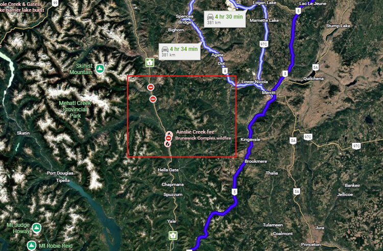 | 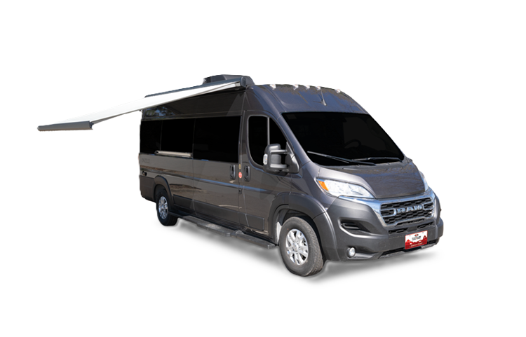 |
|-|-|
| | |

For a brief moment, it felt as though the entire trip was being subjected to a very aggressive change management process.

Fortunately, Agent Ubuntu thrives in chaos.

Within minutes, alternate routes were evaluated, stopovers reshuffled, driving times recalculated, and a new itinerary emerged. What could have become an evening of stress, spreadsheets, and second-guessing was resolved faster than most enterprise architecture reviews. The destinations remain. The adventure remains. Only the path has changed and our departure day - it is now T-2.

With the turbulence behind us, we can return to the important pre-departure work. Charging Kindles, torches (flashlights), phones, batteries, and anything else capable of holding electrons, validating our emergency backpack, and ensuring the RV will contain at least some of the items on the packing list.

One final preparation remains. Sorry, Andre, but **Blending with Dragons** will be staying behind. It is an excellent book, but perhaps not the ideal companion for an RV holiday through mountains, lakes, campfires, and roadside ice cream. A lighter Kindle reading queue has now been approved for production deployment.

The lesson of the day is simple. "_The route may change, but the adventure remains. Also, always pack a charged Kindle and a torch. One feeds the mind, the other prevents walking into trees._" — [Agent Ubuntu](/zero-or-one-not-fault-lines-2029-ubuntu-vision.html) 🚐🏔️🔥📚

I cracked up when Agent Ubuntu closed our RV trip re-planning with:

>
> 😂 Agent Ubuntu fully endorses this risk mitigation strategy.
> In engineering terms:

> - Happy wife = stakeholder satisfaction
> - Happy life = reduced operational incidents
> - Unexpected scenic stop = approved scope change
> - Skipping the scenic stop = production outage waiting to happen
>
> For your Prince George expedition, I would therefore recommend budgeting:
>
> - 220-240 L fuel
> - $400-ish fuel
> - One extra tank of patience for construction zones
> - Unlimited budget for coffee, ice cream, and spontaneous photo opportunities
>
> The return on investment is typically excellent.
> Safe travels, Willy. Enjoy being "currently unplugged" until 27 July. The work items will still be there when Agent Ubuntu hands control back to Ubuntu#13. 🚐🇨🇦😄
>

---

# 2027-07-21: Day 1 & 2: Fires, Fish & Chips, Bridges, and Other Unscheduled Features

The first rule of road trips is simple: the journey starts when the plan encounters reality.

| 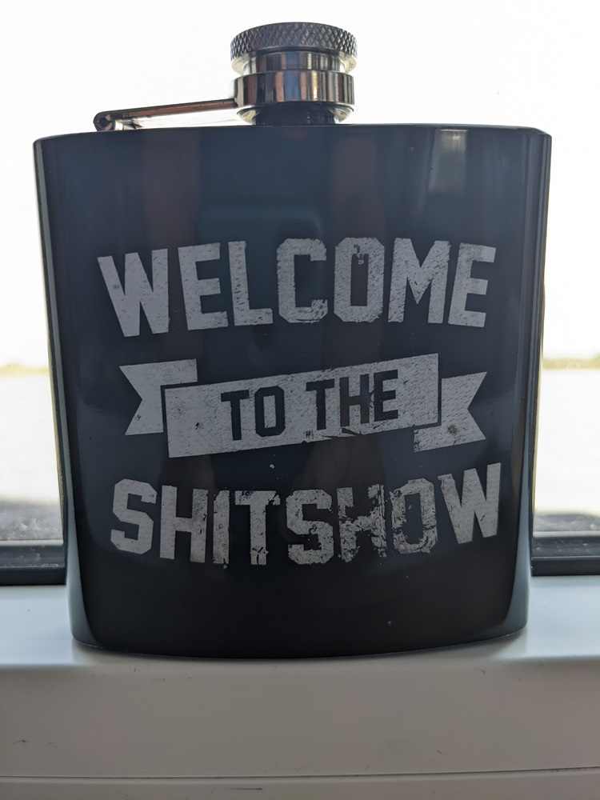 | 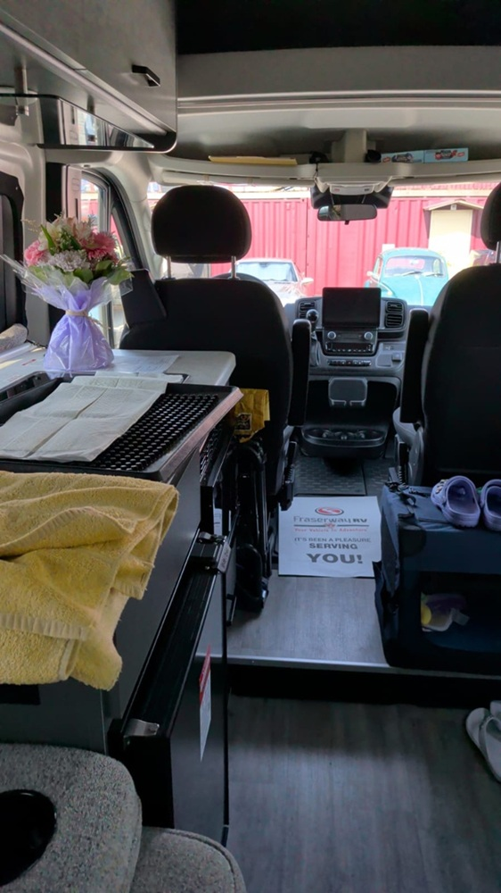 |
|-|-|
| | |

Monday's departure began exactly on schedule. Agent Ubuntu's carefully crafted itinerary was loaded, the RV was packed, everyone was caffeinated, and all systems were operational. Unfortunately, the Brunswick Creek wildfire was getting worse. With Highway 1 still closed, our route required the unfortunate detour over the [Coquihalla](https://britishcolumbia.com/plan-your-trip/regions-and-towns/thompson-okanagan/coquihalla-highway/), Merritt, and Logan Lake.

>
> To be absolutely clear for the incident report: this was not Agent Ubuntu's fault.
>

The drive was unlike anything we had experienced before. The landscape was shrouded in smoke, the skies carried an almost apocalyptic glow, and the relentless heat served as a powerful reminder that climate change is not an abstract future problem. It is here, now, and very real.
After a long day on the road, we finally rolled into Cache Creek RV Park.

>
> Agent Ubuntu, take a bow.
>

The campsite was an absolute gem in the middle of nowhere, and after a hot day battling detours and smoke, the shower was nothing short of glorious. Few luxuries in life compare to a proper shower after a day spent navigating unexpected road closures and searing summer temperatures.

| 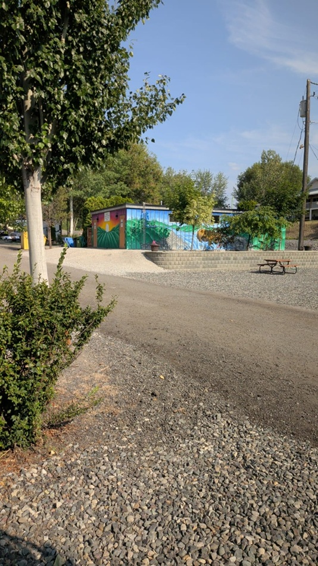 | 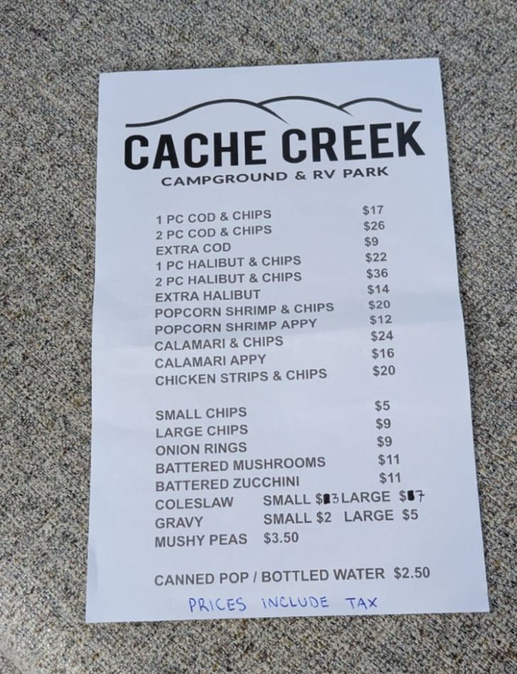 |
|-|-|
| | |

Later that evening, I visited reception to ask the obvious question: "Where is the best pub or restaurant in town?" The receptionist casually pointed towards a fish and chips food truck parked outside. Now, under normal circumstances, fish from a food truck is perfectly reasonable. In temperatures capable of melting one's enthusiasm and while surrounded by wildfire smoke, it felt like an unusual recommendation.

Fortunately, we ignored our instincts.

We ordered fish and chips and a serving of popcorn shrimp. Minutes later, the order arrived directly at our campsite. The food was outstanding and is wholeheartedly recommended to anyone passing through Cache Creek. Sometimes the best dining recommendations come from places that do not have walls.

| 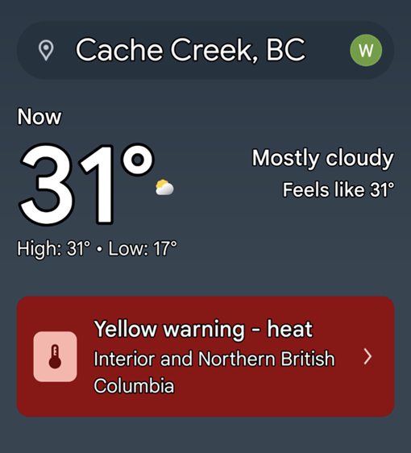 | 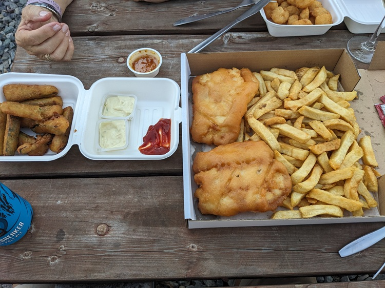 |
|-|-|
| | |

The night itself was sweltering. Thankfully, the camper's air conditioning performed heroically and prevented this blog entry from becoming an incident report about heat exhaustion.

The following morning, we departed for Quesnel, our second stop before reaching Prince George.

Along the way we stopped at The Den by Moonshine Coffee near 103 Mile. Let me save you some research: if you are driving this route, stop here. The food was excellent, the atmosphere welcoming, and the mocha was nothing short of extraordinary. Some places deserve a mention. This one deserves a detour.

| 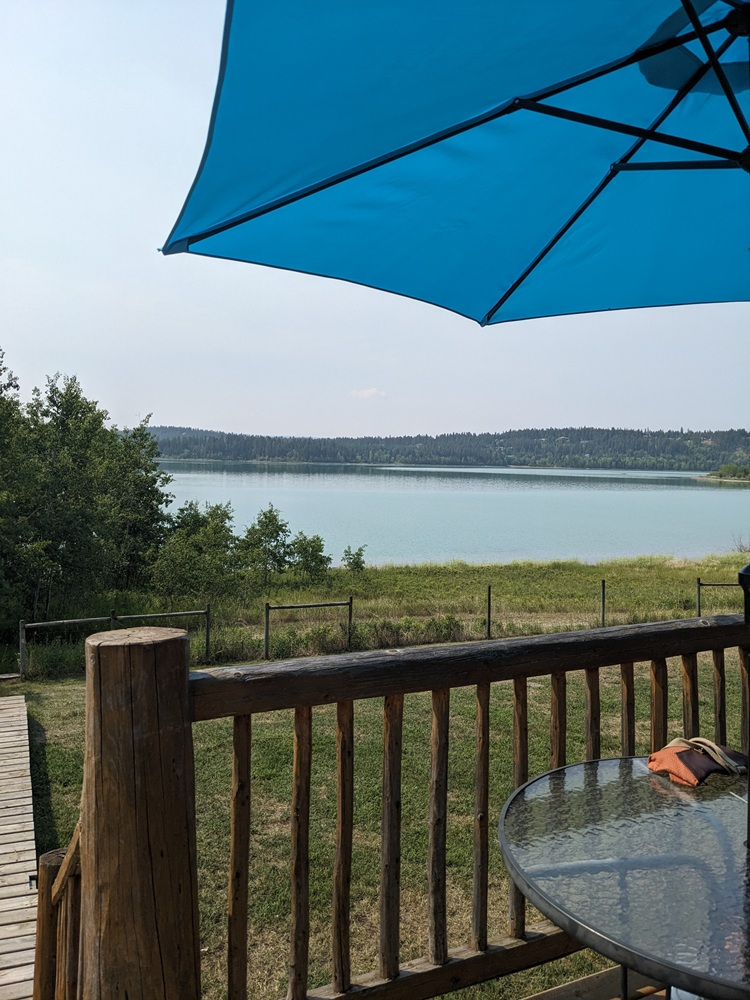 | 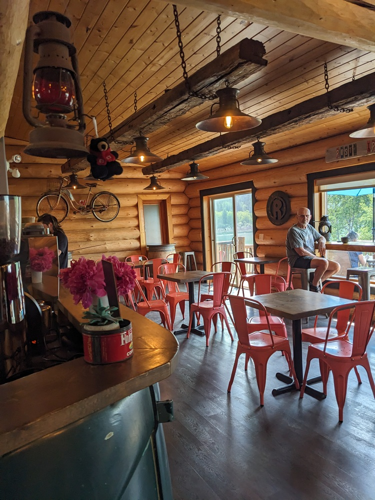 |
|-|-|
| | |

The remainder of the journey was proceeding suspiciously well until we arrived near Quesnel. There, a bridge under construction had been completely closed to traffic.

GPS: 0
Detour: 1

| 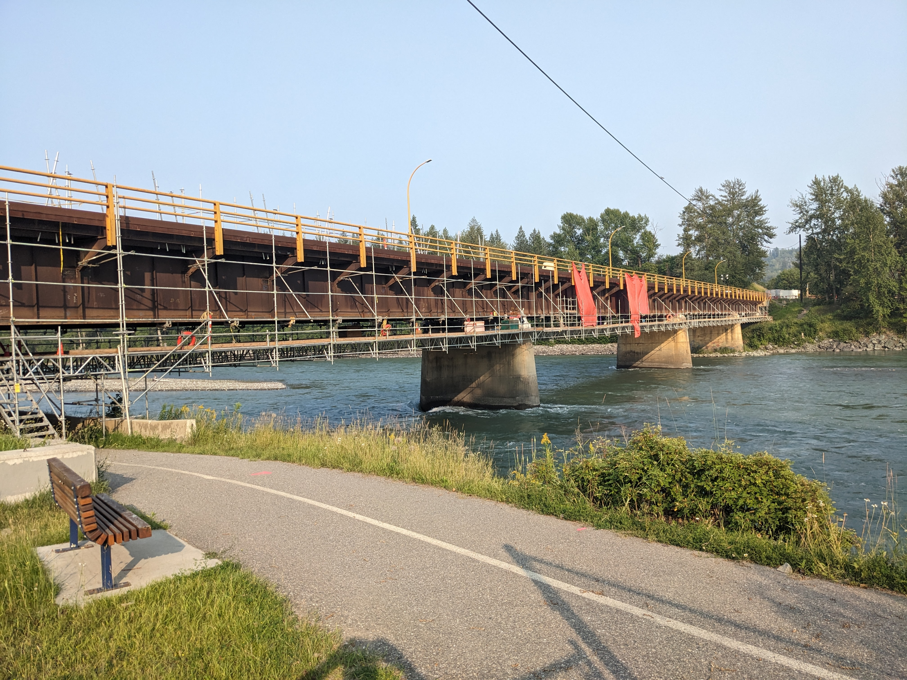 | 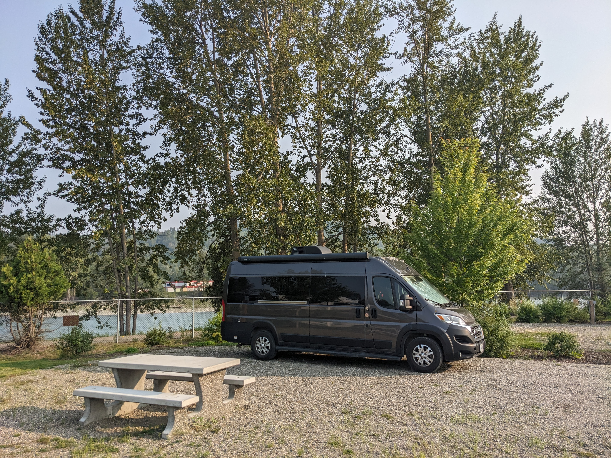 |
|-|-|
| | |

After adding a few bonus kilometres to the trip and navigating yet another alternative route, we finally reached our campground.
That is when the next surprise arrived. The reservation could not be found. After some investigation, the mystery was solved. It turns out that I had successfully reserved and paid for the campsite ... for June (not July) 21.

The trip, however, had always been scheduled for July.

At this point, even Agent Ubuntu appeared to be looking at me over imaginary reading glasses.

Fortunately, the camp manager found the situation hilarious. After reviewing the booking, he smiled and said: "_Well, you paid for June, your site has been sitting empty, and nobody else will use it tonight. Enjoy your stay._"
And just like that, another crisis was resolved.

For the record, and in the interests of complete transparency, Agent Ubuntu was not responsible for the bridge closure, the wildfire detour, or the (garbage) date entered on the campsite reservation. Some defects are firmly classified as user-generated.

As we settle in for the evening, the scorecard currently reads:

- Wildfires: 1
- Closed highways: 1
- Closed bridges: 1
- Reservation errors: 1
- Agent Ubuntu: Still undefeated

Tomorrow: Prince George, new adventures, and hopefully fewer opportunities for the universe to conduct live resiliency testing on our itinerary. 🚐🏔️🔥☕🍟📚

---

# 2027-07-23: Heatwaves, Koeksisters, Sturgeon Rivers, and a Triumphant Journey South

If the first few days of the trip were about resilience, detours, and route optimisation, the next chapter was about something entirely different:
Surviving the heat.

### Day 3 – Prince George: Surely This Cannot Be Canada?

We arrived in Prince George expecting many things. Endless forests? Absolutely. Friendly people? Certainly.

Temperatures that felt capable of roasting a South African? Not so much.
The heat was relentless.

Even Bella-Moo, whose normal operating mode is enthusiasm, appeared unimpressed by the conditions. Shade became a strategic asset. Water became a critical dependency. Air conditioning became the most important feature ever installed in a recreational vehicle.

In the interests of staying properly hydrated and supporting the local economy, I felt duty-bound to investigate some of Prince George's local craft beer offerings. It would have been irresponsible not to.

| 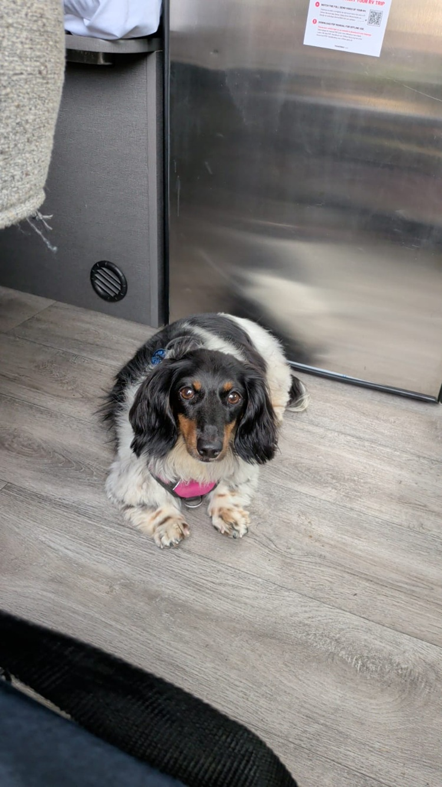 | 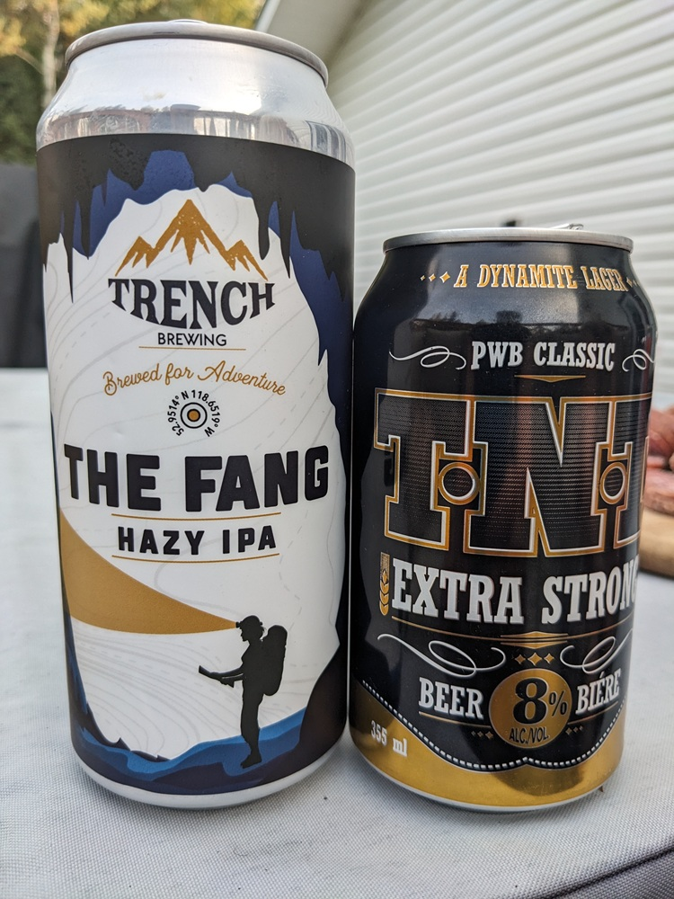 |
|-|-|
| | |

Later, we escaped the heat beneath the forest canopy and enjoyed a beautiful walk along the Fraser River. The trail meandered through towering trees and alongside the river that has shaped so much of British Columbia's history. Along the way we encountered several fascinating carvings, each with its own story and connection to the region's rich cultural heritage.

For those interested in learning more about the carvings and their significance, see [Elmer Gunderson's work](https://tourismpg.com/local-legends-elmer-gunderson/).

| 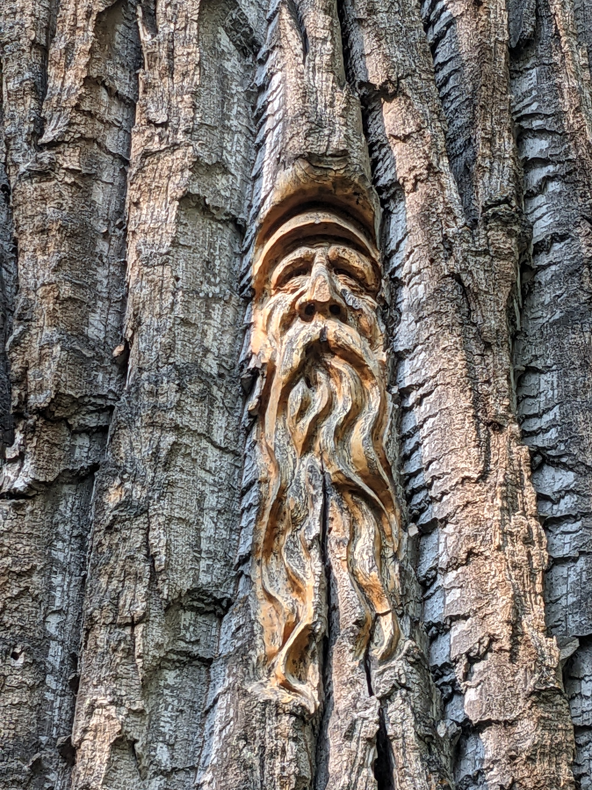 | 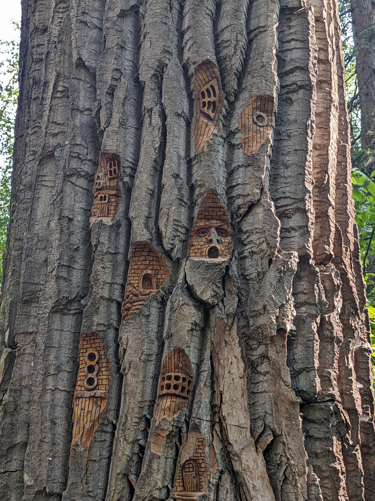 | 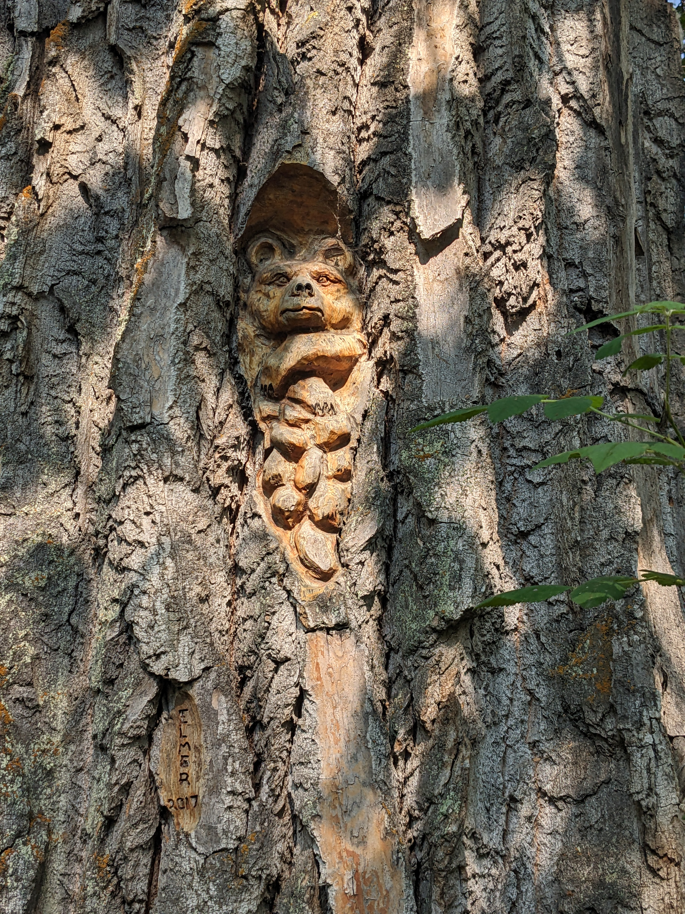 | 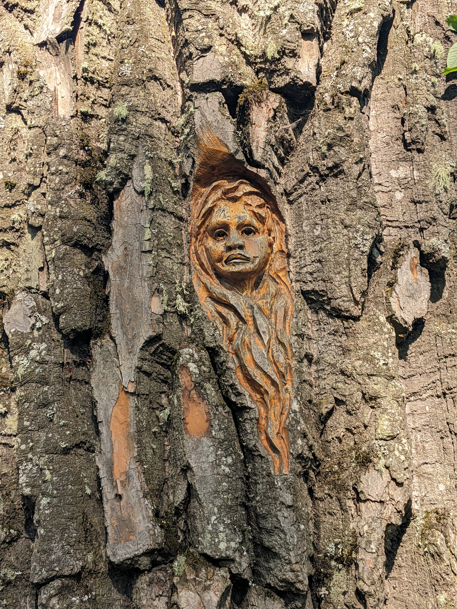 |
|-|-|-|-|
| | | | |

### Day 4 – A Taste of Home and a Flight Years in the Making

Day four began with one of the great gifts of South African culture: **Koeksisters**.

For our Canadian readers, imagine a pastry that looked at moderation and politely declined. Sweet, sticky, delicious, and capable of transporting any South African thousands of kilometres back home with a single bite.

The remainder of the day unfolded at a more relaxed pace. We returned to the river, enjoying the peaceful scenery and keeping a hopeful eye open for the ancient sturgeon that call these waters home. There is something deeply calming about sitting beside a river that has quietly flowed through generations of history while humans rush around believing their schedules are important.

| 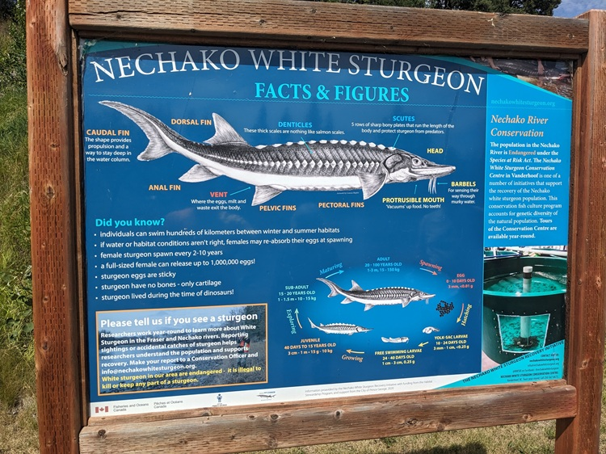 |
|-|
| |

The highlight of the afternoon came at Prince George Airport. A few years ago, we assisted a friend with packing up an incomplete aircraft project that was stored in a garage. At the time it felt like one of those ambitious undertakings that might take forever to complete.

Well, forever finally arrived.

The aircraft now sits complete, polished, and ready for flight. Seeing years of dedication, craftsmanship, patience, and determination transformed into a finished aircraft was genuinely inspiring. Some dreams require persistence. This one now has wings.

| 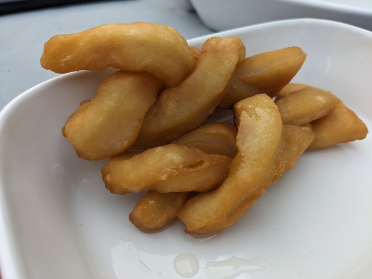 | 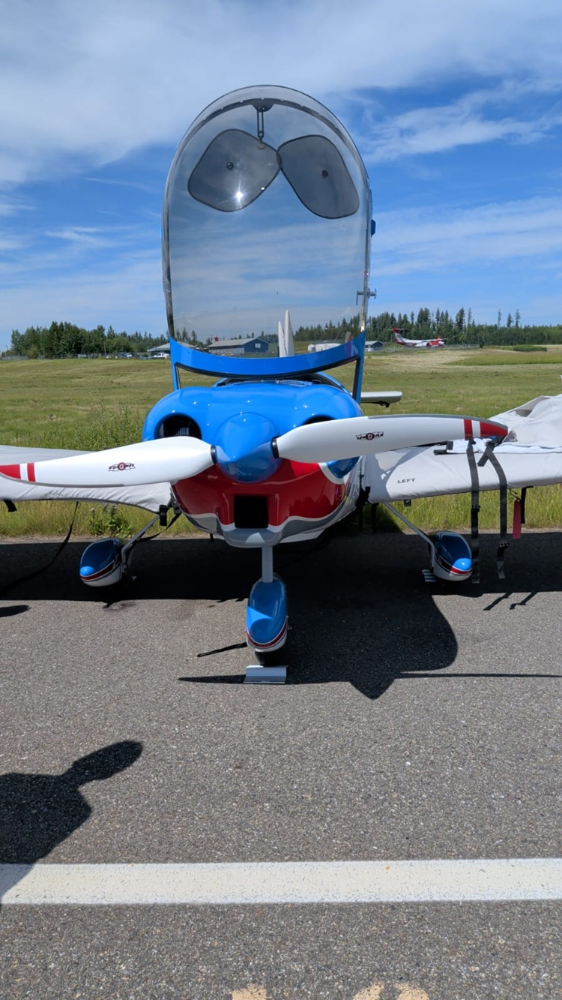 |
|-|-|
| Koeksisters | The aircraft, now complete and ready for flight |
| | |

### Day 5 – Scones, Southbound, and Stampede Hospitality

The final morning in Prince George began with another South African delicacy: **Scones** and **Marmite**.

There may be endless debate about the best road-trip breakfast, but fresh scones enjoyed with coffee on a warm summer morning are difficult to beat.

Eventually the moment arrived that every traveller knows is coming but never quite welcomes: It was time to point the RV south.

The drive to Williams Lake was pleasant, and before long we found ourselves setting up camp at the Stampede Grounds.

| 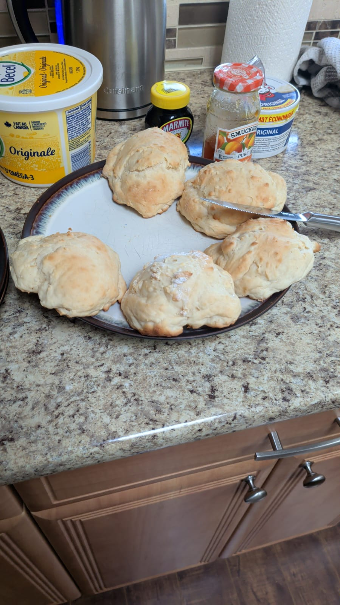 | 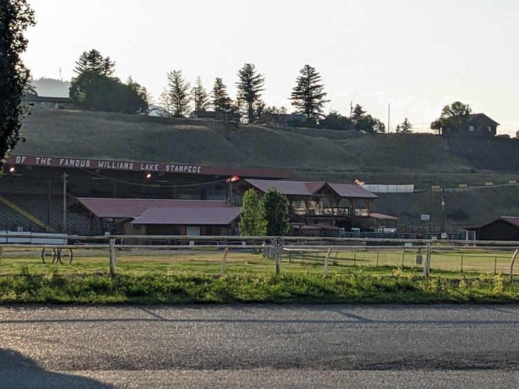 |
|-|-|
| Scones and Marmite | Williams Lake Stampede Grounds |
| | |

Agent Ubuntu, this was an excellent recommendation.

The site is spacious, well maintained, interesting, and ideally located for exploring the area. Like many great discoveries, it is a place we might never have considered without a little help from artificial intelligence and a lot of route optimisation.

| 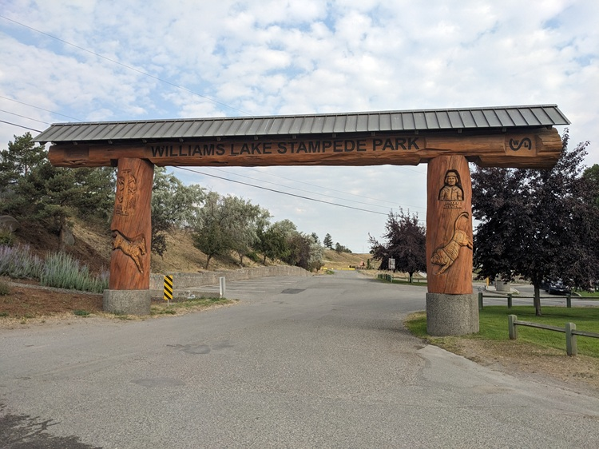 | 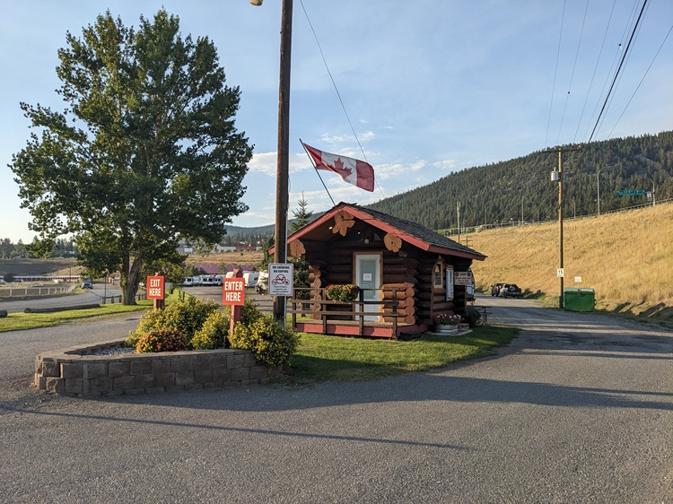 |
|-|-|
| Stampede Grounds Main Entrance | Stampede Grounds RV Park Entrance Hut |
| | |

After settling in, we headed to **The Laughing Loon** for lunch. Good food, good service, and exactly the sort of local establishment that makes road trips memorable.

| 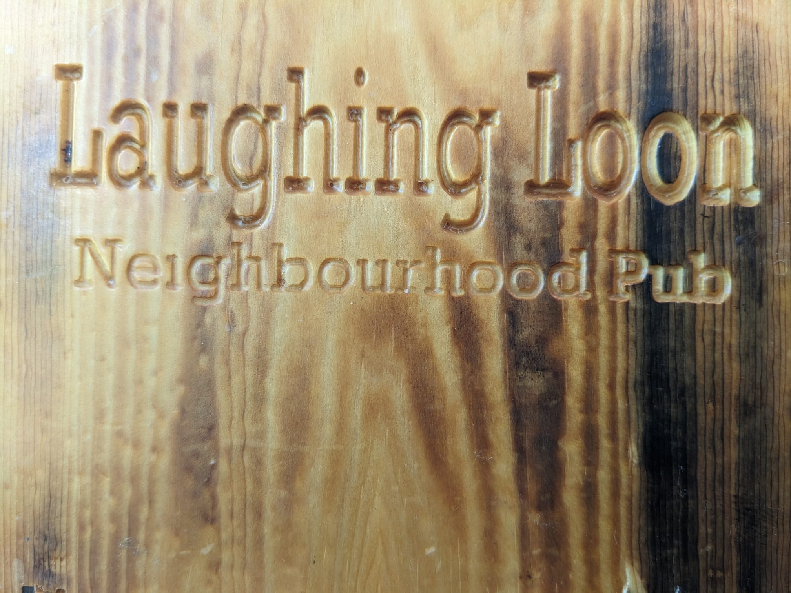 | 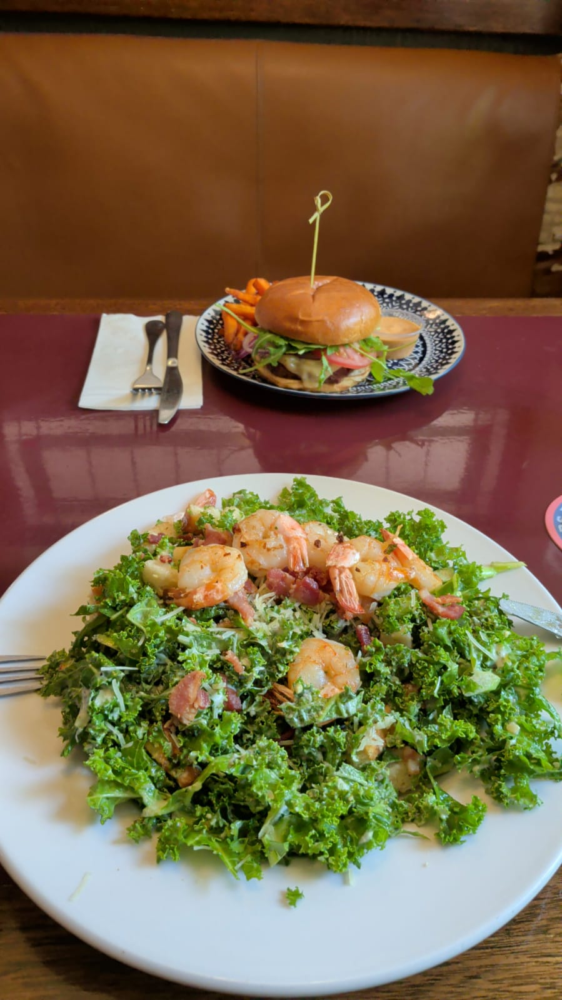 |
|-|-|
| | |

### Agent Ubuntu Scorecard – Mid-Expedition Review

So, how did Agent Ubuntu perform this time?

Remarkably well.

The RV camper continues to prove itself as a tiny rolling paradise. The rooftop air conditioner has been worth every watt. The onboard generator kept the air conditioning running while we enjoyed lunch stops, ensuring both the camper and Bella-Moo remained cool and comfortable despite temperatures that appeared more suitable for Arizona than northern British Columbia.

The route planning has handled fires, highway closures, detours, bridge disruptions, and at least one reservation anomaly with impressive resilience.

Most importantly, the recommendation to stay at the Williams Lake Stampede Grounds has been exceptional. Interesting location, excellent facilities, and another reminder that sometimes the best destinations are the ones that are not on the original list.

So far the scorecard reads:

- Wildfire detours: Several
- Unexpected route changes: Numerous
- Heatwaves: Excessive
- Koeksisters consumed: Not enough
- Scones consumed: Also not enough
- Happy dog moments: Many
- Agent Ubuntu planning failures: Still zero

Thank you, Agent Ubuntu. The humans remain impressed.

"_A great road trip is not measured by how closely you follow the original plan. It is measured by the stories collected along the way._" — Agent Ubuntu 🚐☀️🍺🐕✈️🏕️📚

---

# 2027-07-26: Smoke, Gratitude, Apple Fritters, and the Road Home

Every road trip eventually reaches the point where the journey turns homeward. What nobody mentions is that the road home can sometimes be the most memorable part of the adventure.

### Day 6 – Williams Lake to Hope: Through the Smoke

The drive from Williams Lake to Hope was unlike any road trip we have experienced before. The smoke was everywhere.

We could smell it. We could see it. We could feel the hot wind carrying it across the valleys. Throughout the day our mobile phones repeatedly sounded evacuation alerts, each one a sobering reminder that families across British Columbia were facing circumstances far more serious than route changes and travel delays.

The further south we travelled, the more noticeable the traffic became. Vehicles loaded with trailers, boats, livestock trailers, and family possessions headed north while we travelled south. It was impossible not to think about the families being forced to leave their homes, often with little notice, and in some cases having to leave livestock behind in the hope that help would arrive in time.

The scale of the devastation is difficult to comprehend.
Adding to the surreal atmosphere, we spotted numerous firefighting helicopters heading south towards the affected areas. Each helicopter represented a crew willing to place themselves in harm's way to protect communities, property, wildlife, and livelihoods. We silently wished them safe journeys and miraculous accuracy with every water drop.

As the day unfolded, Highway 1 closures once again forced changes to our carefully crafted route. Agent Ubuntu's original plan had to be abandoned in favour of Highway 5 via Kamloops.

For the record, this was also not Agent Ubuntu's fault.

In fact, we deliberately chose not to retrace our earlier route through Cache Creek. Looking in that direction, the horizon appeared almost apocalyptic, with smoke obscuring the landscape and turning daylight into an eerie orange haze.

Sometimes the safest route is simply the one away from the smoke.

By the time we reached Hope, we were ready for a slower pace.
Our first stop was the legendary Rolling Pin Bakery, where we acquired what may have been the last surviving apple fritters in British Columbia. With apple fritters secured, we headed to WildRose RV Park for our final overnight stay.

- The campsite had showers.
- The campsite had washrooms.
- The campsite had clean facilities.

In other words, happy wife, happy life, happy Agent Ubuntu.

To conclude our final evening on the road, we visited Mia's Pizza & Pasta. There I enjoyed one of the finest Beef Stroganoff dinners I have ever encountered.

If your travels ever bring you through this part of British Columbia, do yourself a favour and put both establishments on your itinerary:

- ✅ [Rolling Pin Bakery](https://www.rollingpinbakery.ca/)
- ✅ [Mia's Pizza & Pasta](https://restaurantguru.com/Mia-Pizza-and-Pasta-Hope-British-Columbia/menu)

Highly recommended.

### Day 7 

Compared to the previous six days, the final drive home was almost uneventful. Almost. Naturally, Highway 17 had to participate in the adventure by introducing bridge construction delays.

At this point we simply laughed.
Over the course of the trip we encountered:

- Closed highways
- Closed bridges
- Wildfire detours
- Construction detours
- Reservation hiccups
- Smoke
- Evacuation alerts

It seems only fitting that one final bridge disruption would appear before the closing credits. We eventually arrived at Fraserway RV and handed back our travelling home. Much like Agent Ubuntu, Fraserway continues to impress. The vehicle performed flawlessly throughout the adventure, and the handover process was smooth and professional. The final surprise of the journey arrived during the inspection when we discovered that the Fraserway representative spoke fluent German.

As we would say in German: "Das war das Pünktchen auf dem i."

### Back to Reality

Once home, we unpacked at remarkable speed and immediately headed to our local pub for a celebratory brunch. A well-earned Widowmaker IPA marked the official conclusion of our long-awaited holiday.

While enjoying lunch, the table beside us became engaged in a passionate discussion about how difficult parking had become in the area. First world problems, indeed.

| 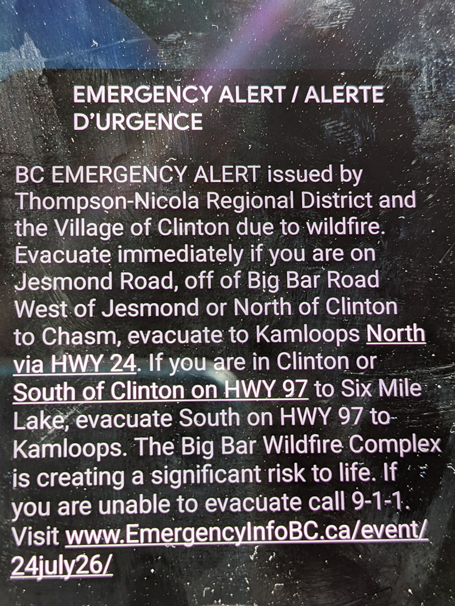 |
|-|
| Eerie Evacuation Notice |
| |

Less than two hours from where we sat, families were evacuating their homes. Firefighters were battling major wildfires. Communities were facing uncertainty and loss. And here we were debating parking spaces. Perspective is a funny thing. Sometimes a road trip teaches us more than geography.

### Post-Mortem: Agent Ubuntu's RV Adventure

As every good technology initiative requires a retrospective, it is only fair that Agent Ubuntu receives the same treatment.

#### Lessons Learned

- Garbage in, garbage out.
- Next time I will be far more explicit in my requirements.
- When requesting campsites, I shall insist that washrooms and showers do not require the elusive and mythical Canadian loonie to operate.

As with all artificial intelligence systems, intent, context, outcomes, and references matter. The [better the inputs, the better the recommendations](https://wsbctechnicalblog.github.io/agent-ubuntu-the-art-of-asking.html).

#### What Went Well

- Flexible route planning
- Excellent campsite recommendations
- Successful adaptation to wildfire disruptions
- Outstanding vehicle selection
- Effective replanning when roads closed
- Exceptional recommendation of the Williams Lake Stampede Grounds
- Happy humans
- Happy dog

#### Final Verdict

Despite fires, road closures, bridge closures, reservation mishaps, extreme heat, smoke, and enough detours to keep any navigation system humble, Agent Ubuntu's plan proved remarkably resilient.

- It adapted when circumstances changed.
- It offered alternatives when routes disappeared.
- Most importantly, it helped transform a long-discussed "someday" adventure into a week of unforgettable memories.
- Well done, Agent Ubuntu.

I suspect we will be collaborating again very soon when planning our next expedition to North Vancouver Island.

"_The destination was never the real objective. The objective was creating stories worth telling when we returned home._" — Agent Ubuntu 🚐🏔️🔥🍎🍺🐕📚

---

That is it for today. Enjoy your favourite brew. I will savour my hot chocolate, reboot, and raise the next one to disciplined engineering, sound judgement, and value‑driven progress.

