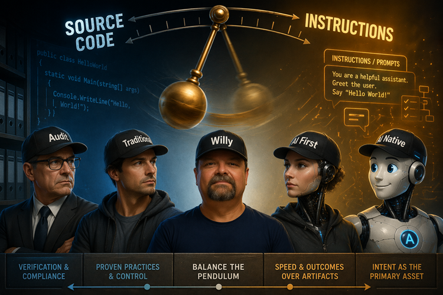

Title: Zero or One, not Fault Lines - When Source Code Stops Being the Centre of Gravity
Date: 2026-06->>
Category: Posts 
Tags: ai, engineering, journal
Slug: zero-or-one-not-fault-lines-ai-trust
Author: Willy-Peter Schaub
Summary: We trusted compilers, then platforms, then pipelines. Artificial Intelligence may be the next delegation leap, but only if trust, auditability, and economic reality move with it.

I find myself standing in a fascinating tension field. On one side are thoughtful people who insist that source code remains pivotal, especially for auditability, confidence, and operational control. On the other are Artificial Intelligence Native subject matter experts who argue that the future will care less about source code and more about the instructions, guardrails, and shared context we give to our Artificial Intelligence agents.

>  

I do not think either side is irrational. In fact, both are responding to something real. One side is protecting trust. The other is chasing leverage. The result is a pendulum swing between certainty and acceleration, between artefact control and outcome control, between what we can inspect line by line and what we can evaluate through intent, policy, and results.

## The challenge is not just technical

Where I stand, where I believe most engineers stand, and where I suspect our internal audit community stands are not yet the same place. That distance matters. It tells us this is not merely a tooling debate. It is a systems-of-trust debate.

>  

So what is really swinging the pendulum? **Trust** is part of it. **Auditability** is part of it. **Awareness** is part of it. **Economic practicality** is part of it. I would add one more: **cognitive comfort**. Source code has been our anchor for decades. It is reviewable, diffable, searchable, and culture-forming. Instructions for Artificial Intelligence agents can be powerful, but they still feel softer, more fluid, and less settled as an accountability artefact.

## We have seen this pattern before

This is not the first epic shift humans have navigated. Industrial revolutions reshaped labour and identity. Whale oil gave way to alternatives when economics, scale, and innovation moved. Integrated Development Environments changed how software engineers thought about editing, compiling, and debugging. Each shift felt disruptive until it became normal.

As inhabitants of Terra, we have a stubborn habit of adapting. Evolution has not beaten us yet. We reorganise our attention. We move up the abstraction ladder. We preserve what still matters, and we let go of detail when the cost of holding it exceeds the value it returns.

>
> **A question for those who insist source code is the only trusted artefact**
>
> - When did you stop reading compiler output? When did you stop inspecting every push, pop, register move, and branch instruction?
> 
> - When did you decide that object code was no longer the centre of your confidence model?
>

At some point, most of us trusted the machine enough to delegate. We did not lose discipline. We shifted focus. We realised the higher-value questions lived above the raw execution detail. What problem are we solving, what guardrails apply, what evidence proves quality, what risks remain, and how do we change safely?

That is why I remain curious about our current attachment to source code as the final sacred layer. It is undeniably important today. Yet history suggests that every generation defends its chosen level of abstraction until a better accountability model emerges.

## And yet, I am not ready to abandon source code

Here is the counterweight. I am not yet convinced by the fully Artificial Intelligence Native future where source code becomes incidental and everything can be regenerated from instructions and prompts. In theory, perhaps. In practice, the economics are brutal. Regenerating entire systems repeatedly through token-heavy context digestion is unlikely to be cheap, predictable, or governable at enterprise scale.

More importantly, source code still gives us a durable and efficient control surface. It is compact compared with constant full regeneration. It anchors repeatability. It makes local changes possible without re-explaining the universe to a model. It remains a practical bridge between human intent, system behaviour, and enterprise assurance.

So perhaps the real answer is not source code or prompts. Perhaps it is layered accountability. Intent and policy at the top, source code as an efficient control artefact in the middle, and automated evidence below. That feels less ideological and more survivable.

>
> **The uncomfortable takeaway**
>
> The future will not be won by people who worship source code, nor by people who dismiss it too early. It will be won by those who can build trust across abstraction layers. From instructions to generated artefacts, from source code to runtime evidence, from human judgement to machine execution.
>

That is the challenge I see. Not whether Artificial Intelligence will change software engineering. It already is. The challenge is whether our trust model, our audit model, and our awareness model can evolve fast enough to meet it.

# The next chapter: Hello Terra

### Traditional Software Development Life Cycle

A software delivery model centred on human-written source code as the primary system artefact, with explicit design, build, test, release, and support stages. Auditability is anchored in repositories, change history, approvals, and repeatable builds. Let us divert our attention to a few definitions to ensure we speak a common language, and then we will explore how the artefacts evolve as we move up the abstraction ladder.

### AI First thinking

A delivery mindset that starts by asking where Artificial Intelligence can accelerate analysis, design, coding, testing, and operations while keeping humans accountable for guardrails, high-risk decisions, and outcomes.

### AI Native thinking

A future-oriented model where instructions, policies, examples, and evaluation loops become the dominant artefacts, and source code may become just one generated representation rather than the centre of gravity. Refer to [Agentic SDLC Handbook](https://github.com/danielmeppiel/agentic-sdlc-handbook) for a great read on this mindset.

### Source Code Abstraction Levels

OK, now that we share a common language, let us explore and compare abstraction layers, starting with the actual C# source code to say "Hello terra". We then look at the Common Intermediate Language example which reflects the kind of output a C# compiler emits. The 8086 and 80486 sections are illustrative lower-level equivalents, not direct output from modern C# compilation.

>
> **Hello Terra C# Sample Code**
>

We start with the familiar. This is the source code we write, review, and commit. It is the artefact we trust for intent, logic, and structure. It is the layer where we feel most comfortable applying human judgement and where we have the most established tools for auditability.

``` csharp
using System;

public class Program
{
    public static void Main()
    {
        Console.WriteLine("Hello, Terra");
    }
}
```

>
> **Hello Terra IDL Sample Code**
>

Next, the C# compiler (Roslyn / csc.exe) compiles the source code into an Intermediate Language (IL) which is a lower-level, platform-agnostic representation. This is the layer that the .NET runtime executes after Just-In-Time compilation. It is more detailed and closer to machine instructions, but it is not typically human-friendly for direct editing or review.

``` csharp
.assembly extern System.Console
{
}

.assembly HalloTerra
{
}

.module HalloTerra.exe

.class public auto ansi beforefieldinit Program
       extends [System.Runtime]System.Object
{
    .method public hidebysig specialname rtspecialname 
            instance void .ctor() cil managed
    {
        ldarg.0
        call instance void [System.Runtime]System.Object::.ctor()
        ret
    }

    .method public static void Main() cil managed
    {
        .entrypoint
        .maxstack 8

        ldstr "Hallo, Terra"
        call void [System.Console]System.Console::WriteLine(string)
        ret
    }
}
```

>
> **Hello Terra 80586 Assembler Sample Code**
>

The ILDASM (Disassembler) output is even closer to the metal. It shows the actual instructions that the .NET runtime will execute after JIT compilation. This is the layer where we start to see the raw operations, register usage, and memory access patterns. It is powerful for understanding performance and debugging at a low level, but it is not practical for day-to-day development or high-level reasoning.

This, by the way, is similar to what I wrote and debugged in the early 1980s on a 16-bit 8086 processor. And yes, it was both scary and exciting!

``` assembly
section .data
    msg db "Hallo, Terra", 0
    msg_len equ $ - msg

section .bss
    hConsole resd 1
    bytesWritten resd 1

section .text
    global _start

    extern GetStdHandle
    extern WriteConsoleA
    extern ExitProcess

_start:
    ; Get standard output handle
    push -11                  ; STD_OUTPUT_HANDLE
    call GetStdHandle
    mov [hConsole], eax

    ; Write message to console
    push 0                    ; reserved
    push bytesWritten         ; pointer to bytes written
    push msg_len              ; message length
    push msg                  ; message address
    push [hConsole]           ; console handle
    call WriteConsoleA

    ; Exit process
    push 0
    call ExitProcess
```

>
> **Hello Terra 8086 Object Sample Code**
>

The Just-In-Time (JIT) compiler converts IL to machine code. This is the actual binary instructions that the CPU executes. It is the lowest level of abstraction and is specific to the processor architecture. It is not human-readable and is not intended for direct interaction, but it is the ultimate layer that determines performance and behaviour.

```
org 100h

    mov dx, msg
    mov ah, 09h
    int 21h

    mov ax, 4C00h
    int 21h

msg db 'Hallo, Terra','$'
```

>
> **Hello Terra 80586 Object Sample Code**
>

```

section .data
    msg db "Hello Vikas", 0

section .text
    global _main
    extern _printf

_main:
    push msg        ; push address of string
    call _printf    ; call printf
    add esp, 4      ; clean stack

    ret
```

# Now over to you!

We once stared at instructions close to the processor. Then we trusted compilers and lifted our gaze. If we now resist instruction-centric Artificial Intelligence systems, are we protecting assurance, or are we defending the last abstraction layer that still feels comfortably human?

- If source code remains the anchor of trust today, what evidence would persuade you to trust a higher abstraction tomorrow?
- Are we debating technology, or are we debating which artefact best serves auditability, accountability, and cost control in this era?
- If previous generations learned to trust compilers and platforms, what must Artificial Intelligence systems prove before we delegate further without becoming reckless?

That is it for today. Enjoy your favourite brew. I will savour my hot chocolate and raise it to disciplined engineering, sound judgement, and value‑driven progress.

>
> 
>
> As always, thank you agent ubuntu for your patience, your insights, and your exceptional copy-editing..
>

