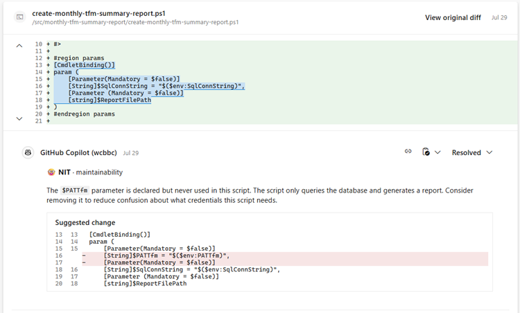
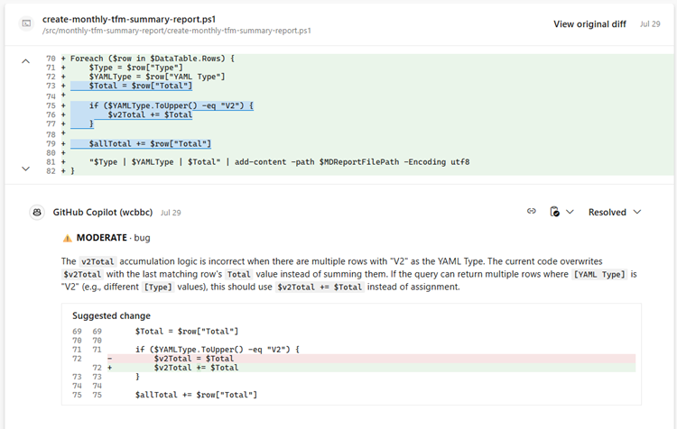
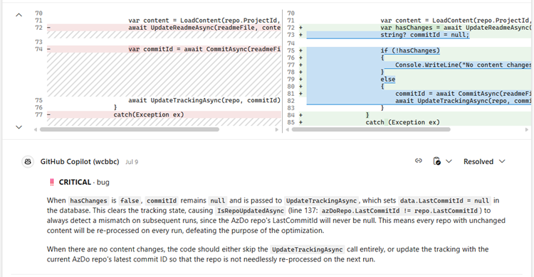

Title: Zero or One, not Fault Lines - The Code Reviewer Who Never Gets Tired
Date: 2026-08-17
Category: Posts
Tags: engineering, journal, ai
Slug: zero-or-one-not-fault-lines-pull-request-code-review
Author: Willy-Peter Schaub
Summary: What if the most valuable reviewer on your pull request is not a person?

What if the most valuable reviewer on your pull request is not a person? What if it is an Artificial Intelligence teammate that never loses context, never gets distracted, and never skips a line because it is Friday afternoon?

That sounds provocative, perhaps even uncomfortable. Good!

> 

A few months ago, in [Dancing With Agents in a Thunderstorm](/zero-or-one-not-fault-lines-2029-ubuntu-vision.html), we asked whether Artificial Intelligence could become an execution layer operating under strong human accountability rather than another productivity toy. We deliberately challenged assumptions about how engineering work is performed, validated, and governed.

The newly announced [GitHub Copilot Code Reviews for Azure Repos](https://devblogs.microsoft.com/devops/copilot-code-reviews-for-azure-repos/) preview offers another opportunity to test those assumptions. Microsoft is bringing GitHub Copilot-powered pull request reviews directly into Azure Repos, enabling teams to request an automated review that analyses proposed changes and provides feedback before peers step in.

Also peruse:

 - [Get started with Copilot code review for pull requests](https://learn.microsoft.com/en-us/azure/devops/repos/git/copilot-code-reviews?view=azure-devops)
 - [Roadmap](https://learn.microsoft.com/en-us/azure/devops/release-notes/features-timeline#copilot-code-reviews-for-azure-devops) 

 So, ...

- The interesting question is not **whether Artificial Intelligence can review code**.
- The interesting question is **whether we are finally ready to change who performs the first review**.

# The Hidden Cost of Traditional Code Reviews

Most engineering teams know this pattern: a pull request arrives, reviewers are busy, context switching is costly, and timelines are tight. To review well, they must quickly understand the changed code, surrounding architecture, established patterns, dependencies, security implications, and long-term maintainability risks. Sometimes they find the defects, and sometimes they do not.

The issue is not capability; it is scale. As systems grow, so does the context required for a high-quality review. Humans are strong at judgement, but less suited to maintaining perfect awareness across thousands of files, hundreds of dependencies, and years of accumulated implementation decisions. That is where Artificial Intelligence begins to create value.

# Not Just Another Reviewer

What differentiates Copilot Code Reviews from many traditional review tools is that it does not simply examine the changed lines. It analyses the pull request within the wider repository context and provides feedback directly in the review workflow. My experience has been remarkable:

>
> "_I love the GitHub Copilot Code Review preview feature because it goes far beyond reviewing the changed lines in a pull request. It performs a deep analysis of both the proposed changes and the surrounding codebase, bringing context that is often difficult for human reviewers to maintain. It has repeatedly identified critical defects, security concerns, and design issues that remained unnoticed through months of traditional peer reviews. By providing fast, consistent, and insightful feedback, it significantly improves both the speed and quality of code reviews. In fact, I now consider a Copilot review to be a mandatory first step and generally do not respond to a pull request review request until the Copilot review has been completed and its findings have been addressed._"
>

That is a strong statement, and I stand by it. The most surprising aspect has not been the volume of feedback, but its quality. Copilot Code Reviews has surfaced issues that survived multiple human reviews, exposed architectural inconsistencies, highlighted security concerns before deployment, and offered best-practice guidance with a level of consistency that no human team can realistically sustain indefinitely.

Here are some examples of the types of feedback we have received and enjoyed, ranging from nit-picking, medium comments, to critical issues:

>
> **NIT** picking
>
> 
>

>
> **MODERATE** comment
>
> 
>

>
> **CRITICAL** OMG moment
>
> 
>

In other words, Copilot Code Reviews offers suggestions that are not only relevant, but also actionable. It is not a replacement for human judgement, but it is a powerful complement that allows humans to focus on the decisions that matter most.

# The Developer Perspective

I am not the only one seeing value.

[Vis Naidu](https://wsbctechnicalblog.github.io/pages/authors.html) summarised his experience well:

>
> "_For me personally, it has been a (near) life-saver. For some of my recent pull requests, Copilot Code Review has detected both best practice issues and critical anomalies in my code, regardless if it is C#, PowerShell or YAML. It has resulted in the output being stable, clean and polished. I have not yet identified any recommendations that seem bogus, overkill or unnecessary. I have pretty much applied all recommendations with very positive results. The fact we have a Draft PR option also allows us to get a first round done before calling in the troops for the final reviews. So far, so good._"
>

The real value is not that Artificial Intelligence finds issues, as static analysis tools have done that for years; it is the breadth of feedback across technologies and the ability to obtain it before consuming scarce peer-review capacity, shifting human reviewers toward business intent, architectural direction, risk trade-offs, and stakeholder outcomes.

# Why This Matters
The value extends beyond developer convenience.

### Stakeholder Experience

**Faster feedback means faster learning. **

Teams can identify issues earlier, refine solutions sooner, and reduce delays caused by review cycles. Engineers spend less time waiting and more time delivering value.

### Risk Reduction

**Every defect found before production is a risk avoided. **

Early identification of security, maintainability, architectural consistency, and implementation quality issues reduces the likelihood of downstream incidents, lowers remediation cost, and improves outcomes.

###  Cost Avoidance

**Perhaps the most overlooked benefit is cost avoidance. **

Cost avoidance comes from reducing scarce engineering review time, rework, and production support overhead by moving quality assurance left. When Copilot identifies issues before human reviewers engage, organisations preserve expert attention for higher-value decisions and create practical leverage, not merely efficiency.

# The Emerging Pattern

In [Dancing With Agents in a Thunderstorm](/zero-or-one-not-fault-lines-2029-ubuntu-vision.html), we argued that engineers should increasingly focus on judgement, governance, and accountability while delegating repetitive execution activities to Artificial Intelligence.

Copilot Code Reviews does not replace the reviewer; it improves the starting position by allowing Artificial Intelligence to analyse, identify patterns, and accelerate execution while the engineer applies judgement, makes decisions, and remains accountable. Ubuntu remains intact: I am, because we are.

## Closing thought

If you have access to the preview, use Copilot Code Reviews as the first reviewer, not as an optional extra or novelty. Let it perform the initial pass, address the findings, and then invite peer reviewers so that human attention is focused on the decisions that matter most.

The future of engineering is not humans versus Artificial Intelligence; it is humans and Artificial Intelligence working together where each creates the greatest value. The thunderstorm is still here, and the question is no longer whether we should dance with the agents, but whether we can afford not to.

---

That is it for today!

Enjoy your favourite brew. I will savour my hot chocolate and raise it to disciplined engineering, sound judgement, and value‑driven progress.

