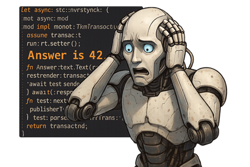
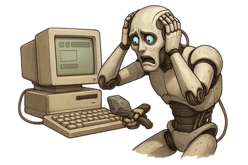
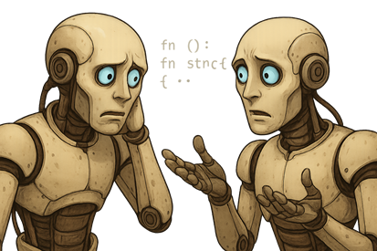
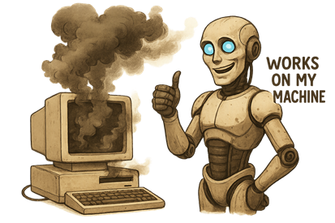
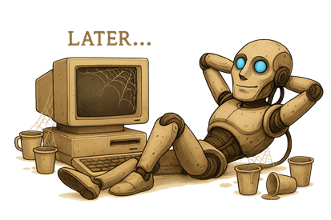

Title: Zero or One, not Fault Lines - Red Flags!
Date: 2026-04-??
Category: Posts 
Tags: engineering, journal
Slug: zero-or-one-not-fault-lines-red flags
Author: Willy-Peter Schaub
Summary: A field guide to decoding well‑intentioned explanations that quietly increase risk, cost, and sleepless nights.

>
> **Every engineer means well.**
> **Most incidents also mean well.**
>

Over the years, I have learned that the most important signals about the health of an information technology system are rarely found in dashboards, logs, or architecture diagrams. They are found at the water cooler, in casual sentences, often delivered confidently, usually without malice, and occasionally with a straight face.

Sentences like:

- “It took a while, as there is no documentation.”
- “We had to test it manually, as there is no automation.”
-“There is no time to do it properly right now.”

>
> **These are not excuses.**
> **They are symptoms.**
>

This blog post is not about blaming engineers. It is about listening better. Because when you listen carefully, red flags start waving politely before they escalate into outages, rework, audit findings, and budget conversations nobody enjoys.
Consider this a friendly survival guide for leaders, architects, and engineers who would prefer calm delivery over heroic recovery.

>  

# The Red Flags (and what they are really telling us...)

## 🚩 “It took a while because there is no documentation.”

>  

What it sounds like:

- A reasonable explanation.

What it usually means:

- Knowledge is tribal and fragile.
- Onboarding is slow and expensive.
- The solution does not scale beyond the people who built it.

Hidden impact:

- Stakeholder experience suffers when change becomes slow.
- Risk increases when only one person understands the system.
- Cost rises through repeated rediscovery of the same knowledge.

Anti-dote:

- Invest in documentation as a first-class deliverable, not an afterthought.

## 🚩 “We had to test it manually, as there is no automation.”

>  

What it sounds like:

- Being pragmatic.

What it usually means:

- Quality is dependent on human availability and memory.
- Feedback loops are slow and inconsistent.
- Every change carries avoidable uncertainty.

Hidden impact:

- Increased production risk.
- Delayed releases and reduced confidence.
- Manual effort replacing repeatable automation.

Anti-dote:

- Prioritise test automation as part of the definition of done, not a future improvement.

## 🚩 “There is no time to do it right now, we will come back after go‑live.”

>  

What it sounds like:

- Delivery pressure.

What it usually means:

- Technical debt is being consciously created without a repayment plan.
- Future teams will inherit today’s shortcuts.
- “Temporary” often becomes permanent.

Hidden impact:

- Deferred risk compounds quietly.
- Cost avoidance opportunities are missed.
- Stakeholder trust erodes when the same issues return.

Anti-dote:

- Recognise that “no time” is a red flag for technical debt. Make it visible, and create a clear plan to address it before it becomes unmanageable.

## 🚩 “I have no idea how the solution works.”

>  

What it sounds like:

- Honesty.

What it usually means:

- The system is opaque, not resilient.
- Learning opportunities were skipped.
- Available tools, including modern engineering assistants, such as GitHub Copilot, were not used.

Hidden impact:

- Bus‑factor risk is high.
- Debugging and incident response are slow.
- Confidence is replaced by guesswork.

Anti-dote:
- Build systems that are observable, explainable, and teachable. Encourage a culture of learning and curiosity, where engineers feel empowered to understand and improve the systems they work on.

## 🚩 “Do not touch it, it is fragile.”

>  

What it sounds like:

- Protectiveness.

What it usually means:

- The system lacks tests and clear contracts
- Change has historically caused failures
- Fear has replaced engineering confidence

Anti-dote:

- Invest in refactoring, test coverage, and clear interfaces. Create a culture where change is expected, and systems are designed to be resilient to it.

## 🚩 “It works on my machine.”

>  

What it sounds like:

- Relief.

What it usually means:

- Environments are inconsistent.
- Deployment is not deterministic.
- Production behaviour is unpredictable.

Anti-dote:

- Standardise environments using infrastructure as code and containerisation. Ensure that the path from development to production is as similar as possible, reducing the “it works on my machine” gap.

##🚩 “We will document it later.”

>  

What it sounds like:

- Good intentions.

What it usually means:

- It will never be documented.
- Future engineers will reverse‑engineer decisions.
- The organisation will pay interest on forgotten context.

Anti-dote:

- Make documentation a non-negotiable part of the development process. Treat it as a deliverable that adds value, not a chore that can be deferred indefinitely.

# Why These Red Flags Matter

> 
> - Individually, each sentence feels harmless.
>

Collectively, they describe systems that are:

- Hard to change
- Risky to operate
- Expensive to sustain

Listening for these signals early allows teams to intervene before incidents, improve stakeholder experience, reduce operational risk, and avoid unnecessary cost.

When you hear these red flags, do not ask “Who is at fault?”. Instead, ask:

- Where can we add automation to replace manual effort?
- Where does documentation unlock speed and safety?
- Where can we make quality repeatable rather than heroic?

Strong engineering cultures are not built by avoiding these conversations. They are built by recognising the signals early and acting deliberately. Because the best systems do not rely on memory, courage, or luck. They rely on clarity, evidence, and care for the next person who has to change them.

Enjoy your favourite brew. I will savour my hot chocolate and raise it to disciplined engineering, sound judgement, and value‑driven progress.

