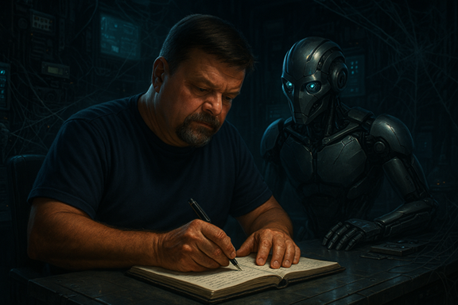

Title: Zero or One, not Fault Lines - Software Engineering in the Thunderstorm
Date: 2026-08-24
Category: Posts 
Tags: engineering, journal, ai
Slug: zero-or-one-not-fault-lines-software-engineering
Author: Willy-Peter Schaub
Summary: Why Software Engineering Matters More Than Ever.

A recurring question from students, graduates, and experienced engineers is whether it still makes sense to become a software engineer when Artificial Intelligence can already generate increasingly sophisticated code, automate workflows, and challenge long-standing assumptions about how software is built.

The concern is understandable, but my experience points in the opposite direction: software engineering is not disappearing into the storm; it is becoming more important because the value is shifting from writing every line of code to understanding, validating, and taking accountability for outcomes.

>  

In [Dancing With Agents in a Thunderstorm](/zero-or-one-not-fault-lines-2029-ubuntu-vision.html), I explored the possibility that much of the execution work within software engineering may eventually be delegated to agentic Artificial Intelligence under strong human accountability. That future feels increasingly plausible. We are already seeing Artificial Intelligence generate code, create tests, produce documentation, analyse requirements, and assist with architecture decisions. 

What many people miss is that software engineering has never been fundamentally about typing code. Coding is a skill, while engineering is the discipline of understanding systems, trade-offs, failure modes, accountability, and the thinking required to turn tools into reliable outcomes.

# Exposing an ancient truth

Artificial Intelligence is exposing an old truth: generating code is not enough, because somebody still needs to determine whether the solution is correct, maintainable, secure, performant, compliant, and free from unintended consequences. Artificial Intelligence can propose answers, but engineering determines whether those answers can be trusted.

The faster Artificial Intelligence enables teams to generate software, the more engineering discipline matters, because velocity does not automatically improve quality, maintainability, reliability, or technical debt. It amplifies the practices already present in the system.

- If strong engineering practices exist, Artificial Intelligence can accelerate value delivery.
- If weak engineering practices exist, Artificial Intelligence can accelerate chaos.

The storm does not change the laws of engineering. It merely increases the consequences of ignoring them.

Principles such as abstraction, layering, testability, maintainability, observability, separation of concerns, and sound architectural boundaries remain every bit as important today as they were before Artificial Intelligence entered the picture. Some may argue they are more important now because problems can accumulate at machine speed rather than human speed.

# The Question

This brings us to a question I hear often: "Is a software engineering degree still worth pursuing?"

My answer is simple: yes, absolutely. Not because a degree teaches a specific programming language, framework, or toolchain, as these have always changed, but because it provides the foundation that outlasts them.

The lasting value of a software engineering education lies in structured systems thinking, design and architecture, algorithms, quality practices, requirements engineering, risk management, ethics, and professional accountability. These are not obsolete skills; they are precisely the skills needed to evaluate, govern, and take responsibility for Artificial Intelligence-generated solutions.

University is not the only path to software engineering; exceptional engineers emerge through apprenticeships, self-directed learning, and adjacent disciplines, but every path must build the same foundation: the ability to understand systems deeply, challenge assumptions, validate outcomes, and make informed decisions. Artificial Intelligence has not removed that requirement. It has elevated it.

# Misunderstanding

Perhaps the greatest misunderstanding about the future of engineering is the belief that engineers will become less important as Artificial Intelligence becomes more capable. What I am observing is different: the nature of engineering work is changing, with less effort spent writing every line of implementation and more effort spent defining intent, validating outcomes, governing autonomous systems, managing risk, protecting stakeholder interests, and ensuring quality.

We are not becoming less technical; we are becoming more accountable. The future engineer may spend less time acting as a compiler of source code and more time acting as a steward of outcomes, which feels less like the end of engineering and more like its evolution.
So, if you are a student wondering whether your degree still matters, let me offer some reassurance.

The thunderstorm is real: the industry is changing, today’s tools will age quickly, and many current engineering tasks will be automated. Yet none of this diminishes the timeless value of understanding systems, designing for quality, managing risk, making responsible technology decisions, and owning outcomes; in a world of increasingly capable Artificial Intelligence agents, those skills may become the most valuable engineering capabilities of all.

## Closing thought

Artificial Intelligence may change the tools, the pace, and even the shape of delivery, but it does not change the fundamentals. **Good engineering, sound judgement, and clear accountability still matter**. Artificial Intelligence may help us write software, but engineers remain responsible for understanding it, challenging it, and owning its outcomes; that is why software engineering still matters, and why the future will be shaped by those who know how to guide the storm rather than merely admire the lightning.

Ubuntu reminds us: "_I am, because we are. The future will not be built by Artificial Intelligence alone. It will be shaped by engineers (humans) who understand enough to guide it, challenge it, and take responsibility for its outcomes._"

That is it for today!

Enjoy your favourite brew. I will savour my hot chocolate and raise it to disciplined engineering, sound judgement, and value‑driven progress.

