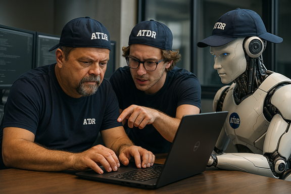

Title: Zero or One, not Fault Lines - What is our ATDR mindset?
Date: 2026-XX-XX
Category: Posts 
Tags: engineering, journal
Slug: zero-or-one-not-fault-lines-what-is-our-atdr-mindset
Author: Willy-Peter Schaub
Summary: No Lone Wolves. No Over‑Engineering. Only Excellence.

There are times when a name defines a movement, and times when a movement outgrows its name. ATDR is both.
**ATDR** began as our `Automated Technology Debt Remediation` project in 2025. It was meant to be a toolset. It evolved into a mindset. It became a service that our teams depend on, a structure with political backing, and a trusted engineering companion. We deliberated intensely about renaming it, because the acronym is admittedly cryptic. Yet its value, recognition, and influence have become too significant to discard. Therefore, the **ATDR** Mindset remains.

>  

This is not about branding. This is about building a disciplined engineering culture that strengthens stakeholder experience, reduces risk, and avoids unnecessary cost.

# Breaking the In‑Person, Hybrid, and Remote Deadlock

Hybrid work has trapped many engineering teams in a silent stalemate. In‑person teams operate one way. Remote teams operate another. Hybrid teams blend both and suffer from neither. ATDR challenges this division with a simple philosophy:

>
> - When we are in the **office**, we engineer **together**.
> - When we are **remote**, we engineer **aligned**.
>

The ATDR Mindset fosters intentional, side‑by‑side engineering when we are physically together. Governance shared. Guidance shared. Best practices shared. Engineering riddles solved collectively. Real people working next to real people.

Our golden rule makes this absolute:

>
> When we sit at our laptop and we look left and right, and there is no human sitting next to us, we are not in the context of **ATDR**. This is collaboration with purpose, not ceremony.
>
>  
>

# A Dependable Support Structure for Engineering Teams

>
> **ATDR is not an inspection service. It is a safety net.**
>

It is a reliable support structure designed to empower engineering teams to make strong, sustainable decisions. Its purpose is simple:

- Strengthen engineering outcomes
- Reduce organisational risk
- Avoid avoidable costs
- Elevate stakeholder trust

Isolation may produce impressive engineering artefacts, but it seldom produces sustainable engineering.

# An isolation example from personal experience

One of my greatest professional concerns, and frankly one of my recurring nightmares, is entrusting consultants with engineering innovation in isolation. Before anyone reacts, let me be absolutely transparent: I was a consultant for most of my engineering career. I know, from painful personal experience, how much damage unchecked personal ambition and isolated innovation can inflict on an organisation.

Consultants often arrive with an impressive toolbox of experience, knowledge, and confidence. This can be a tremendous asset when it is aligned with the organisation’s culture, governance, guardrails, and engineering maturity. When they integrate, collaborate, and adapt, they help create outstanding outcomes.

However, when they push beyond the organisation’s ability to understand, operate, and sustain their engineering marvels, we step directly into a risk zone. Consultants are seldom long‑term custodians. They build, they deliver, and they move on. What remains is often a beautifully crafted engineering treasure that is difficult to maintain, fragile under pressure, and tolerated rather than owned.

When these creations eventually break, and they always do, the organisation is left with a nightmare scenario. This harms our ability to “think value” and erodes the very currencies we rely on to elevate stakeholder experience and reduce risk and cost.

>
> **The danger is not consulting. The danger is engineering in isolation.**
>

This is why we push for discipline, collaboration, and sustainable engineering practices. This is why we insist on alignment. This is why we challenge aggressive, overly ambitious engineering that prioritises individual brilliance over organisational resilience. This is why we have our **ATDR** mindset.

# A Common Language Through Awareness and Continuous Learning

> 
> **Culture without alignment is chaos.**
>

ATDR depends on every engineer completing our Awareness and Continuous Learning Dojos. These Dojos explore our guidance, guardrails, processes, and products, ensuring that we speak the same language, pursue the same discipline, and protect the same organisational interests.

This alignment matters. It is how we maintain consistency across teams, maintain security by design, and sustain engineering excellence without the noise of conflicting practices.

# Championing the Pillars That Make Engineering Sustainable

ATDR promotes the principles that endure beyond any individual:

- `Consistency` as the backbone of engineering trust.
- `Standardisation`as a defence against chaos.
- `Security` as a default, not an afterthought.
- `Simplicity` as proof of engineering maturity.
- `Doing it right, at the right time, all the time`.
- Acting in the `best interest` of the group and organisation, not in pursuit of personal engineering ambition or vendor marketing illusions.

These pillars protect us from ourselves. They shape engineering into something that lasts.

# Challenging the Culture of Over‑Engineering and Lone‑Wolf Brilliance

Aggressive IT thinking has a dangerous side. It encourages individuals to break away, build alone, optimise beyond reason, and return with magnificent solutions that no one else can maintain. The result is predictable:

- Isolated brilliance.
- Exceptional complexity.
- Beautiful systems.
- Immovable technology debt.

> 
> **This does not hurt the engineer. This hurts the organisation.**
>

ATDR rejects this behaviour:

- It challenges over‑engineering.
- It opposes engineering without context.
- It confronts the hero culture that leaves teams cleaning up after individual ambition.
- We must build solutions, not monuments.
- We must engineer for the group, not the résumé.
- We must collaborate, not disappear.

# Zero or One: The Final Message

Engineering is binary at its core. Either we do it right, or we do not. Either we deliver sustainable value, or we build tomorrow’s problems. Either we align as a group, or we fracture as individuals.

**ATDR** is our commitment to disciplined engineering.

It is our stand against unnecessary complexity. It is our promise to each other that we will build strong, simple, secure, maintainable solutions. And above all, it is our reminder that we engineer better together than we ever will in isolation.

Enjoy your favourite brew. I will savour my hot chocolate and raise it to disciplined engineering, sound judgement, and value‑driven progress.

